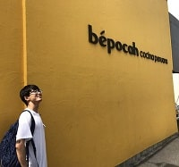

こんちは〜、**ひろち**です。

ここでは、かる～く私のことを紹介してます！

## 簡単な自己紹介

**ひろち**

「はじめまして！ひろちと申します。現在大学4回生でプラズマ理工学研究グループに所属しています(*´∀｀)」

## ひろちの経歴紹介

1. 幼少期はとにかく走るのが大好き！
2. **小中学校は苦しみながら成長**
    - ゲームとスポーツは大好き
    - イジメって良くないよね
    - 親にはマジ感謝
3. **高校での友達が良い人ばかり**でバリバリ楽しみつつ、人間として成長
4. 理系の国公立大学へ進学
5. **大学でガチ挫折**(僕は何で電気工学を専攻しているの…？)
6.** Web業界へ潜り込むために努力を始める(2019年3月〜2020年4月)**
    - 2019年4月〜: このブログ(heacet.com)を始める
    - 2019年6月: このブログ(heacet.com)にて月間226000PVを達成
    - 2019年10月: 機械学習に興味を持って1ヶ月間だけ勉強して、[Qiitaに記事を投稿](https://qiita.com/Hirochon/items/12379d7ca6141f1fb6fa)
    - 2019年11月〜: Djangoを使ったバックエンド開発を始める
    - 2019年12月〜: AWSを使ったインフラ構築を始める
    - 2020年1月〜: Dockerにてコンテナ管理を始める
    - 2020年1月〜: [Shappar](https://github.com/Hirochon/Shappar)を友達と共同で開発を始める
7. [東京大学松尾研 GCI2020Summer](https://gci.t.u-tokyo.ac.jp/gci-2020-summer/)にて**優秀生に選ばれる**(2020年5月〜2020年8月)
8. 内定先でアルバイトを始める(2020年9月〜)

## ひろちのスキル

<ul>
	<li>プログラミング: C言語／Python／TypeScript／Go</li>
	<li>フレームワーク／ライブラリ: Django／Django REST Framework／Numpy／Pandas／Scikit-learn／Pytorch／TensorFrow(Keras)／React／Apollo／Gorm／Gin／gqlgen</li>
	<li>インフラ: AWS(ECSなど)／Docker／CircleCI</li>
	<li>現在勉強中: データサイエンス／React／Go／GraphQL</li>
	<li>スポーツ歴: 水泳／サッカー／フットサル</li>
	<li>特技: パントマイム／ルービックキューブ／ムーンウォーク</li>
	<li>オタク: 乃木坂46／欅坂46／日向坂46←Hot!!</li>
</ul>

## Hirochi’s GitHub Account

[僕のGitHub](https://github.com/Hirochon)

DjangoやNumpy、データ分析の練習用リポジトリや競技プログラミングで解いた問題の回答などがあったりします。