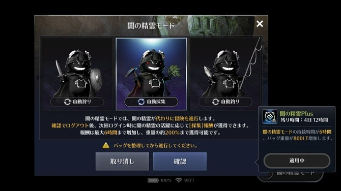
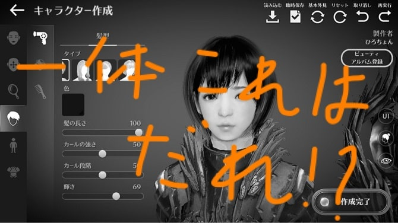

はじめまして～。ひろちょんです。いま春休みなのですが、ほんと生活習慣の乱れがすーごいです。(笑)

ただいま16時半頃なのですが、寝始めたのが6時なので、10時間寝たということですね。はい。そうなんです。昼夜逆転の代表例でかつ、めっちゃ寝るっていう、、、もうNE◯Tの鏡です。

さあさあ本題行きます！！！

**黒い砂漠がめっちゃおもろい件**

最近、なんか日常がつまらないなぁ～とか思ってないですか？？

**『そこで黒い砂漠！！』**

最近リリースされたスマホ向けのアプリですね！

さてさて、『ランキングこの前1位とってたけど、結局どうなん？？』というお声も多いと思いますが、結局どうなんでしょう？

実際に、というか、リリース初日からプレイして、結構楽しませていただいているひろが解説いたします！！

<h2 id="h-jump1">黒い砂漠ってどんなゲーム？</h2>

### ジャンルでいうとMMORPG！

**MMORPGというと、大人数で同時に(オンラインで)楽しむことのできるRPG**ってことです。（ここにVRを足せば、某キリトさんのゲームになりますね。笑）

RPGといえば、ドラクエだとか、FFだとか、思い浮かぶと思いますが、そのジャンルで、かつ日本中のみなさんと一緒にプレイしよう！という想いから来ているゲームなのです！

とりあえず下にリンクを貼っているので、今の時点でプレイしてみたい！と思った方がいたらっしゃいましたら、是非どうぞ！笑

[黒い砂漠Mobiile（Apple Store）](https://itunes.apple.com/jp/app/%E9%BB%92%E3%81%84%E7%A0%82%E6%BC%A0-mobile/id1439175829)

[黒い砂漠Mobile（Google Play）](https://play.google.com/store/apps/details?id=com.pearlabyss.blackdesertm.jp)

### 黒い砂漠の魅力は？？？

**『放置狩りができる！！』**

これに尽きますね。

本当にこの機能は画期的。

なぜかといいますと、従来のMMORPGは進めるにつれ膨大な時間を取られることが多かったんです。

1. ドロップアイテムが欲しい～
2. レベル上げたい～
3. DROPアップの時間帯に狩りしたい～
4. 仕事が忙しくてゲームに時間がさけない！
5. 狩り中にボタン押すの飽きて、寝てまう～
6. etc…

などなど、過去にこの部類のゲームをした方はわかると思いますが、特に２はほんとに途方にくれます。あと4ですねー。平日などは仕事があって、ゲームしている時間などない方が多いですよね～

その悩みを解決いたしましょう！！！

黒い砂漠では、闇の精霊くんが勝手にキャラを動かしてくれます！↓↓↓

このように通常は3時間ですが、アイテム（無課金でも入手可）を使えば**最長6時間もの間に放置狩り**をすることができます！それに加えて、**バックグラウンド**でもやってくれるので、**アプリを終了しても狩り続けてくれます！**

狩りの他にも、素材集め（モンハンで言うユクモの木とかハチミツ）や、釣りもできますねー。

つまりこの機能を用いれば、ゲームでの最前線キープは可能となります！

ところで、言いたかった方いるんじゃないでしょうか？？

**『放置だけとかクソゲーwww』**

めっちゃ分かります。この気持ち。

最初私も思っていました。笑

ですが、それだけで攻略はもちろん不可能です。笑

しっかりと**自分でしなければいけない要素はたっっっっくさんあります**。ご安心ください。笑

軽く紹介させていただきますが、

- 自分に合った装備の能力や水晶をつけるなどの、キャラ育成を考える
- PVP(対人戦)
- 戦力が互角なボス戦
- ギルド戦などなど、、、

モンスター相手だといいのですが、機械がオートで戦闘するので、やはりプレイヤー相手だと厳しい所があります。そこで、自分自身がどのようにキャラを育成して、**キャラ自身のスキルを使いこなせるか**にかかっています！

他にも面白い要素はたっくさんございます！

知りたいですか？

知りたいって言ってみてください！（うざ

その面白い魅力をこれから紹介できたらいいですなぁ～

ってこで……

<h2 id="h-jump2">次回から黒い砂漠ぱーと1始まります！笑</h2>

記事が出来上がったら、リンクを貼っておきます(^o^)／

[【黒い砂漠Mobile】ぱーと１ 生駒ちゃん旅立つ。～キャラメイク・ストーリーも！～](/black-desert-part1/)

---

PS.画像少なめですみません。

改善していくつもりです。笑

次回はキャラメイクと、ストーリーを進めると思いますー。

お見苦しい記事だったかもしれませんが、これから改善できたら…と思います！気になることがございましたら、コメントの方を送っていただけると幸いです。

では、また会いましょう～