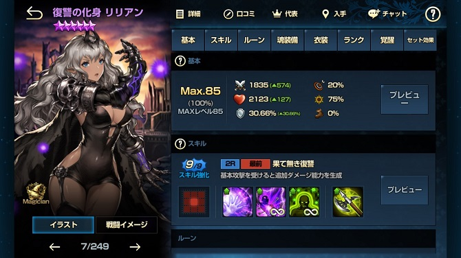
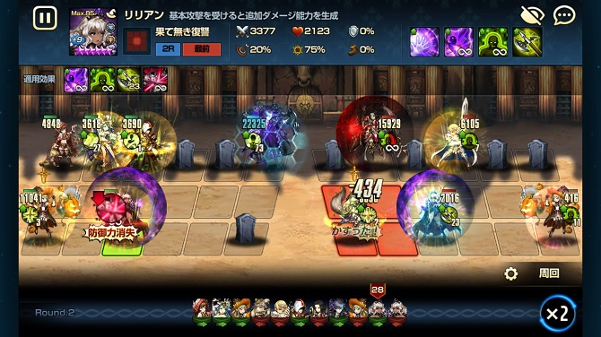
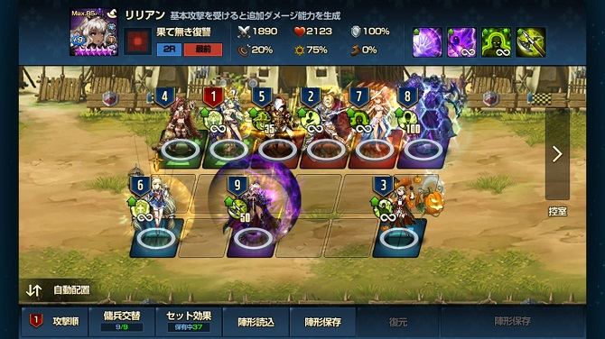

どーも、ひろちです！

もう１，２か月前の話ですが、ブラウンダスト1周年を迎えましたね～。一年が過ぎるのは早い！
この頃、スマホゲームにノスタルジックにさせられております…

 

今回は実装されて結構経ちますが、<b>もうアリーナでは手放せないリリアン</b>の使用感について話していきたいと思います。

<i class="fa fa-check" aria-hidden="true"></i> 今回のもくじ！

<ol>
	<li><a href="#h-jump1"><strong>リリアンのスペック</strong></a></li>
	<li><a href="#h-jump2"><strong>使うなら覚醒+9した方が良い理由</strong></a></li>
	<li><a href="#h-jump3"><strong>弱い点もある</strong></a></li>
	<li><a href="#h-jump4"><strong>リリアンの配置はこれで決まり！</strong></a></li>
</ol>

<h2 id="h-jump1">リリアンのスペック</h2>

<h3>基本性能</h3>

基本ステータスは他の魔法型とさして変わりはない。攻撃が少し高くて、HPが少ないと言った感じ。

<h3>スキル一覧</h3>
<ul>
	<li><a href="#h-jump11"><strong>集中防御</strong></a></li>
	<li><a href="#h-jump12"><strong>魔力増幅(永続)</strong></a></li>
	<li><a href="#h-jump13"><strong>デバフ免疫(永続)</strong></a></li>
	<li><a href="#h-jump14"><strong>(覚醒)攻撃力持続上昇</strong></a></li>
</ul>

ではでは詳しい内容を見ていきます！

やばいポイントを赤字にしていきます。

<h4 id="h-jump11">集中防御</h4>

+0
戦闘開始前:自身に防御力+35%→集中防御は攻撃の前に終了する。
集中防御終了後:防御力-200%

+9
戦闘開始前:自身に<b>防御力+70%</b>→集中防御は攻撃の前に終了する。
集中防御終了後:防御力-200%

<h4 id="h-jump12">魔力増幅(永続)</h4>

戦闘開始前:基本攻撃を受ける際に自身に魔力増幅を付与する。

+0
基本攻撃を受ける前:16ターン:魔力増幅の数に応じて攻撃力×100%追加ダメ(<b>重複可</b>)

+9
基本攻撃を受ける前:<b>24ターン</b>:魔力増幅の数に応じて<b>攻撃力×250%追加ダメ</b>(<b>重複可</b>)

<h4 id="h-jump13">デバフ免疫(永続)</h4>

ずっとデバフが効かない。

<h4 id="h-jump14">(覚醒)攻撃力持続上昇</h4>
<b>戦闘開始前:50ターン:毎ターン攻撃力+3%</b>

<h3>見た目</h3>

ギャルっぽさを兼ね備えたスタイル抜群のダークエルフ。
<b>
『腰回り…お尻の曲線がやーばい。奇跡の生足とタイツの2パターンを一気にたんのうでき(自主規制』</b>

<h2 id="h-jump2">使うなら覚醒+9した方が良い理由</h2>

リリアンが使えるのか使えないのかをめぐっては様々な意見がありますが、使うのならば<b>絶対に覚醒+9にしてください</b>。

上のスキル一覧から、+9にする利点としてこれらが挙げられます。
<ul>
	<li>防御力35％→70％</li>
	<li>100％追加ダメ→250％追加ダメ</li>
	<li>追加ダメの効果期間16ターン→24ターン</li>
</ul>

<h3>元の防御力が上がると、ルーンを攻撃に使える。</h3>
リリアンの特徴として挙げられるのが、なんといっても<b>『攻撃するまで防御力100%維持できる』</b>ことですよね！

恐らく+3で防御力+50%になるので、25％の防御ルーンを2個つけて運用している方もいらっしゃると思いますが…

『リリアンが本領発揮するのは攻撃もできるから！』

防御力100％に目線が行きがちですが<b>、この子火力がやばいんです！！</b>

攻撃を受けるたびにリリアンに魔力増幅が付与され、攻撃時に<b>攻撃力×250％の追加ダメージを重複で発生させます</b>。まあこれなら他にも同じようなスキルを持ったキャラがいるのですが…

<b>なにせリリアンが倒されないんですね。</b>

<b>これで攻撃されて、追加ダメージがどんどんたまっていく→攻撃範囲が9×9で敵を駆逐という気持ちいい流れになります</b>！

リリアンの凄みはまだあるんです！

<h3>覚醒するともっとヤヴァイ</h3>

覚醒スキルで攻撃力持続上昇がありますよね？<b>このスキルによって最大で攻撃力が2.5倍されちゃいます（笑）</b>それに加えて先ほどの重複250％の追加ダメージなので、当たったらもう敵が吹き飛ぶわけですね。

<h2 id="h-jump3">やはり弱い点もある</h2>

↑は月夜に攻撃しているので、防御力によって軽減させられていますが、<b>火力がゴミです（笑）</b>。なぜでしょう。

<h3>攻撃を受けなかったら火力は...</h3>

攻撃を受けて、追加ダメージを与えられるからこそ火力があるので、攻撃をされないとアタッカーとしてはいないも同然。

<h3>味方の挑発持ちに吸われて攻撃されない</h3>

セイル様が頑張ってくれている証拠なのですが、<b>『ソコじゃない！』</b>と思うことはありますよね。笑

<h3>固定ダメに弱い</h3>

やはり魔法型なので、<b>HP自体が少ないです</b>。なのでアレックやキュウビ、レヴィアの攻撃が当たると消し飛びます。

<h3>でも逆に考えると…</h3>

<h4>固定ダメでしか倒されない</h4>

そうなんです。相手が固定ダメを持っていなかったら2列配置などにすると、殲滅できますね。サファイア帯になってくると固定ダメを編成に入れてない方は、だいぶ少なくなってきますが、そこまでのランク帯へ行きたいのなら、<b>クリスタルまでは余裕で勝率上がります</b>。

<h4>別にリリアンだけが防御しているわけではない</h4>

セイルや最近実装されたレクリスなどは挑発を持っています。<b>挑発でセイルに固定ダメが当たれば生き残るんですよね</b>。

<h2 id="h-jump4">リリアンの配置はこれで決まり！</h2>

僕はリリアンの配置を下列の前から2人目にしています。
理由を挙げると
<ul>
	<li>狂キャラはスルーが多い</li>
	<li>固定ダメは最前列が多い</li>
	<li>足止めができる</li>
</ul>

一個一個解説していきます。

<h3>狂キャラはスルーが多い</h3>

狂キャラというと、僕の中では<b>シグさん</b>と<b>フォク氏</b>なのですが、<b>二人とも攻撃はスルーです</b>。
挑発で引っ張れなかった時にリリアンに攻撃が行きますが、ダメージは０です。

<h3>固定ダメは最前列が多い</h3>

<b>レヴィアやアレック、キュウビに関しては全員攻撃が最前列ですね</b>。ここで注意してほしいのが、<b>レヴィアの+10です</b>。<b>あの方+10になると攻撃範囲が広がるというチート属性を持っているので、セイルの3個後ろに配置しました。</b>

<h3>足止めができる</h3>

これに関しては、上中下どこにおいても言えることなのですが、<b>防御型は防御で列固めをした方がいいと思いますね</b>。
他にも、上列にリリアンを単体で置いて、中列にはルシウスなんてことされたら、僕の場合はツミですね。笑

<h2>まとめ</h2>

どうでしたか？

様々な面からリリアンを取り上げてみたのですが、やっぱり思うのは…

『ウツクシイ！！』

まあ何にしろ、アリーナ編成では『キャラ愛』という要素がとても大きいと思うのです。それでも<b>『このようなスキル面があるけどリリアンを使ってみてはいかが？』</b>というお話でした。

 

最後まで見て頂いてありがとうございます！『これ良かったよ！』とか、気になる点、間違っている点などございましたら、[お問い合わせフォーム](/contact-form/)にて気軽にお問い合わせください。
