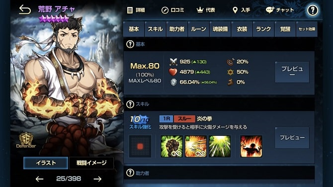
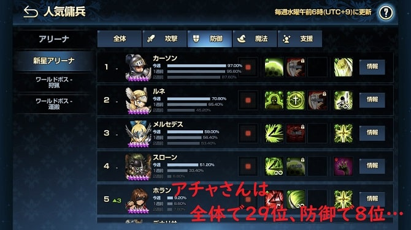
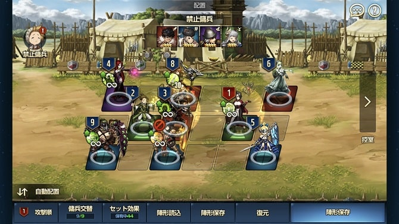
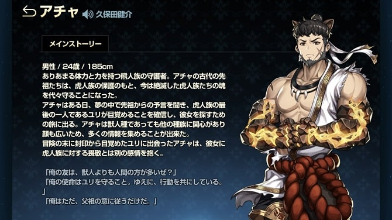

どうも。ひろちです。

今週の<strong>ブラウンダスト</strong>にて<strong>新生アリーナ</strong><b>禁止傭兵を愛用している</b>というゲストをお呼びしています。

<b>ひ◯ちょん　『今週ね。<strong>アチャ</strong>外してからめっちゃ負けるのよwww』</b>

 

今週は<strong>アチャ</strong>が<b>禁止傭兵なんですよ！</b>(2019年8月15日現在)

それで<strong>新生アリーナ</strong>を見たら…20敗です。はぁ。<strong>ブラダス</strong><b>辞めたろか！</b>(絶対に辞めません。)

今回は失ってやっとありがたみが分かった<strong>アチャ</strong>について紹介していきたいと思います！

もくじです～～
<ol>
	<li><a href="#h-jump1"><strong>アチャのスペック</strong></a></li>
	<li><a href="#h-jump2"><strong>使うなら+10した方が良い理由</strong></a></li>
	<li><a href="#h-jump3"><strong>やはり弱い所もある</strong></a></li>
	<li><a href="#h-jump4"><strong>アチャはこんな配置で使おう！</strong></a></li>
</ol>

<h2 id="h-jump1">アチャのスペック</h2>

<h3>基本性能</h3>

基本ステータスは防御型の中でも少し充実しているなという感じ。防御型らしくHPと防御力が高い上に、攻撃力が少し高くて、クリ率が既に20%ありますね。

<h3>スキル一覧</h3>
<ul>
	<li><a href="#h-jump11"><strong>平穏(永続)</strong></a></li>
	<li><a href="#h-jump12"><strong>火傷カウンター(永続)Ⅱ</strong></a></li>
	<li><a href="#h-jump13"><strong>クリ能力増加</strong></a></li>
	<li><a href="#h-jump14"><strong>(覚醒)火傷</strong></a></li>
</ul>

ではスキルの詳しい内容を見ていきましょう！！

↓強いポイントを赤字にしております。

<h4 id="h-jump11">平穏(永続)</h4>

防御力が上昇します。
相手の基本攻撃を受けた際に、自身に動揺効果が適用されます。

+0
戦闘開始前：自身に防御力+15%
(動揺効果)基本攻撃を受けた後：攻撃力+30%,　防御力-20%　(重複可)

+10
戦闘開始前：自身に<b>防御力+35%</b>
(<b>動揺効果</b>)基本攻撃を受けた後：<b>攻撃力+70%,　防御力-10%</b>　(<b>重複可</b>)

 

『動揺効果』が重複可能です。つまり攻撃を受ければ受けるほど、攻撃力が上がり、防御力は下がるわけですね！

<h4 id="h-jump12">火傷カウンター(永続)Ⅱ</h4>

基本攻撃を受ける際に相手に火傷ダメージを与えます。

+0
基本攻撃を受ける前：6ターン：毎ターン攻撃力×20%火傷ダメージ(重複可)

+9
基本攻撃を受ける前：6ターン：<b>毎ターン攻撃力×40%火傷ダメージ,　被ダメージ+35%(重複可)</b>

 

カウンターで重複可能な火傷を相手に与えます！

<h4 id="h-jump13">クリ能力増加</h4>

クリティカル確率とクリティカルダメージが増加する。

+0
基本攻撃後：6ターン：クリ率+50%,　クリダメ+50%

+8
基本攻撃後：6ターン：<b>クリ率+70%,　クリダメ+100%</b>

 

この能力によって火傷のダメージを上昇させているわけですね！

<h4 id="h-jump14">(覚醒)火傷</h4>

基本攻撃後：6ターン：<b>毎ターン攻撃力×40%火傷ダメージ(重複可)</b>

 

まず言わせてください。『めっちゃ火傷させるやん。笑』
重複が可能なので、火傷カウンターとのコンボで相手を倒しに行きます！

<h3>見た目</h3>

『これはご褒美のっネコミミ…』

※熊人族です。
※24歳男性です。
※185cmです。

本人曰く友達は獣人よりも人間の方が多いみたいです。

<h2 id="h-jump2">使うなら+10した方が良い理由</h2>

やはり硬さや火力が大きく違ってきますね。<b>火力が出始めるのは+9からだと思います</b>。

↑でスキルの説明をしたのですが、スキルレベルを+10にするとこのような変化があります。

<ul>
	<li>基本防御力：+15% ⇒ +35%</li>
	<li>攻撃力付加：+30% ⇒ +70%</li>
	<li>防御力付加：-20% ⇒ -10%</li>
	<li>火傷ダメ：攻撃力×20% ⇒ 攻撃力×40% + 被ダメ+35%</li>
	<li>クリ率上昇：+50% ⇒ 70%</li>
	<li>クリダメ上昇：+50% ⇒ 100%</li>
</ul>

<h3>良いルーンを装備すれば防御力100%に！</h3>

最初のうちは難しいかもしれないですが、27%と28%の防御ルーンを装備すれば、<b>新生アリーナにて防御力100%が達成されます！</b>

ですがスキルレベルを+10にしていない場合は、攻撃されるごとに<b>防御力が-20%されてしまいます</b>。

これは<b>初撃は耐えることができますが、攻撃が重なるにつれすぐに弱くなってしまいますね。</b>

ですが<b>-10%だと防御力が下降するスピードは落ちて、逆に攻撃力が爆上がりするので、そのうちに敵を倒すことができます！</b>

<h4>この前まで+9で使っていた話</h4>

実はこの前まで焼き鮭が出なくて、+9で使っていました。笑

感想としては、+10の硬さを知らなかったので、<b>正直硬さは気になりませんでした。笑</b>

ですが+10にしてみると、最後の最後まで生き残るようになることが増えたので、やはり違ってきますね！

<h3>火傷ダメージ半端ないって！</h3>

ほんとにこれだけは半端ないです。<b>まず防御型じゃない火力が出ますね。笑</b>

本領を発揮するのは+9の被ダメ+35%ですね。

攻撃を受けた際に、<b>全員火傷で倒れていきます。笑</b>

やはりクリ能力増加や、攻撃を受けることでの攻撃力付加が重なりに重なって、終盤になるにつれ<strong>狂キャラ</strong>になります。笑

<h3>結局どこが狂キャラ？</h3>

答えは全てです。

基本の能力が高すぎるんですよね。

まず<b>防御100%</b>に、<b>攻撃されるたびに増えていく攻撃力</b>、<b>クリ率クリダメの上昇効果</b>。

意味わからないです。

ですがそんな<strong>アチャ</strong>にも欠点があります…

<h2 id="h-jump3">やはり弱い所もある</h2>

ここまで褒めまくってきましたが、しっかりとした欠点もあります。

<h3>デバフ免疫と持続ダメ免疫</h3>

もうどのキャラもこの免疫シリーズは苦手ですが、特にアチャは苦手ですね。

<h4>デバフ免疫</h4>

対象キャラはこの方達です。
<ul>
	<li>ルネ</li>
	<li>アナイス</li>
	<li>デナリサ</li>
</ul>

ルネに関しては未だに勝てた記憶がないです。笑

他はアナイスの支援ですよね。なんですか。<b>デバフ免疫を付与するって。笑</b>

1対1のデナリサは正直勝てます。まあ『<b>状況によるんだからああ！！</b>』とか言っている方いらっしゃいますけど、攻撃上昇が上回って<b>大体アチャが勝ちますね</b>。

<h4>持続ダメ免疫</h4>

対象はこのキャラ達です。
<ul>
	<li>エダン</li>
	<li>カーソン</li>
</ul>

他にも持続ダメ免疫キャラはいた気はしますが、<b>エダンは特に嫌ですね。</b>

『<b>あれ？なんで負けたんだろ</b>』とか思ってたら、僕は持続ダメで倒していくパーティなので、結構エダンなことが多いですね。

カーソンは、まあ『持続ダメージでは倒せない』って感じです。笑

<h3>あんまり人気じゃない</h3>

これが一番怖いですけどね。笑

僕は常に新生アリーナのスタメンですね！(今週は禁止傭兵だけど)

また記事をあげようと思っているのですが、<b>アチャとあるキャラをいれたら、新生のアリーナランクが爆上がりしました。笑</b>

<h2 id="h-jump4">アチャはこんな配置で使おう！</h2>

これは僕の人生アリーナの攻撃時の編成なんですが、アチャは見事禁止傭兵ですね…笑

僕は防御列の2列目にいれています。理由はこちら。
<ul>
	<li>強キャラのみなさんがスルーor最後</li>
	<li>最後まで生き残らせたら強い。</li>
	<li>陣形のバフ的に。</li>
</ul>

<h3>強キャラの皆さん</h3>

僕的にまあこいつら！(抜けてるヤツいるかも)
<ul>
	<li>ルト</li>
	<li>ウンラン</li>
	<li>リジー</li>
	<li>コレット</li>
	<li>ヘル</li>
	<li>etc...</li>
</ul>

ちょっといっぱいいそうだったので、これ以上はやめときます笑

強キャラのみなさんは範囲攻撃の場合が多いので、<b>攻撃列に入れるのは、周りを巻き込んでしまってあまりよくないかも…</b>

<h3>最後まで生き残らせたい</h3>

数攻撃までは耐久力があるので、残り一体となっても、<b>起死回生の一手がうてることがあります！</b>

なので<b>防御列で一番攻撃が当たりにくい(なんとなくそう思っている)中盤においています</b>。

<h3>陣形のバフ的に</h3>
<b>クリダメ上昇</b>と<b>浄化</b>や<b>その他諸々のバフ</b>をかけたかったので、こんな配置になっています！

<h2>まとめ</h2>

どうでしたか？

もう<strong>ブラダス</strong>で『<b>こんなに取り上げた人がいるのか？？</b>』ってくらい僕の愛用する<strong>アチャ</strong>について取り上げてみました。笑

やっぱりここまで書いていて思ったのは…

『アチャって名前が可愛い。笑』

ほんとどうでもいいですけど、<strong>アチャ</strong>ってどこからの由来何でしょう。笑

まあ何にしろ、新生アリーナ編成では特に『<strong>キャラ愛</strong>』という要素がとても大きいと思うのです。それで『<b>こんなスキル、キャラの要素があるけどアチャを使ってみてはいかが？</b>』というお話でした。

 

最後まで読んでくださってありがとうございました。

気づいたこと、記事の感想、この文章おかしい…などなどございましたら、お問い合わせページにてお問い合わせください。

↓他にもこちらでリリアンの紹介もしてたりします！

[【ブラウンダスト】リリアン覚醒+9の配置はこれで決定！『弱い点も紹介』](/brown-dust-1/)

あとTwitter(@heacet43)フォローとかこのサイト(https://heacet.com)をお気に入りにしてくれると嬉しいなぁ…笑