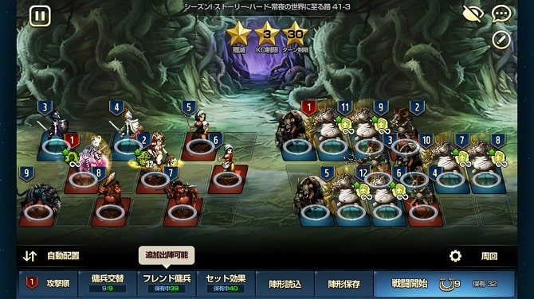
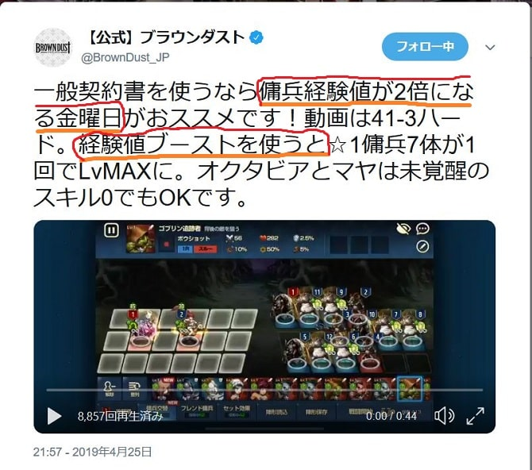
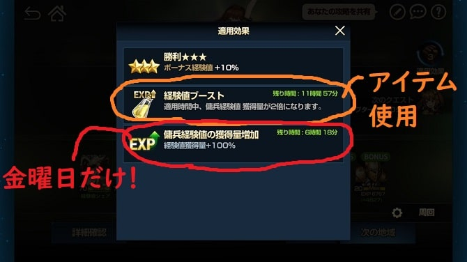
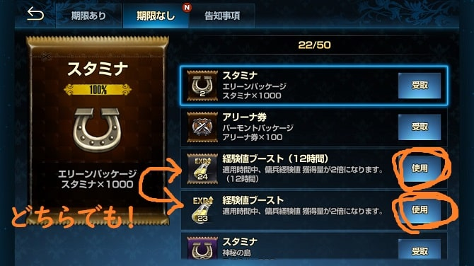

どうも～こんにちは。ひろちです。

今回はレベル上げに関して、革新的な方法が発見されたので、検証かねてご紹介したいと思います！！

今回のもくじです
<ol>
	<li><a href="#h-jump1"><strong>1周で星1傭兵7体が一気にレベルMAX!</strong></a></li>
	<li><a href="#h-jump2"><strong>実際に編成して、クリアしてみよう！</strong></a></li>
	<li><a href="#h-jump3"><strong>レベルMAXには条件がある。</strong></a></li>
	<li><a href="#h-jump4"><strong>一般契約書を使うなら金曜日！</strong></a></li>
</ol>

<section>
<h2 id="h-jump1">1周で星1傭兵7体が一気にレベルMAX!</h2>

<h3>どうなってレベルMAXに？</h3>

上の画像を見て頂くと、オクタビアとマヤ2体以外の星1傭兵7体が全員レベルMAXになっています。よく見てみると1体につき経験値(Exp)が<strong>6767</strong>入っているのがわかりますね！

<b>星1をレベルMAXにするには約5500ほど経験値が必要</b>となるので、十分足りている訳ですね。

<h3>方法を公開したのはブラダス公式さん！</h3>

<blockquote class="twitter-tweet" data-dnt="true" data-theme="light">
一般契約書を使うなら傭兵経験値が2倍になる金曜日がおススメです！動画は41-3ハード。経験値ブーストを使うと☆1傭兵7体が1回でLvMAXに。オクタビアとマヤは未覚醒のスキル0でもOKです。 <a href="https://t.co/VOX8oEc88a">pic.twitter.com/VOX8oEc88a</a>
&mdash; 【公式】ブラウンダスト (@BrownDust_JP) <a href="https://twitter.com/BrownDust_JP/status/1121639410238251008?ref_src=twsrc%5Etfw">April 26, 2019</a></blockquote>

上のTwitterのリンクを押していただいたら、動画が再生されるのですが、見事に全員を倒して星3をげっとできたので、<strong>『うわぁこんなやり方あるんだなぁ』</strong>と感心させられました。

というわけで…

</section>

<section>
<h2 id="h-jump2">早速実際に編成して、クリアしてみよう！</h2>

パーティーはこのような感じです。オクタビアとマヤの2体を使って敵を倒していくので、<b>オクタビアとマヤは必須キャラとなります</b>。

注意していただきたいのは、<strong>必ず攻撃順が①オクタビア②マヤとなるようにしてください。

</strong>他の7キャラは気にしなくていいですが、この2体が順番に動かないと、負けてしましまったり、効率よく周回できない場合があります。

<h3>見事クリア…あれ？経験値が足りないぞ？</h3>

よく見てみると1体につき、経験値(Exp)が4500ほどしか入ってませんね…
おかしいなぁと思って、ツイートを見返してみると発見しました。笑

囲んでいる所を見てください。条件が2つ書かれていますね。リストアップしました。↓
<ul>
	<li>経験値が2倍になる金曜日！</li>
	<li>経験値ブーストを使う！</li>
</ul>
</section>
<section>
<h2 id="h-jump3">レベルMAXには条件がある。</h2>

やはり何の制約もなしに経験値アップは望めないみたいです。笑
ですが<b>僕にはスライムで経験値をアップするより条件が簡単に思えます！</b>

<h3>経験値が2倍になる金曜日！</h3>

皆さん知っていましたか？金曜日はブラダスでは経験値2倍デーなんですよ！

<strong>『金曜日だからスライムでレベル上げるので精一杯～』と言っているそこのあなた！</strong>

<i class="fa fa-check" aria-hidden="true"></i> ストーリー周回なのでスライムとの並行作業が可能です！！

<strong>なのでより効率的に昇級をさせることができるという仕組みなわけですね～</strong>

<aside><blockquote>ちなみに僕はブラダス公式様ツイートを見るまでは、経験値2倍デーの存在を知りませんでした。笑</blockquote></aside>

<h3>経験値ブーストとは？</h3>

ずばり言うと経験値の獲得量が2倍になるアイテムです！

<aside>
<blockquote>友達も言ってたのですが、ブラダスを1年間やってきた人なら使いどころに困って、溜まりに溜まりまくったアイテムでしょう。笑</blockquote>
</aside>

<h4>私経験値ブースト持ってないです。</h4>

なるほど！<strong>『ちょうどいま持ってない！』</strong>という方もいらっしゃるでしょう。
そーーんな時に<strong>運営さん神ですか！</strong>

なんとちょうどエリーゼ姉さんがHot商品として売り出し中です！！！
ぜひこの機会にお買い求めください～（※見ての通り僕はもう買いました。）

<h4>経験値ブーストの使い方は？</h4>

Hot商品を買った方なら、期限ありの方のメールに届いていると思いますので、<strong>受取を押しちゃってください</strong>！(※まだアイテムは使用できていません。)
次に期限なしのメールの方へ移動してもらうと次の画面が出てきます。

めちゃめちゃアイテム溜まってますね。笑

この内容を説明しますと、(12時間)と書いている方が<b>使用してから12時間経験値2倍の効果</b>がるものに対して、下側の何も書いていない方は、<strong>使用してから6時間経験値2倍の効果</strong>となります。人には人の経験値ブーストです。自分に合った経験値ブーストを選んでくださいね(/・ω・)/

<h3>これでやっとレベルMAXに！</h3>

さて、今までご紹介したことを注意しながら実際にやってみてください！<b>『忘れた！』</b>という方に向けて簡単にまとめておきますね！
<ul>
	<li><strong>①オクタビア②マヤの配置は間違えていないか</strong></li>
	<li><strong>今日が金曜日か</strong></li>
	<li><strong>経験値ブーストを使っているか</strong></li>
	<li><strong>ストーリーのハード41-3であるか</strong></li>
</ul>

これらの点に注意したら、周回が可能です！
</section>

<section>
<h2 id="h-jump4">一般契約書をゲット→ハード5-10を周回</h2>

周回していらっしゃる方の中に星1傭兵がそもそもいない方が多いんじゃないでしょうか？そんな時は<strong>一般契約書を使いましょう！！</strong>

『いや、一般契約書がなくて困ってるんだよ！』

なるほど！そんな時は<strong>ハードの5-10の周回をオススメします！</strong>一般契約書を落とすし、高速周回が可能で効率がとてもいいです！

僕の場合は編成はラフィーナとローガンを使っています。（<strong>※スルー十字と最前十字ならバフ次第で誰でも。</strong>）
</section>

 

最後まで見てくださって、ありがとうございました！！
何か気になる点、思ったことなどございましたらお気軽に[お問い合わせフォーム](/contact-form/)にてお問い合わせください。
