こんにちは。ひろちょんです。

今回は<strong>魔導士パターン</strong>の<strong>ハード</strong>の<strong>攻略</strong>をまとめていきます！

協同討伐で一番狩られているであろう方です。

『もっとブラダスをプレイしていきたい！』という方には必見です！！

目次です～
<ol>
	<li><a href="#h-jump1"><strong>パターンに絶対勝てる編成例①</strong></a></li>
	<li><a href="#h-jump2"><strong>パターンに絶対勝てる編成例②</strong></a></li>
	<li><a href="#h-jump3"><strong>パターンのダメージ量や報酬</strong></a></li>
</ol>

 

<h2 id="h-jump1">パターンに絶対勝てる編成例①</h2>

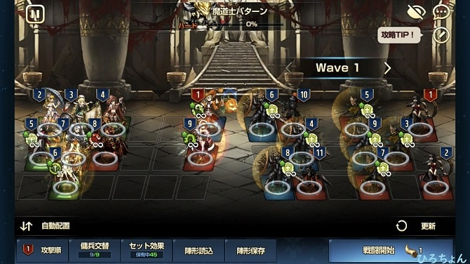

↑こちらが普段僕が使っている陣形になりますね。

Wave1の解説から始めさせていただきますね。

ざっくりと流れを説明するとこんな感じ
<ol>
	<li><a href="#h-jump11">※セイルで挑発</a></li>
	<li><a href="#h-jump12">※アナイスでデバフ免疫付与</a></li>
	<li><a href="#h-jump13">支援型でアーチェとギュンターにバフをかけまくる</a></li>
	<li><a href="#h-jump14">※アーチェで敵の4,6,8を壊滅</a></li>
	<li><a href="#h-jump15">ギュンターで敵の1,2,3,5,7を壊滅</a></li>
	<li><a href="#h-jump16">※アンジェリカで敵の9を倒す</a></li>
	<li><a href="#h-jump17">残った10,11を倒して、次ステージへ！</a></li>
</ol>
重要そうなところに※を付けさせて頂きました。
決して『ア』から始まる場所を赤の※印をつけたわけではありません。笑

詳しい説明をさせて頂きます。

<h3 id="h-jump11">セイルで挑発</h3>

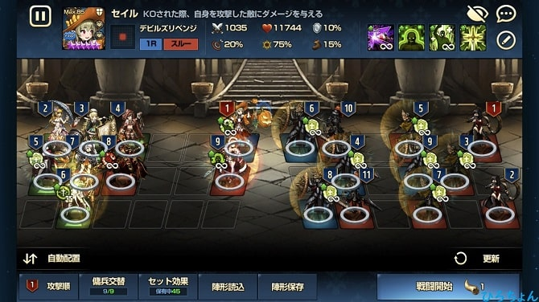

『挑発だったら誰でもいいの？』という質問に答えさせていただくと、答えは『ダメ』です。

Wave1ではセイルでなくとも、特に苦労はしないのです。

ですが『いざボスを倒す』となった時に、セイルでないとボスを倒せないので、僕の方法ではセイルは必須キャラです。

ステータスは星６の+10で、ルーンは血気ルーンを２つ積みの方がボス戦にて安定します。(血気と防御でもいけます。)

<h3 id="h-jump12">アナイスでデバフ免疫付与</h3>

アナイスも必須キャラですね。

具体的に言うと、敵が『漆黒カウンター』なるものを持っていて、カウンターが決まった10ターン後に最大HP×65%を追加ダメージとして与えられます。

つまりいくつか重複してしまえば確定で攻撃陣が壊滅してしまう訳ですね(/・ω・)/

ここでアナイスの『デバフ免疫付与』というチートじみたスキルを使いましょう！

つまりデバフ免疫によってカウンター対策になるので、アナイスは必須になってきますね。

<h3 id="h-jump13">支援型でアーチェとギュンターにバフをかけまくる</h3>

とにかくかけまくってかけまくっちゃってください。笑

ちなみに攻撃力はバフでは上がる限度があるのでご注意を。

支援キャラクターのステータス
<ul>
	<li>ナレサ/星5/+9/破滅と怒涛</li>
	<li>セレス/星6/+9/破滅と怒涛</li>
	<li>セレンディア/星6/+15/破滅と怒涛(※アリネスでも代用可)</li>
	<li>ベロニア/星6/+9/血気と血気</li>
</ul>

ステ上昇系の支援は代用しようと思えばできるので、ファイトです！！

<h3 id="h-jump14">アーチェで敵の4,6,8を壊滅</h3>

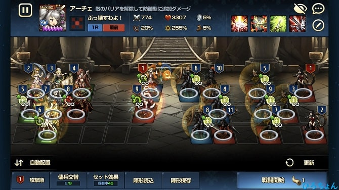

これが割と僕の鬼門になりました。
つまりバフをかけまくっている第一の要因なんですね。

4,6,8を倒しきれる火力が中々出ませんでした。

僕は改善として、こんなことしました。
<ul>
	<li>アーチェ：星5　⇒　星6</li>
	<li>ベロニア：+3　⇒　+9</li>
</ul>

<i class="fa fa-check" aria-hidden="true"></i>結果的に今のアーチェはこんなに火力でてます

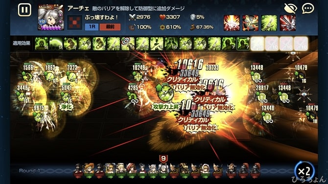

ベロニアの+値上げは中々にしんどかったですが、ワールドボスなどにも使えるので、コスパは良いです。

<h3 id="h-jump15">ギュンターで敵の1,2,3,5,7を壊滅</h3>

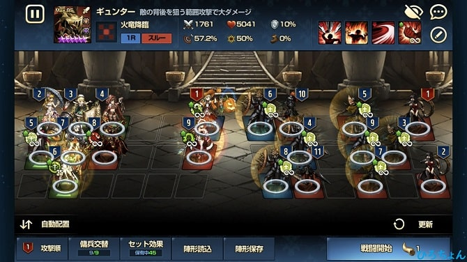

アーチェがかかっているバフをそのままギュンターが受ければ、普通に倒せます。

クリ率が上がりきらなかったので、片方はクリ率ルーンを付けています。

<i class="fa fa-check" aria-hidden="true"></i> 攻撃時のステータス、ダメージ量はこんな感じ。

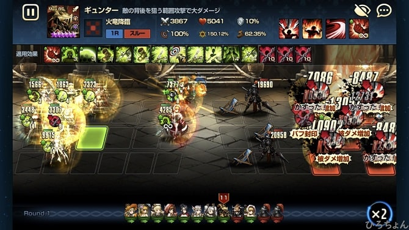

僕の友達君はコレットで代用できていたので、ギュンターを持っていない方はコレットを使ってみては…？

<h3 id="h-jump16">アンジェリカで敵の9を倒す</h3>

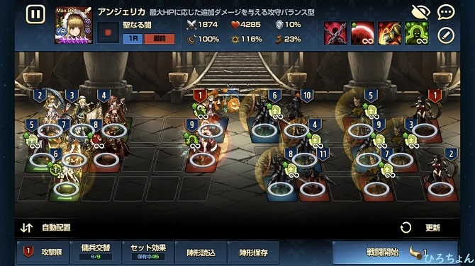

色々疑問に思っている方が多いと思いますので、詳しく解説します。

<h4>なぜアンジェリカなのか</h4>
このポジションがアンジェリカである理由は多々あります。
<ul>
	<li>デバフ免疫を持っている</li>
	<li>バフなしで火力が出る</li>
	<li>耐久出来る</li>
	<li>呪いを付与できる</li>
</ul>

どれも重要なことで、一つでも欠けるとこのパーティは全滅します。笑

一番重要なことがバフなしで火力が出ることで、次のお話に関わってきます。

<h4>なぜクリ率ルーンが２つついているのか</h4>

単純にクリ率を100%にするためなんですけれど、敵の9番がすごく耐久するんです。

こんな時にバフをかけるのですが、バフの効果範囲に入っていない。(Wave2にて、ボスの攻撃を避けるために一番前に配置してます。)

それで且つ余っている支援もいない…

これだと個体の力が必要となってくるわけで、アンジェリカを採用しました。

<h4>敵の9番を倒しきる理由</h4>

この9番が生き残ることで、アーチェやギュンターが敵のスキルによってバフ封印されてしまいます。

これによってバフがかからないので、Wave2にて敵を倒すことができなくなり、詰みます。

そこで僕の方法では、9番は倒しきらなければいけない対象となるわけです。

<h3 id="h-jump17">残った10,11を倒して、次ステージへ！</h3>

注意なのが、敢えてベロニアを下段に置いている理由にあります。

敵の11番の攻撃を耐えることができるキャラクターが必須なんですね。

そこで支援型ベロニア。硬いです。

<h2 id="h-jump2">パターンに絶対勝てる編成例②</h2>

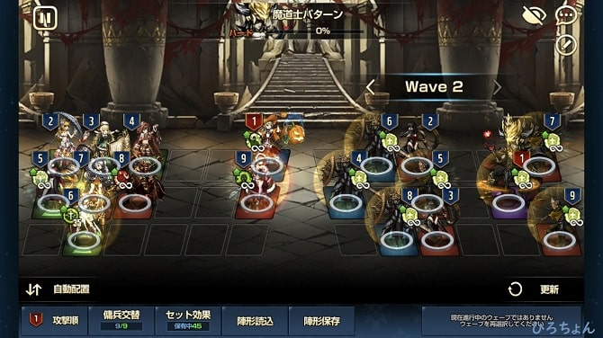

Wave2の解説始めますね～！

基本的に流れはWave1と同じなので、被っている所は端折ります。

Wave2の流れはこんな感じ。
<ol>
	<li>セイルで挑発</li>
	<li>アナイスでデバフ免疫付与</li>
	<li>バフをアーチェとギュンターにかけまくる</li>
	<li>アーチェで敵の4,6,8を確実に壊滅させる</li>
	<li><a href="#h-jump21">※ギュンターで7,9を確実に倒す</a></li>
	<li>アンジェリカで敵の5を倒す</li>
	<li><a href="#h-jump22">パターンに後列を壊滅させられる</a></li>
	<li><a href="#h-jump23">※セイルが敵の2番に攻撃することで、バフ封印を防ぐ</a></li>
	<li><a href="#h-jump24">『アンジェリカの呪い』と『セイルの烙印』でパターンを倒す！</a></li>
</ol>

<h3 id="h-jump21">ギュンターで7,9を確実に倒す</h3>

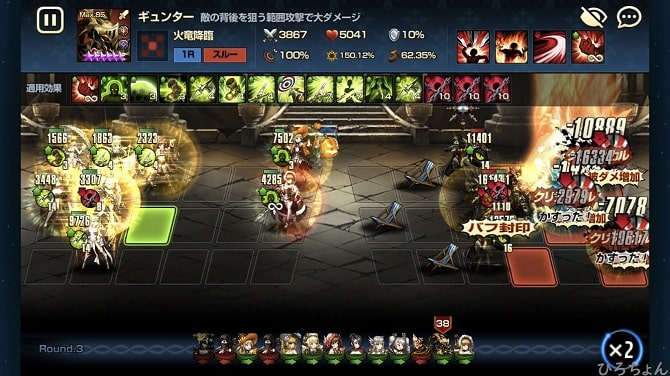

確実に倒さなければいけない理由は、セイルが敵の7番を攻撃してしまうと、バフ封印がかかってしまうからです。

セイルは『攻撃された時の即時回復』と『烙印で敵を倒した時に防御力を65%上昇』というバフを持っているので、封印をされると簡単に倒されてしまいます。

なのでスルー攻撃のセイルにとっては、確実に最後尾の敵を倒しておく必要がある訳ですね！

<h3 id="h-jump22">パターンに後列を壊滅させられる</h3>

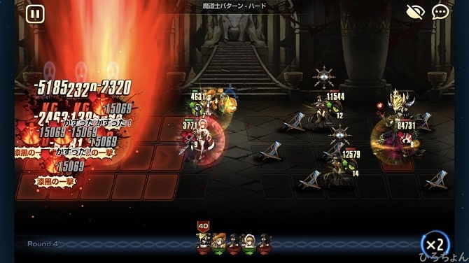

『安心してください。想定内です。笑』

ここでアンジェリカが巻き込まれると、パターンのHPを削ったり、『呪い』を効果的に使えなかったりするので、配置を最前列にしてます(/・ω・)/

<h3 id="h-jump23">セイルが敵の2番に攻撃することで、バフ封印を防ぐ</h3>

すでに『<a href="#h-jump21">ギュンターで7,9を確実に倒す</a>』にて詳しいことを言ってしまったので、割愛させていただきます。

敵の2番は『洞察』と『会心の一撃』しかスキルをもっていないので、攻撃してもバフ封印はされません( *´艸｀)

<h3 id="h-jump24">『アンジェリカの呪い』と『セイルの烙印』でパターンを倒す！</h3>

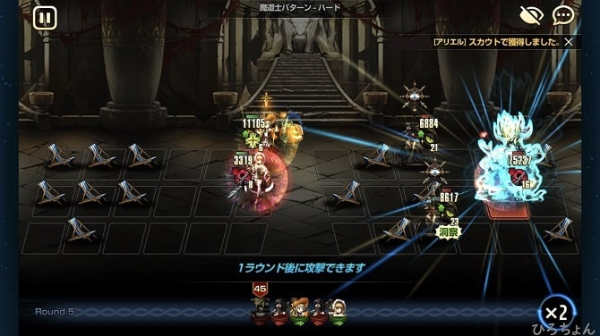

ついにやってきました。最終局面ですね！

残党が2体ほど残っていますが、セイルの烙印でサヨナラバイバイできます。

パターンはHPが9万ほどあるので、少しはアンジェリカで削りたいところですね。

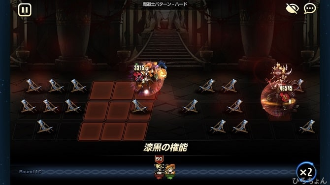

アンジェリカの『攻撃』と『呪い』、セイルの『烙印』と『呪い』でここまできました！

そしてそして～～

『やった！』

<h2 id="h-jump3">パターンのダメージ量や報酬</h2>

最後に僕のキャラたちの総ダメージ量や共同討伐のハード報酬はどれくらいもらえるかなど載せておきます。

<h3>総ダメージ量はなんと…</h3>

アーチェがものすごい事になってますね。笑

アーチェに関しては『代替不可能かなぁ』と思ってますね。

<h3>報酬はこんな感じ</h3>

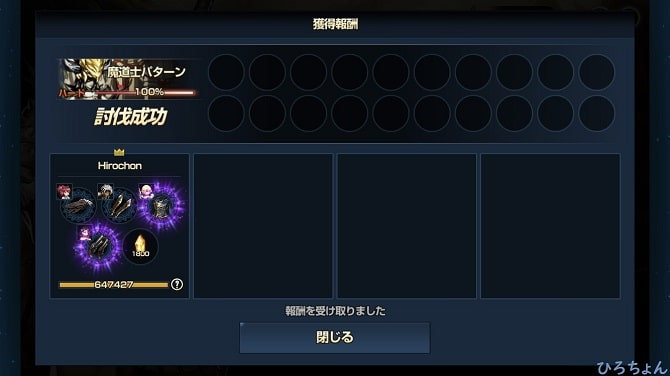

見やすくリストにすると
<ul>
	<li>魂の破片×1800個(確定)</li>
	<li>魂装備×4個(確定)　←　装備のレア度はランダム</li>
</ul>

一日につき協同討伐は4回挑戦することができるので、1日につき7200個の破片をゲットできる計算になります！

最後まで読んで頂きありがとうございました。

気づいたこと、記事の感想、この文章おかしい…などなどございましたら、<a href="/contact-form/">お問い合わせページ</a>にてお問い合わせください。

最後にTwitter(@heacet43)フォローとかこのサイト(https://heacet.com)をお気に入りにしてくれると嬉しいなぁ…笑