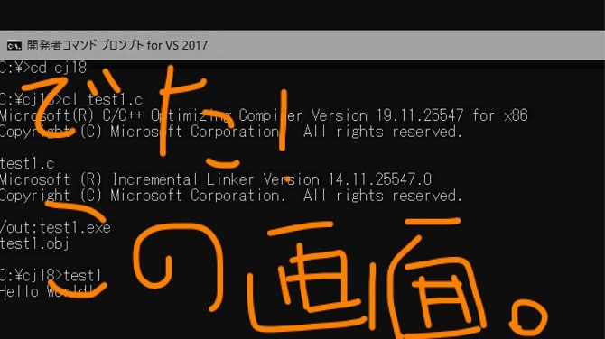

ひろちょんです！こちらはプログラミング講座になります。なんだか恥ずかしくて、初投稿をゲームの方に捧げちゃいました(笑)

↓↓リンクを申し訳なさげに貼っておくので、よかったら！
[【黒い砂漠Mobile】序章:なんかランキング上位やったけど、結局どない？『おもろいで。』](https://heacet.com/black-desert-part0/)

さてさて、本当はこちらをメインでやりたかったんです（笑）。これまで大学で学んできたものをどのように形にしていくのか、形になっていくのか、楽しみながら記事を書いております！

私は大学で初めてプログラミングに触れたのですが、**C言語で1年もかけました**。一体何をしていたんでしょうか…？

さて、今回の目次となります。

1. [なんで初のプログラミング言語はC言語なん？](https://heacet.com/c-course0/#h-jump1)
2. [C言語の講義では何を習っているの？](https://heacet.com/c-course0/#h-jump2)
3. [大学生がC言語を学んでよかった理由(学んだ側の意見)](https://heacet.com/c-course0/#h-jump3)
4. [C言語学んでみませんか？](https://heacet.com/c-course0/#h-jump4)

<h2 id="h-jump1">なんで初のプログラミング言語はC言語なん？</h2>

なぜかと言われれば、C言語が必修科目なので仕方なかったのです（笑）。ですがそれをふまえて、最初に学ぶべき言語は**C言語**と私はオススメします。（個人的意見です。）

他にもたくさん言語はあります。そして自分の立場で学ぶべき言語は当然変わってきます。なので他の言語と比較したい方は[こちらのサイト](https://eng-entrance.com/programming-recommend)を御覧ください。

プログラミングの入門でC言語を学ぶメリットとして以下が挙げられます。

- C言語さえ習得すれば、他の言語も容易に習得できる。
- 基礎的な言語なので、コンピュータの理解が進む。
- サンプルコードが豊富にある。
- ポインタという分野がある。

### C言語さえ習得すれば、他の言語も容易に理解できる。

他の有名な言語は**全てC言語に影響されています**。なんならPythonやPHP、RubyはC言語で書かれていて、影響を与え…というかそのものなのです！言語でのコードは違えど、中で動いているのはC言語なので、おのずと理解できるはずです。

### 基礎的な言語なので、コンピュータの理解が進む。
C言語は低レイヤーで動いているので、一つの動作をさせるのに多くのコードを必要とします。ソート（並び替え）は関数を使えば一発で実装できるのですが、C言語は文法が理解しやすく、実際に文字の比較によって、**よりハードに近い状態でプログラムを書くことができます**。そしてソートにも色々と種類があり、**場合に合ったソートを自ら実装させることができます**。

### サンプルコードが豊富にある。

歴史がとても深い言語なので、優秀な先駆者がたくさんおられます。詰まった時にはググれば改善方法がポンポン出てきます。（笑）

### ポインタという分野がある。

これがPythonにもJAVAにもないC言語の唯一無二と言っていい特徴です。ですが、めっちゃ挫折するポイントでもあります(笑)。簡単に言うと、**予め収納場所を指定して管理できる**って感じです。詳しい説明は将来このサイトでするつもりです。あ！ググったら記事はたくさんでてきます（笑）。

<h2 id="h-jump2">プログラミングの講義では何を習っているの？</h2>

一覧としてあげれば以下のことです。

1. 定数、変数、データ型
2. 標準入出力、演算子
3. 分岐(ifなど)、繰り返し(for,whileなど)
4. 標準関数
5. 関数
6. 記憶クラスと範囲
7. 配列
8. ポインタ
9. 構造体と共用体
10. ファイル処理
11. プリプロセッサ（と分割コンパイル←習ってない気がする）

このような感じです。これを**1週間に3時間半前期後期（実質8か月）**勉強していました。

もちろん試験のためにも勉強したので…つまりですね。まあまあ勉強してます!

独学と大学で習うことを比較すると、知識を得れる機会の差もあると思いますが、**単純に勉強時間が長いという要因もあります。**

<h2 id="h-jump3">C言語を学んでよかった理由（学んだ側の意見）</h2>

見出しにもある通り、**本当に学んでよかったと思います**。そりゃあC言語は難しかったですよ(笑)。ですが！**C言語の習得後、本当に他の言語が頭にスルッスル入ってきます**。どの言語も元が似てるんですねー。書き方がちょっと違うだけです。

いまちょうどウェブやPythonを勉強しているのですが、Pythonのライブラリには驚かされました。算術的に計算しやすくなっている面があって、これがAIに向いていると所以かと、まー感じれることがたくさんあります。

ひたすらにC言語を褒めちぎってみましたが、全て本当の事を書かせていただきました。ここまで書いてきましたが、ここに繋げたくて繋げたくてたまりませんでした！！！

いきますよ～？（元乃木坂46 1期生のひめたんVo）

<h2 id="h-jump4">C言語を学んでみませんか!?</h2>

Aさん: 「でも～、そのために大学行くのもなぁ～」

Nobさん: 「シンプルに時間がないんじゃあ～」

えちぜん鉄道さん: 「難しいらしいじゃん」

**『そのお悩み解決させていただきます！』**

大学へ行かなくてもサイトを見るだけで、大学の授業を受けたくありませんか？

私が大学で身に付けた知識をできるだけ細かくゆっくりと段階を踏んで、伝えていこうと努力していきます。

ただ僕の経験上、ひたすら演習を繰り返して身についたので、演習問題をやっていただくなど、見る側にも努力をしていただく予定です！これから共に頑張りましょう！！

## 次回はプログラムのコンパイルと実行についてどす！！

お楽しみに～～。

↓次の記事を読まれる方はこちら↓
[【C言語講座】1章　独学でプログラミングを始めたい『開発環境を整えよう！』](https://heacet.com/c-course1/)

PS.自分の文章力のなさに日々苦しめられています…笑

ちなみに途中で突然出てきたひめたんは元乃木坂の子です！乃木ネタついつい出ちゃいました笑

お見苦しい記事だったかもしれませんが、これから改善できたら…と思います！気になることがございましたら、コメントの方を送っていただけると幸いです。

また会いましょう～