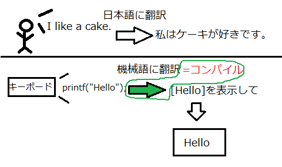
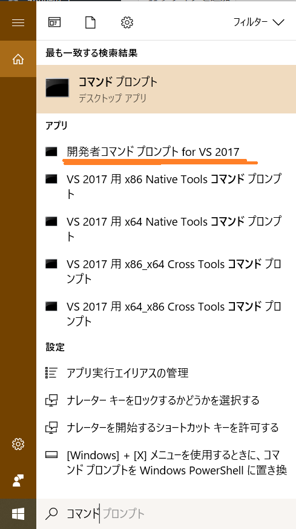
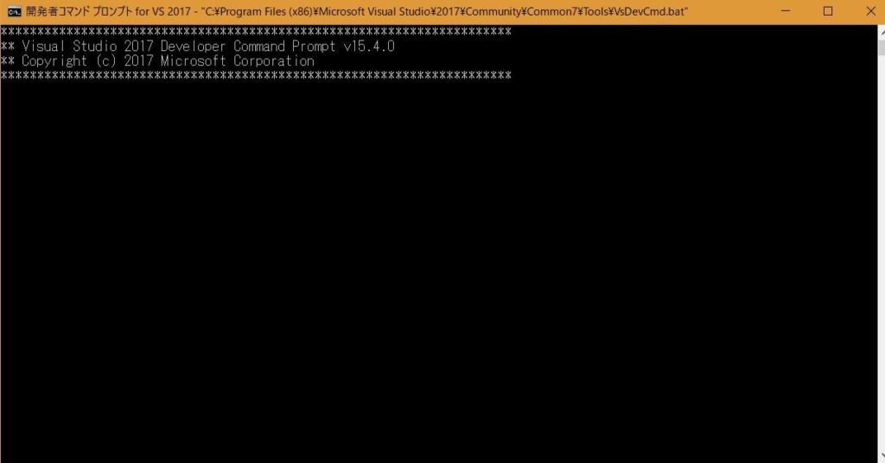

ひろちょんです！
このごろ早寝早起きという目標を達成するために、生活改善中です！

---
さて！どうもです！（挨拶２度目ですね笑）

今回は未来のプログラマーである方が絶対考えるであろう疑問を解決していきます。

それは…

**「プログラミングしたいけど何から始めればいいの！？」**

もう今の時点で答えちゃいます！『開発環境を整える！』です！

さて、今回の目次ですー

1. [開発環境ってなに？](/c-course1/#h-jump1)
2. [自分に合った開発環境を選ぼう！](/c-course1/#h-jump2)
3. [出た！黒い画面やつ( *´ 艸｀)](/c-course1/#h-jump3)
4. [今回の課題](/c-course1/#h-jump4)

<h2 id="h-jump1">開発環境ってなに？</h2>

【開発環境】とは…

- 簡単に言うと→プログラムを書いて、実際に使えるようにするための**道具箱**
- 詳しく言うと→ソフトウェアを開発するにあたって必要となる**テキストエディタコンパイラ**、**デバッガ**などの機能を備えた**総合的な開発支援ツール**

詳しいことを理解するのは必要ありません！

なにせ使っていくと自然にわかる言葉たちなので、今は理解しなくても構わないということです。（経験談）

１回生初期の私: **『よっしゃ！全部ググって理解してやろ！！…（５分後）…(-_-)zzz』**

とまあ、概観を掴まずにいきなり理解するのはとても難しかったです。

ですがご安心ください！言葉の理解に関しては、後で嫌でも理解してしまう程使います（笑）。

先に開発環境の機能の一つであるコンパイルのことだけ少し触れておきます。

イメージで説明をすると…

コンパイルとは、例えを挙げるなら、**機械が理解できる言葉に翻訳をする**ということです。ですが、**何を何に翻訳するんだ**って感じですよね。

↓そこで、一般例とコンパイルとの翻訳を比較する図を作ってみました↓

緑色で囲んでいる部分によって、自分で打ったコード【printf(“Hello”)】を**コンパイル【機械語に翻訳】している**ということになります。

ただ単に英語のコードを打っただけでは、**プログラムは動きません**。しっかりと **「機械が理解できるものに翻訳する」** という手順を踏み、**プログラムは動く**わけですね！

つまり、通訳さんが外国語を日本語に通訳するという行為はコンパイルをする動きに非常に似ているわけです！

このようなプログラムを実装させる時に必須な機能を様々兼ね備えているのが開発環境というわけです。

<h2 id="h-jump2">自分に合った開発環境を選ぼう！</h2>

**C言語やC++はプログラムを実行する際に必ずコンパイルを行います。**

ですがコンパイルを行わない言語もあります(Pythonなど)。

**『つまり学ぶ言語によって用いる環境が変わってくる訳ですね～』**

↓もし学ぶ言語を迷っている方はこちらの記事も参考にしてください。↓

[0章　理系大学で習うプログラミングってどんなの？『基礎を学べる！』](/c-course0/)

ではでは、ついに最大の疑問を具体的に解決させていただきます。

悟くん: **「オラはC言語勉強してーんだけど、どーすりゃいいんだ？」**

私が実際に大学の授業で使っているのは、不動の圧倒的人気を誇る**VisualStadio**ですね。俗にいうVSというやつです。

こちらはコンパイルを行うコンパイラが非常に使いやすく、中でも**プログラムのコードを実際に書いていくテキストエディターは機能面で最も優れていると言われてたりします**。**もちろん無料なのでご安心ください。**（有料版もありますが、無料で十分すぎます。）

インストールに関しては以下のサイトなどを参考にすればうまくいくと思います。インストールに時間がかかるので、インストールしながら記事を読んじゃったら、効率がいいかもしれません！笑

- [Visual Studio のインストール | Microsoft Docs](https://docs.microsoft.com/ja-jp/visualstudio/install/install-visual-studio?view=vs-2017)
- [WindowsでのC言語の開発環境（Visual Studio Express）](https://gabekore.org/windows-c-visual-studio-express)

ただし、VSは起動に時間がかかります。サクサク動く方がいいという方は、さくらエディターというテキストエディターをインストールして、windowsのコマンドプロンプトを用いたコンパイルの方法もあります。

こちらのサイトではVSを使っていくので、サイトに沿ってC言語を学ばれる方は、VSをオススメします。

<h2 id="h-jump3">出た！黒い画面やつ( *´艸｀)</h2>

ついに出していきましょうか！プログラミングしてるっぽいやつ！笑

ちなみに、昔にブラッディマンデイというドラマを見ていた方いらっしゃらないですかね…？

あの時、黒い画面をカタカタしてましたねー。多分これっぽいのをいじってたのかな？？

VSをインストールできた方は、パソコン内で検索すると下のような一覧が出てくると思います。

まずこちらの **【開発者コマンドプロンプト for VS 2017】**を右クリックして、**タスクバーにピン留めをする**を押しましょう！

そしてクリックしちゃってください！！

黒カッコイイやつが出てきたらオッケーです。

少し待ってればピョンピョンとなにか出てきます。←ここまで来て成功です！！

<h2 id="h-jump4">今回の課題</h2>

VSのインストールにかなり時間がかかったんじゃないでしょうか？

私がインストールしたときはかなり時間がかかった記憶があります。

インストールしてる時間って何故かしんどいですよね～笑

今回はその間にコマンドプロンプトについて調べて頂けたらと思います。

次回、実際にコマンドプロンプトを使っていくのですが、**コマンドプロンプト**だけに**コマンド**を使わなければいけません。その中でも、**【cl】**と **【cd】**をよく使います。こちらのコマンドについて、もちろん私も解説するつもりですが、どのような役割をしていくのかを少しでも多く知って欲しいです。よろしくお願いします。

↓次の章へ↓

[【C言語講座】２章前編:Cドライブの使いやすさ。ディレクトリとは？【開発者用コマンドプロンプト】](/c-course2-1/)

---

読んでいただきありがとうございました。今回は自作で図を作ってみました。わかりやすくなりましたかね（笑）。

気が付いたこと、間違っていることなど至らない点がありましたら、気兼ねなくコメントまたはお問い合わせください。

また、会いましょう～