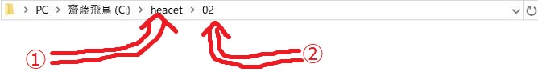

こんちゃっす！ひろちょんす。

わたくしただいま季節の変わり目をすごい感じています。

- サクラが綺麗
- 風邪で喉が痛い
この２本立てとなっております。

嬉しいような、つらいような．．．笑

---

今回はですねー！

ついに！

やっと！

**プログラムが動いているところが見れます！**

やはりプログラミングを始めるめるための準備が多かったり、ファイルの保存先→**【作業ディレクトリの移動】**で躓いたり、などなど**プログラムに触らず挫折してしまう方が多い**と思います。

ですが！しっかりと一から説明いたします(/・ω・)/

なにせ**例の黒い画面【コマンドプロンプト】**の使い方を身に付ければ．．．

**プログラムが動かせちゃいます！！！！！**

ここで前回でチョイ出ししました【**cd**】【**cl**】が関係してくるわけっす！

今回のモクジデスー

1. [わかりやすい場所にディレクトリが欲しい！](https://heacet.com/c-course2-1/#h-jump1)
2. [Cドライブにフォルダ【heacet】を置こう](https://heacet.com/c-course2-1/#h-jump2)
3. [パソコン内での整理や名づけのお話](https://heacet.com/c-course2-1/#h-jump3)

<h2 id="h-jump1">わかりやすい場所にディレクトリが欲しい！</h2>

はい。笑

いきなり新単語出てきましたね。笑

『**ディレクトリ**』とはなんぞや！

安心してください。ちゃんと解説してまいります(/・ω・)/

### ディレクトリ=フォルダ？

プログラミングという世界にいたら、ディレクトリという言葉は目にしたことはあると思いますが、一体何なんだ．．．

つまり、『**フォルダを指しています**』何かの書籍に登場するかもしれないので、一応触れておきました。笑

厳密には違う意味らしいですが、難しいことを考えず同じ意味だと思っていただいていいです。

『ディレクトリと言ってみるとカッコいいですよね…笑』

### なぜディレクトリ（フォルダ）の話をしたのか

なぜ急に出したかというと、前回で言葉の意味を紹介したのですが、コンパイルを行う際にフォルダを指定しなければいけません。

コンパイルの意味が分からない方は↓をご覧ください。

[【C言語講座】1章　独学でプログラミングを始めたい『開発環境を整えよう！』](https://heacet.com/c-course1/)

かみ砕いて説明すると、前回の最後に出てきたコマンドプロンプトに **『このフォルダでコンパイルするわー』** と伝える過程が必要ということです。

そこでもし、フォルダの場所を複雑でわからない所に置いてしまうと、コマンドプロンプトにフォルダの場所を伝えることが難しくなってしまいます！

<h2 id="h-jump2">Cドライブにフォルダ【heacet】を置こう</h2>

またまた出てきちゃいました！新単語！

解説していきまー！

### Cドライブとはなんぞや。

名称の由来は、AドライブとBドライブが元からあって、『**じゃあ次はCドライブやな！**』みたいな感じでした笑

Cドライブの働きとしては、**パソコンに何かを保存するとなった時、Cドライブのどこかに保存されます**。

例えば、何かをネットからダウンロードすると、初期設定では**ダウンロードというフォルダに保存されます**。

このダウンロードというフォルダはどこにあるかというと、Cドライブ＞ユーザー＞ユーザー名＞ダウンロードとなり、**Cドライブ内にあります**。

次にピクチャというフォルダは、Cドライブ＞ユーザー＞ユーザー名＞ピクチャとなり、これも**Cドライブ内ですね**。

**Cドライブはどのファイルを得るにしても、絶対に最初に通る入り口なんです！**

さてさてさーて、先ほど説明した絶対にわかりやすいフォルダの場所といえば、もうわかりますよね…？笑

### Cドライブにフォルダ【heacet】を作ってみよう！

自分でCドライブを開ける方は、今までの説明は全ていらなかったんですが（笑）。

さあCドライブってどうやって開きましょうか。色々方法はありますが、どうせなんで**コマンドプロンプトを使ってみましょう！！**

**開発者用コマンドプロンプト**を起動してください！

黒い画面が出てきて、文字が打てるようになったらまず↓図１の下線部のようにstart c:と打ってください。（※今は>の左側が違っても問題はありません。）

```bash
C:\Users\(ユーザー名)\source> start c:

C:\Users\(ユーザー名)\source>
## 図1 (下線はキーボードからの入力)
```

1. 急にフォルダが開いたと思いますが、そちらが俗にいう**Cドライブ**でございます。
2. そこででフォルダを新規作成して、名前をheacetとしてください。
3. 次に作成したheacetをダブルクリックして、heacet内で02という名前でフォルダを新規作成しましょう。

それが完了して、02フォルダを開くと↓このようなパスになっていると思います。
※ひろちょんは乃木オタです。



Cドライブって名前変えれるんですよ！知ってました？？
※Cドライブの名前を変える必要はないです。笑

<h2 id="h-jump3">パソコン内での整理や名づけのお話</h2>

これからプログラミングを勉強するにあたって、必ず気を付けてほしいことなので、少し触れておきます。

聞いちゃいマス！

**『過去に保存したファイルやフォルダはどれが何なのかわかりますか？』**

この質問をした理由は２つあります。
1. プログラミングの効率化につながる。
2. コードは他人に見られても大丈夫なものに（笑）

### プログラミングの効率化につながる。

パソコン内での整理整頓の質問をしましたが、しょーじきパーソナルな物なので、あくまで個人の自由です！

ですがパソコン内でフォルダをぐちゃぐちゃにしている方は、**プログラミングでもぐちゃぐちゃにしがち**です。プログラミングにおいて１つ１つの塊にそれぞれ処理を与え、結合させてプログラムを作り上げていくのですが、一つ一つが何なのかがわからなかったら、**いちいち遡って調べなければいけません**。もちろんその分ミスも増えます。（教授談）

そこで！

**１つ１つの塊にそれぞれの役割を指すキーワードを名前に入れて置いたら、わかりやすいですよね！**

なので！後悔する前に！プログラミングを一から修正しないように！名づけを自分にとってわかりやすいものにしましょう。（※辛い経験アリ）

### コードは他人に見られても大丈夫なものに（笑）
パソコンは自分の物ですので、色々な名前で色々なものが保存されているでしょう。笑

ところがコードは自分のパソコンで書いていても、基本的に自分のためには書かないんですよね。それはソフトをクライアントのために作るとか、プログラミングの試験であれば、先生に見てもらいますよね。やはり将来的にプログラミングに関わっていくなら、**自分でしか読めないコードを書くのはナンセンスである**と考えます。

そこで**他人にも読めるコードを書くことを意識していれば、自分にとってもわかりやすいコードとなっていく**ので、その心がけは必要だなと感じます。

## すみません！コンパイルと実行は後編で書いています！

ゲームブログの方もそうだったのですが、想像以上に記事が長くなったので後編を使ってみます！

完成したらリンクを↓に貼るので是非見て頂けたら嬉しいです。

[【C言語講座】２章後編:VisualStudioを使ってコンパイルをする！【コマンドcdは簡単にできる！】](https://heacet.com/c-course2-2/)

ではでは～