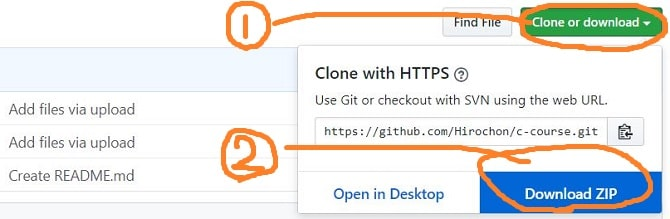
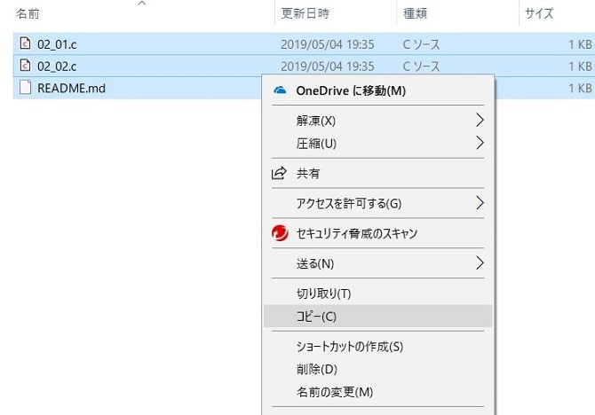
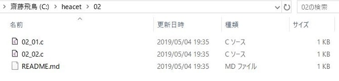

どーもです！前回の続きをやっていきます！

↓前編は「**コンパイルをする**」に向けて**ディレクトリの使い方をまとめています**。まだ見ていないという方はこちら～↓

[【C言語講座】２章前編:Cドライブの使いやすさ。ディレクトリとは？【開発者用コマンドプロンプト】](/c-course2-1/)

さてさて、待ちに待った実行です！正しくコンパイルできるのかもワクワクします！

後編でのモクジデスー

1. [テキストエディタでプログラムを開いてみる](/c-course2-2/#h-jump1)
2. [プ．．．プログラム！実行！！！](/c-course2-2/#h-jump2)
3. [今後めっちゃくちゃ使うであろう【cl】さん](/c-course2-2/#h-jump3)
4. [【課題】自分で一からやってみよう！](/c-course2-2/#h-jump4)

<h2 id="h-jump1">テキストエディタでプログラムを開いてみる！</h2>

さあプログラムの中身をテキストエディタ（Visual Studio）を使って見てみますよ！

### Cファイルをダウンロードしよう！！

今回は拡張子（ファイルの右側についてる○○.zipのzip部分）が.cであるCファイルを開きたいです。なので**Githubを用いてCファイルをダウンロードしていきます**。先にダウンロードの説明をしておきますね！

下に貼っているリンクを押すと、Githubのページへ飛ぶので、↓図の **①→②の順番でボタンを押して、フォルダを保存してください！**
※講座が進めば、ファイル数も変わってくるので、ファイル数は気にしないでください。

[C言語講座のCファイル一覧(Github)](https://github.com/Hirochon/c-course)



こちらのZipファイルがダウンロードできたら、解凍してくださいね。そして前回説明した02ファイルの方へコピー＆ペースト（貼り付け）してください。コピーの方法はファイルをドラッグやshiftキーなどを使って複数選択して、↓図のようにコピーを押してください。**※アイコンが図のようになってない方は、設定方法を後で説明するので、そのまま続けてください。**



最終的に↓この形ができたら完成です！！



### こ…これがC言語…！？

実際に`02_01.c`ファイルを開くのですが、アイコンが違う方はVisualStudio(以降VSと省略します)で開けないので、**ファイルを右クリック**して、**プロパティを押してください**。すると**変更というボタンがあるので**、**VSを選択して適用を押してください。**
設定も終わったところで、02.01.cファイルを開いてみてください！！

これがC言語のソースコードになります！！！これを今後の講座にて一つ一つ理解していきます。ちなみにコードの難易度はスライム程度です。（笑）

ここでファイルの保存方法を説明しておくと、**CTRLキー（コントロールキー）+ sキーを同時押しすると上書き保存をすることができます**。また名前を付けて保存をする場合は、左上のメニューから保存することができます。

さああああ！最終局面です！コンパイルからの実行です！！

<h2 id="h-jump2">プ．．．プログラム！実行！！！</h2>

### 解き明かします【 **cd** 】とは、何か。

さて、忘れかけていたコマンドプロンプトさんを出してきてください。

ここでCドライブにフォルダを置いた意味が出てきます！↓の図1の下線部のように`cd C:¥heacet¥02`と入力してください。

```bash
C:\Users\(ユーザー名)\source\>cd C:\heacet\02

C:\heacet\02>
```

すると、**＞の左側**が変わりました！

何をしたかというと、**cd**を使って、先ほど`02_01.c`を保存していたフォルダ（c:¥heacet¥02）を作業するディレクトリとして指定しました。

この**cd**によって、いま『**私はCドライブのheacetフォルダの02フォルダで作業をするよー！**』と宣言したわけです。

cdは略語なんですが、そこまで調べた方はいらっしゃいますかね。笑

序盤で話した**ディレクトリ（フォルダ）**を、見た通りチェンジしているので、**cd**【**Change Directory**】をしているわけです。

<h2 id="h-jump3">今後めっちゃくちゃ使うであろう【cl】さん※小文字でシーエル</h2>

**ずばり言っちゃいますと、clを使ってコンパイルをするんです。**

ちなみにcompileのclではなく、【**Compile & Link**】の**cl**です。由来はググって理解できるならしてください！(※つまり理解しなくていいです)

↓の図2の下線部のように`cl 02_01.c`と打ってください。

```bash
C:\heacet\02>cl 02_01.c
Microsoft(R) C/C++ Optimizing Compiler Version 19.11.25547 for x86
Copyright (C) Microsoft Corporation. All rights reserved.02_01.c

Microsoft (R) Incremental Linker Version 14.11.25547.0
Copyright (C) Microsoft Corporation. All rights reserved.

/out:02_01.exe
02_01.obj
C:\heacet\02>
```

↑のような画面が出てきた方は…

**おめでとうございます！成功です！！！**

### あとは実行だけ！

下の図4のように`02_01.exe`だけを打ち込んでみてください。

```bash
C:\heacet\02>02_01.exe
Hello World!

```

上図3のように**Hello World!**と出てきたら成功です！

<h2 id="h-jump4">【課題】自分で一からやってみよう！</h2>

**演習の準備を整えるために、VisualStudioとコマンドプロンプトの右上の×を押しちゃってください。**

画面上から消えましたか？

それではテキストエディタとコマンドプロンプトを起動させて、こちらのサイトを見ながらでも構わないので、以下の問題を自分でやってみてください。

`02_01.c`と`02_02.c`のプログラムを見比べて↓のように『Hey Hirochon!』と出力する。

課題の実行例↓

```bash
C:\heacet\02>02_02.exe
Hey Hirochon!

```

ヒントは…

テキストエディタ(VS)を使ってソースコードをイジルことです！

↓コチラが次の記事になります！↓

[【C言語講座】3章前編:おまじないを理解しよう！『include〈stdio.h〉』『printf();』](/c-course3-1/)

---

お疲れさまでした～。最後まで見てくださりありがとうございました！

気が付いたこと、間違っていることなど至らない点がありましたら、気兼ねなくコメントまたはお問い合わせください。

『ではでは～、また会いましょう～』