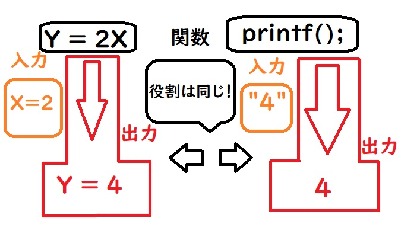

ひろちょんです～。睡眠6時間に対して、活動時間が18時間以上になりましたぁ～笑
なにもかもがずれていく日々です．．．

## いきなりですが、前回の問題と解答を載せておきます。

前回に配ったCファイルとVisualStudioで開いたときの表示されるプログラムを載せておきます。

[前回に配ったCファイルのリンクはこちら](https://github.com/Hirochon/c-course/archive/master.zip)

↓前回に配ったCファイルの中身
```c
#include<stdio.h>

int main(void)
{
    printf("\n");

    return 0;
}
```

『**このファイルをダウンロード、Visual Studio(以降VSと略します。)のテキストエディターにて編集、コンパイルを使って、Hey Hirochon!と出力してください。**』というのが前回の課題でした。

VS、ディレクトリの場所指定、コンパイルとは何かわからない方は、過去のC言語講座をご覧ください。↓↓

[C言語講座一覧](/tag/c-lang/)

今から課題をやるという方は、**上のCファイルをダウンロードするようにしてください。**※Visual StudioにてCファイル新規作成すると、ディレクトリ関係が面倒になるので薦めません。

↓こちらが答えになります。

```c
#include<stdio.h>

int main(void)
{
    printf("Hey Hirochon!\n");

    return 0;
}
```

正解は**VSのテキストエディター**を使って、printf(“¥n”);を**printf(“Hey Hirochon!¥n”);**に変えて、**上書き保存(CTRLキーとSキー同時押し)で保存**して、**Cファイルをコンパイル**、**実行**すればよかったんですね～。

**いやまてまて、知らない単語が多すぎるわ！**

それは．．．こいつらですかね！

- \#include<stdio.h>
- int main(void)
- printf(“\n”);
- return 0;

たくさんの方から『うん。それ。』を頂いたところで、解説します！！

> printf();の使い方を除き、今回の内容は魔法の言葉と説明されるもので、理解を省略させられる所になります。
> はっきり言って難しいので、現段階では読み飛ばして頂いても構わないと思います。

--- 

今回の目次です。

1. [これはいける！printf();の使い方！](/c-course3-1/#h-jump1)
2. [《ちょいムズ》プログラム冒頭の#include<stdio.h>](/c-course3-1/#h-jump2)
3. [後編:《難》int main(void)とreturn 0;とは](/c-course3-1/#h-jump3)

<h2 id="h-jump1">これはいける！printf();の使い方！</h2>


課題にて、printf(“¥n”);の中身を変えればいいと書いていました。

『待って。こいつら何？』って感じですよね。↓

- printf();
- ¥n

### printf();とは画面に出力！

**printf(“Hello World¥n”);**とVSのテキストエディターに書いて、**保存**→**コンパイル**→**実行**をすると、《**Hello World**》と出力されました。今回では**printf(“Hey Hirochon!¥n”);**と書いて、《**Hey Hirochon!**》と出力されました。

見比べてみると、””（ダブルクォーテーション）で囲まれている最後の場所で¥nが共についていて、書いている文章が違っていますね。

そうなんです！

**“○○○○¥n”**←この **○部分**にテキストエディターを使って、文章を入力すると、その **◯部分が出力されます！！**

先ほどのCファイルを使って、ファイル名は変えなくていいので、VSのテキストエディターにて編集をして、好きな文字を入力してみてください！！
※上書き保存と、コンパイルは忘れずに！

↓はコンパイルと実行の方法を忘れたという方はこちら。

[【C言語講座】２章後編:VisualStudioを使ってコンパイルをする！【コマンドcdは簡単にできる！】](/c-course2-2/)

### ところで¥nってなんだよ笑

引っ張ってしまいすみません。

ずばり！**改行**してるだけ！

本当にこれだけです。笑

ただこの改行はプログラムを書く上で、最後に必ず付いています。

AOJというプログラミングの問題集が載っている有名なサイトがあるのですが、こちらのサイトはプログラムの正誤判定機能が付いていまして、最後に¥nを出力しないと、正解を出してくれないんです。

つまり、『**プログラムの最後には必ず改行を入れてください！**』ということです。

### printf();は関数です。

ここで関数という言葉をすこし解説しちゃいます。
関数とは、数学で聞いたことがある方もいらっしゃると思いますが、そのとおりで、**与えられた値に対して何かを返すものです。**

1次関数だったらy=2xでxに2を代入すると、4が返ってきますよね。
それはプログラミングでも同じで、printf();も()内に与えられたものを、画面に出力で返します。

下図では、**printf();**の **()内**に **”4″を代入**して、**4を返しています**。



このように何かを与えるに対して、何かを返すことから、printf();を**関数**と呼んでいるわけです。(他にもscanf();やsqrt();など様々な関数があります。)

> ここからちょいムズになります。どのみち理解できますので、いま理解しなくてもいいやという方は飛ばしてください。

<h2 id="h-jump2">プログラム冒頭の#include<stdio.h></h2>


さて、プログラムを書く際に必ず#includeの文がついてますよね。

こちらの名称を先に書いておきますね。

- \#include　←　プリプロセッサ指令
- <stdio.h>　←　ヘッダファイル

### \#include

まずコマンドプロンプトでは、プログラムをコンパイルする前に、様々な処理を行うことができます。その処理を指示するために、**指示内容をソースプログラム内に書き込んでおく必要があります**。

またこの時の『**コンパイルする前の処理**』を**プリプロセス（前処理）**と言います。

またそのような**前処理を行うシステム**を**プリプロセッサ**と言います。

今回ではそのプリプロセスとして**include**という指示を出しているわけですね！


↓重要な点をまとめると↓

- \#→プリプロセッサで何かするで！
- include→ヘッダファイルを読み込むで！

さらっとincludeを出しましたが、**\#include**では、**ソースプログラムにて使用するヘッダファイルや他のソースプログラムをinclude(英訳:含める)します**。

使い方は`#include<ファイル名>`として、ファイル名と書かれたところにヘッダファイル名を書くだけです。

使いかたは簡単ですが、具体的な内容となると難しくなってくる。これが『**おまじない**』となってしまう要因な訳です。

### じゃあヘッダファイル<stdio.h>とは？

\#includeの説明を終えたところで、次はヘッダファイルについてです。

\#includeが<>を用いて、ヘッダファイルというのを読み込むものというのは伝わったと思いますが、ヘッダファイルはどのような働きをするのでしょうか。

上の課題では`stdio.h`を`include`しています。まず`stdio`というのは**standardなinput、output**を略したもので、日本語で言うと標準的な入力と出力という意味になります。

後ろの`.h`は**ヘッダファイルの頭文字**ですね。

この標準的な入出力を`include`することによって、先ほど説明した関数`printf();`が**使えるようになります**。

<br />

もう一度噛み砕いて説明すると、`printf();`を使うためには、**`stdio.h`を`include`する必要があります。**

もし`stdio.h`を`include`していなければ、コンパイル時にコマンドプロンプトに『**え？`printf();`ってなに？**』と言われて**エラーが出てしまいます。**

**わかりやすく例え話で解説！**

小学校の授業を受けに行くときには、カバンに`<筆箱>`や`<給食セット>`を **\#準備して**持っていきますよね！
そして授業を受ける時には、**`<筆箱>`から`鉛筆();`と`消しゴム();`**を取り出して使います。
給食を食べる時には、**`<給食セット>`から`お箸();`や`フォーク();`**などを取り出して、食べますよね！

つまり **`鉛筆`という関数を使うため**には、**`鉛筆`が収納されている`筆箱`というヘッダファイルが必要**となります。また**筆箱を持っていくには**、**筆箱を準備するというincludeすることが必要**なのです！

まとめのプログラム面へ行きますね。

```c
#include<stdio.h>　//←関数printf();を使うためにstdio.hをinclude
int main(void){
    printf("おっす。\n"); //←stdio.hをincludeしたことから使用可
    return 0;
}
```

<h2 id="h-jump3">少し疲れましたか？</h2>

ドリンク休憩をはさんでください。笑

それでは次は↓について！

```c
int main(void){
    return0;
}
```

後編に続きます↓↓

[【C言語講座】3章後編:おまなじないは誰でも理解できる『int main(void)』『return 0;』](/c-course3-2/)

---

最後まで見て頂きありがとうございました！

何か気になることなどありましたら、気軽にお問い合わせください。