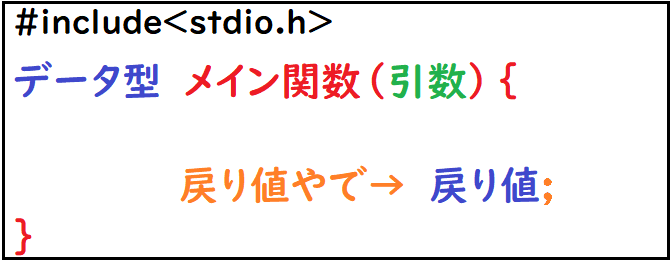
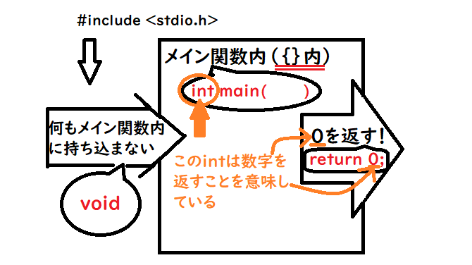

書籍や、授業でC言語を勉強していると急にこんな『**おまじない**』が出てきますよね？

```c
#include<stdio.h>

int main(void){

    return 0;
}
```

急に『**おまじない**』なんて言われてもモヤモヤしませんでしたか？

『僕はめちゃくちゃモヤモヤしました。』

これ実は超簡単で、

**《{ }外からは何も受け取らずに、{ }外に数字の０を返す》という動作をしているだけなんです。**

今回は **`int main(void)`**と **`return 0;`**について具体的に解説していきたいと思います。

それでは目次です。

- [おまじないではない。【役割がある】](/c-course3-2/#h-jump1)
- [わかりやすくプログラムの流れを見ていく](/c-course3-2/#h-jump2)
- [おまじない編のまとめ](/c-course3-2/#h-jump3)

<h2 id="h-jump1">おまじないではない。【役割がある】</h2>


先ほど示したプログラムの名前は**おまじないではなく**、**それぞれのプログラムに役割があります**。

※ \#include<stdio.h>は前回の記事にて説明しています↓

[【C言語講座】3章前編:おまじないを理解しよう！『include〈stdio.h〉』『printf();』](/c-course3-1/)

まずは以下の図をご覧いただきたいです。



おまじない達をそれぞれ日本語にしてみました(*´∀｀*)

上図にプログラムを関連付けるとこのようになります。

- \#include<stdio.h>　←　前回説明
- データ型　←　int
- メイン関数　←　main
- 引数　←　void
- 戻り値やで→　←　return ;
- 戻り値　←　0

これでやっと名前が、おまじないではなくなりましたね！（笑）ではでは！個々の役割を紹介していきます！

### データ型　int

ここでのデータ型とは、『**メイン関数内の戻り値にて渡す値のカテゴリをあらかじめ決める**』という役割を担います。データ型の詳しい話もまたしようと思いますが、数あるデータ型の中から今回は**戻り値としてint型（整数）を予約した**ということになります。

### メイン関数　main( ){ }

関数と言えば**何かを入力すると何かが返ってくるもの**と[前編](/c-course3-1/)にて解説しました。それは**メイン関数も同様**です。**引数を( )内に入力して、戻り値を返している**ものです。ただし普通の関数とは違って、**{ }内で命令の内容を変えられます**！
<br>
※( )と{ }の使い分けに注意！

### 引数　void

引数を設定する場所になります。<br />
ここでメイン関数内に持ってくる値を設定するのですが、今回では『**void**』となっています。これは『**引数として何も取ってこない**』ということを意味しています。<br />
そうです！**つまり何もしていない！**

### 戻り値やで→　return ;

これは戻り値を渡すための文になります。つまり『**returnの横に打っているのが戻り値です！**』とメイン関数に伝えるための文ですね！

### 戻り値　0

最初にデータ型を定義しましたよね？その**データ型（カテゴリー）内**で戻り値として値を与えてあげなければいけません。<br />
今回では**int型（整数）**だったので、『**整数である0を返した**』ということです。<br />
※整数なので１でも２でも構いません。

大体の意味は理解できましたかね。それでは実際にプログラムの流れを見ていきましょう！

<h2 id="h-jump2">わかりやすくプログラムの流れを見ていく</h2>


まずは下記の図をご覧ください。



それぞれのプログラムを赤字の吹き出しで指しています。とりあえず流れとしては、矢印の方向に進んでいくような感じです。

### プログラムの気持ちになって会話してみよう！

#### ⓪なんか準備せんでいい？

`include<stdio.h>`。（訳：**標準入出力のヘッダファイル欲しい。**）

#### ①戻り値でなにくれるの！？

`int`。（訳：**う～ん、整数系かなぁ**）

#### ②今から何するつもり！？

`main`。（訳：**メインの関数実行していくでぇ～**）

#### ③メイン関数内に引数いる？

`void`。（訳：**何もいりません。**）

#### ④メイン関数終わるけど、終わっていい？

`return`。（訳：**まって！いまから戻り値出すでぇ～～**）

#### ⑤整数系言ってたけど何くれるのかなぁ…

`0`。（訳: **せいすうのぜろあげる**）

#### もう一度ソースコードを見てみる！

```c
#include<stdio.h>

int main(void){

    return 0;
}
```

どうでしょうか！だいぶ馴染んで来たのではないでしょうか？<br />
やはり何も知らない状態で使うより、少しでもわかっている状態で使う方がいいですよね！

> プログラムの気持ちで会話することはできましたか？(笑)できたならもうあなたは正真正銘のプログラマーです！
> さて、これでおまじないという言葉を使わせないための説明は以上になります。まとめにいきますね！

<h2 id="h-jump3">おまじない編のまとめ</h2>

僕がこの前編後編で伝えてきたかったのは、おまじないを理解して欲しいということもありますが、多くは

**『ソースコード一つ一つに意味があり、何らかの処理をしていることを感じ取ってもらう』**

ことにあります。<br />
C言語の良さというのは、**一つ一つの処理を細かいところまで命令できること**です。これによって**無駄な処理を省き**、プログラムの**高速化**が図ることができます。ですがこの良さを引き出すためには、**ソースプログラムの一つ一つの理解が非常に重要**となってきます。一つでも理解を省いてしまうと、あとに響いてきて、ズラズラっと崩れてきてしまいます。<br />
なので！ソースコード一つ一つに対して『**これは何を意味するのかな？**』ということを常に考えながら、これからも学んで欲しいと思います。

---

最後まで見て頂きありがとうございました！<br />
何か気になることなどありましたら、気軽にお問い合わせください。