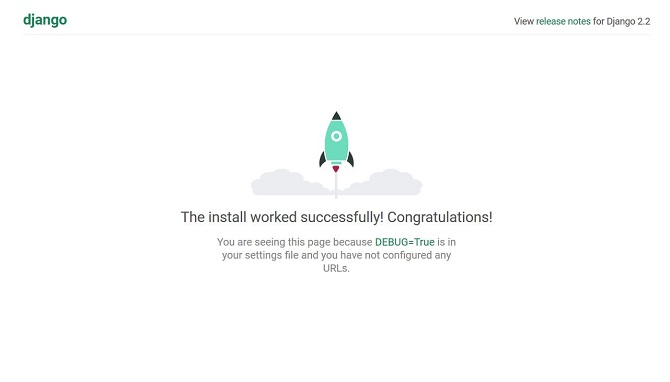

※筆者は現在コチラの環境は使っていません！

こんちゃっす。ひろちです。

**Python**の**フレームワーク**で現在最も使われてると言われている『**Django**』を用いて、**初心者**が**ローカルサーバ**を起動させるまでの記事です！

今回は初心者を抜け出せた(と思っている)ひろちが『**初心者目線**』且つ『**全体像はわかっている**』という二つの視点で発信していきたいと考えています。

前提条件として↓コチラが整っている条件としています。

- OSはWindows10
- ディレクトリとは何かわかる ⇒ [わからない方はコチラ](/c-course2-1/)
- テキストエディタはVisual Studio Codeを使用
- Anacondaが使用可能 ⇒ [ダウンロードしてない方はコチラ](https://www.sejuku.net/blog/59340)
- Anaconda Promptを開ける
- 仮想環境の名前はmyspaceで作成
- 仮想環境内にDjangoパッケージをダウンロード済み(version:2.2.6)


では今回の目次です。

1. [仮想環境をアクティベートしよう！](/django-1/#h-jump1)
    - [ショートカットを設定](/django-1/#h-jump11)
    - [ディレクトリに移動＆アクティベート](/django-1/#h-jump12)
2. [Djangoプロジェクトを作成](/django-1/#h-jump2)
3. [Webアプリを実行してみよう！](/django-1/#h-jump3)
    - [Djangoでローカルサーバを起動](/django-1/#h-jump31)

<h2 id="h-jump1">仮想環境をアクティベートしよう！</h2>

仮想環境を使うには**NavigatorでAnaconda Promptを開く**か、**Anaconda Promptからコマンド入力するか**の二択になります。

<h3 id="h-jump11">ショートカットを設定</h3>

Navigatorから開く方がカチカチするだけなのでわかりやすいですが、イチイチNavigatorを開くのが面倒なので、僕は**Anaconda Promptをショートカットでデスクトップに配置していつでも開ける**ようにしています(´艸｀*)

度々開くことになるので、『**Anaconda Prompt**』と検索してコピー⇒分かりやすい場所に置いておくことをオススメします。

<h3 id="h-jump11">ディレクトリに移動＆アクティベート</h3>

これから**Djangoプロジェクト**を作成していくわけですが、作成する場所までディレクトリを移動しておきましょう！

ちなみに僕の作成する場所はDesktop下のPythonフォルダの下に作っているので、こんな感じ↓

```bash
(base) C:\Users\ユーザ名> cd desktop\python
(base) C:\Users\ユーザ名\Desktop\Python>
```

そして作成済みの仮想環境をアクティベートします！

僕の仮想環境名はmyspaceなので、↓こんな感じ。

```bash
(base) C:\Users\ユーザ名\Desktop\Python> activate myspace
(myspace) C:\Users\ユーザ名\Desktop\Python>
```

左側のカッコ内が変わりました！

<h2 id="h-jump2">Djangoプロジェクトを作成</h2>

それでは早速**Djangoプロジェクト**を新たに作成していきます！

プロジェクトとはその名の通り、様々なプログラムを総括する名前みたいなもので、そのWebアプリの名前でも付けると良いでしょう。

僕の場合はサイトから名前を取って、『**heacet_app**』にしておきます。笑
なのでこんな感じ↓

```bash
(myspace) C:\Users\ユーザ名\Desktop\Python> django-admin startproject heacet_app
```

作成できているかどうか実際にフォルダを開いて、確認してみましょう！

あれば成功です。

<h2 id="h-jump3">Webアプリを実行してみよう！</h2>

早速Webアプリを実行していきましょう。

Anaconda Promptにてプロジェクトのディレクトリに移動しましょう。

僕の場合はこんな感じ↓

```bash
(myspace) C:\Users\ユーザ名\Desktop\Python> cd heacet_app
(myspace) C:\Users\ユーザ名\Desktop\Python\heacet_app>
```

<h3 id="h-jump31">Djangoでローカルサーバを起動</h3>

なんとDjangoではローカルサーバを起動させる機能が備わっていて、非常に便利でございます。笑

以下のコマンドでローカルでWebサーバを起動させていきましょう！

```bash
(myspace) C:\Users\ユーザ名\Desktop\Python\heacet_app> python manage.py runserver
Watching for file changes with StatReloader
Performing system checks…

System check identified no issues (0 silenced).

You have 17 unapplied migration(s). Your project may not work properly until you apply the migrations for app(s): admin, auth, contenttypes, sessions.
Run ‘python manage.py migrate’ to apply them.
October 19, 2019 – 10:54:33
Django version 2.2.6, using settings ‘heacet_app.settings’
Starting development server at http://127.0.0.1:8000/
Quit the server with CTRL-BREAK. 
```

**ローカルサーバ**の起動に成功すれば、↑このような画面が出て来ます。

ブラウザにて『http://localhost:8000/』にアクセスして、↓の画面が出てきたら成功です！



## まとめ

お疲れさまでした。

今回はローカルサーバ起動までを解説しましたが、『成功したよ！』というDjangoページが出てきた時はうれしかったですね。笑

また『Djangoをまだまだもっと学びたい！』という方はコチラの本がオススメです↓

[Python Django 超入門](https://af.moshimo.com/af/c/click?a_id=1597531&p_id=170&pc_id=185&pl_id=27060&r_v=&s_v=&url=https%3A%2F%2Fwww.amazon.co.jp%2FPython-Django-%25E8%25B6%2585%25E5%2585%25A5%25E9%2596%2580-%25E6%258E%258C%25E7%2594%25B0%25E6%25B4%25A5%25E8%2580%25B6%25E4%25B9%2583%2Fdp%2F4798054488)

こちらで僕も勉強しているので、『初心者だけどDjangoを始めたい！』という方にはもってこいの本ですね！

次はテキストエディタを用いて、実際にコードを書いていきたいと思います。記事ができたので、↓にリンクを貼っています(‘ω’)ノ

[【Django】初心者がviews.pyとurls.pyを解説！『2日目』](/django-2/)

---

最後まで読んで頂きありがとうございました。

気づいたこと、記事の感想、この文章おかしい…などなどございましたら、[お問い合わせページ](/contact-form/)にてお問い合わせください。

ついでにTwitter([@heacet43](https://twitter.com/heacet43/))フォローとかこのサイト(https://heacet.com)をお気に入りにしてくれると嬉しいなぁ…笑
