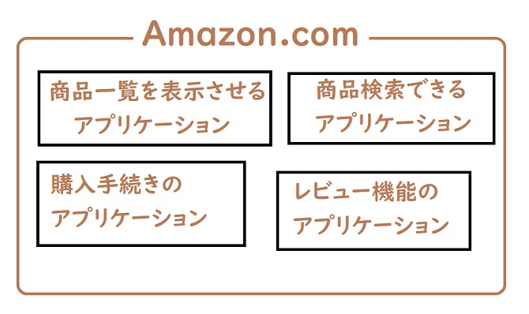
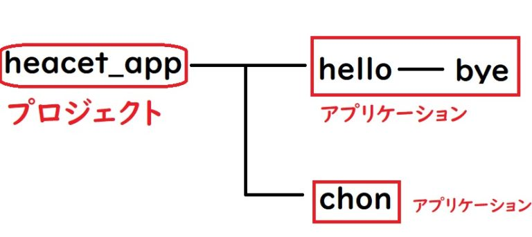
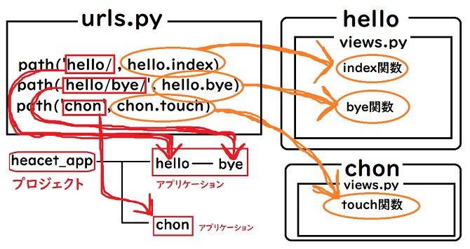

こんちゃっす。ひろちょんです。

今回は**Django**のファイルである『**views.py**』と『**urls.py**』をイジっていこうとおもいます！

↓前回の記事はコチラ(動作環境もコチラに載せています)↓

[【Django】初心者がローカルサーバを起動させるまで『1日目』](/django-1/)

今回の目次です！

1. [Djangoプロジェクトにアプリを作成！](/django-2/#h-jump1)
    - [アプリケーションとは？](/django-2/#h-jump11)
    - [アプリケーションを作成しよう！](/django-2/#h-jump12)
2. [『views.py』と『urls.py』とは何か](/django-2/#h-jump2)
    - [『views.py』とは？](/django-2/#h-jump21)
    - [『urls.py』とは？](/django-2/#h-jump22)

<h2 id="h-jump1">Djangoプロジェクトにアプリを作成！</h2>

ではAnacondaPromptを開いて、作業ディレクトリに移動して、仮想環境をアクティベートしましょう！

<h3 id="h-jump11">アプリケーションとは？</h3>

さて今からプロジェクトの中に**アプリケーション**を作っていくわけですが、この『**アプリケーション**』とはいったい何なんでしょうか？

まずプロジェクトは複数のアプリケーションから成り立っていて、Amazonというプロジェクトを例に出すとこんな感じ↓



一番外の茶色い枠が『**プロジェクト**』、中の黒い四角の枠が『**アプリケーション**』を指しています。

このようにプロジェクトの中に色々な機能を実装していくうえで、**アプリケーションという単位で区切っている**という認識を僕は持っています。

これによって、**どこのプログラムがどこに作用しているのかを明確にしていく効果がある**と考えています！

<h3 id="h-jump12">アプリケーションを作成しよう！</h3>

実際にアプリケーションを作成していきます。今回、僕が作るアプリは『hello』とするので、↓のようにアプリケーションを作成します。

```bash
(myspace) C:\Users\ユーザ名\Desktop\Python\heacet_app> python manage.py startapp hello
```

これによってプロジェクト(heacet_app)下にアプリケーション(hello)が作成されているはずです！

<h2 id="h-jump2">『views.py』と『urls.py』とは何か</h2>

てか『**heacet_appフォルダ**』や『**helloフォルダ**』の中とか見て思いませんか？よく分からないファイル多いなぁ…と。笑

初めに『**views.py**』と『**urls.py**』について紹介していきますね！

<h3 id="h-jump21">『views.py』とは？</h3>

『**view**』という英語を読んで字のごとく『**見せるためのプログラム**』ってことなんですね。

つまりviews.pyに画面出力させたいプログラムを書いていくことになります。

<h3 id="h-jump22">『urls.py』とは？</h3>

『**url**』という文字列の如く、アドレスの書式(URL)を示しています。

まあつまりはページ毎の『**アドレス**』を指定して、関数を出力させるイメージです。

ディレクトリを↓のように仮定します。



『views.py』と『urls.py』をまとめると、こちらのような働きです↓



スゴイぐちゃぐちゃしていますが(笑)、繋がりはなんとなくわかったのではないでしょうか？

## まとめ

今回は序盤にアプリケーションの説明と、『**views.py**』と『**urls.py**』の簡単な役割を説明させていただきました！

使い方に関しては『**クエリパラメータ**』を**Django**で使うにはどうすれば良いかみたいなのをググると、練習になると思います！

『もっとDjangoを勉強したい！』という方は↓コチラの書籍を参考に勉強を進めるのも良いと思います！

[Python Django 超入門](https://af.moshimo.com/af/c/click?a_id=1597531&p_id=170&pc_id=185&pl_id=27060&r_v=&s_v=&url=https%3A%2F%2Fwww.amazon.co.jp%2FPython-Django-%25E8%25B6%2585%25E5%2585%25A5%25E9%2596%2580-%25E6%258E%258C%25E7%2594%25B0%25E6%25B4%25A5%25E8%2580%25B6%25E4%25B9%2583%2Fdp%2F4798054488)

<br />

---

<br />

最後まで読んで頂きありがとうございました。

次はテンプレートについて詳しく扱っていきます。続きはコチラの記事になります↓

[【Django】テンプレートを使いこなそう！《3日目》](https://heacet.com/django-3/)

気づいたこと、記事の感想、この文章おかしい…などなどございましたら、[お問い合わせページ](/contact-form/)にてお問い合わせください。

ついでにTwitter(https://twitter/heacet43)フォローとかこのサイト(https://heacet.com)をお気に入りにしてくれると嬉しいなぁ…笑
