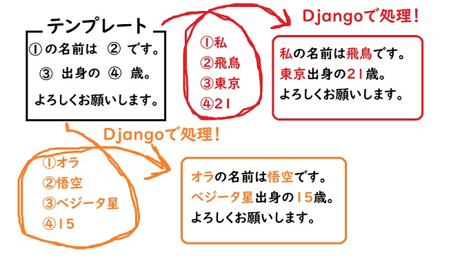
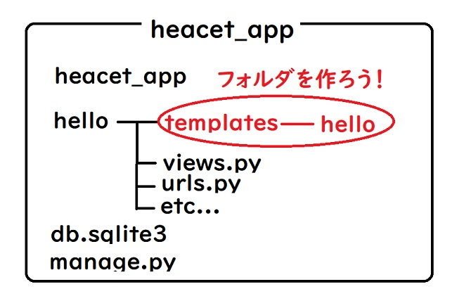
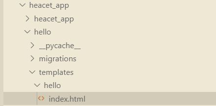
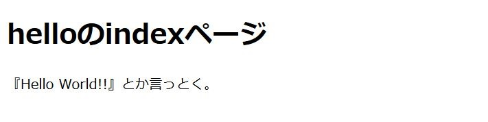
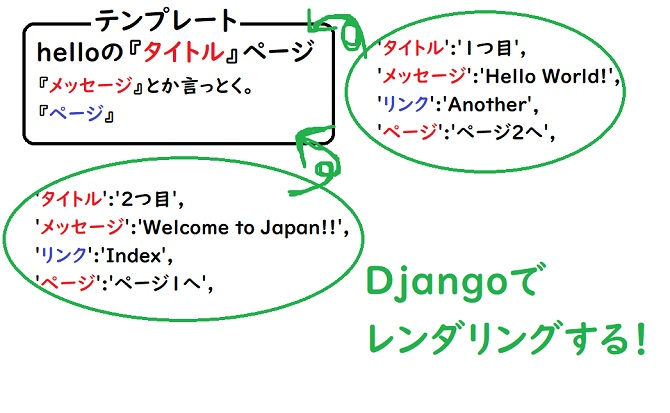
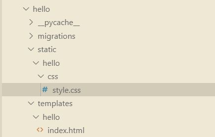

こんちゃす。ひろちょんです。

今回は**Django**で**テンプレート**に関しての一連の処理をやっていきたいと思います！

**括弧内を%で囲むテンプレートタグ**というのも出てきて少し複雑なので、『**かみ砕いて解説していけたらな**』と思っております。

※使用しているDjangoのバージョンは2.2.6です

今回のもくじです！

1. [とりまアプリケーションを登録しよう！](/django-3/#h-jump1)
    - [アプリケーションの登録は超簡単](/django-3/#h-jump11)
2. [テンプレートに触ってみよう！](/django-3/#h-jump2)
    - [テンプレートって何？](/django-3/#h-jump21)
    - [テンプレートを書く場所は？](/django-3/#h-jump22)
    - [HTMLファイルを追加して、Webページを表示させる！](/django-3/#h-jump23)
3. [テンプレートを使いこなしていこう！](/django-3/#h-jump3)
    - [テンプレートとレンダリング先を設計してみる。](/django-3/#h-jump31)
    - [views.pyでパラメータを渡す！](/django-3/#h-jump32)
    - [レンダリングする時のindex.htmlの書き方](/django-3/#h-jump33)
    - [urls.pyの引数nameの正体](/django-3/#h-jump34)
4. [静的ファイル(CSS)を実装する](/django-3/#h-jump4)
    - [staticフォルダを作ろう！](/django-3/#h-jump41)
    - [style.cssをイジる！](/django-3/#h-jump42)

<h2 id="h-jump1">とりまアプリケーションを登録しよう！</h2>

前回までの処理であれば、関数を呼び出しているだけなので、アプリケーションも動いたのですが…

どうやら『**テンプレート**』を扱うような処理はDjangoのシステム的な部分が関係するみたいです( ;∀;)

※Djangoでのアプリケーションの意味については↓の記事にて紹介しております。

[【Django】初心者がviews.pyとurls.pyを解説！『2日目』](/django-2/)

結論から申し上げると、『**テンプレート**』の機能を使う際には**Djangoのシステム**に対して、あらかじめ『**こんなアプリケーションでテンプレートつかうよ！**』と伝える必要があるとういことです！

<h3 id="h-jump11">アプリケーションの登録は超簡単</h3>

登録する必要があるだけで、難しくないので気負いする必要はございません。

まずDjangoプロジェクト(heacet_app)のフォルダ内の『**setting.py**』を開いてください。

**setting.py**にて下にスクロールしていくと、↓このような文字の羅列が見えると思います！

```python
INSTALLED_APPS = [
    'django.contrib.admin',
    'django.contrib.auth',
    'django.contrib.contenttypes',
    'django.contrib.sessions',
    'django.contrib.messages',
    'django.contrib.staticfiles',
]
```

このプログラムに『helloアプリケーション』を表記することで、Djangoに『helloアプリケーション』の存在を伝えることができます！

では↓のように一行追加しましょう。

```python
INSTALLED_APPS = [
    'django.contrib.admin',
    'django.contrib.auth',
    'django.contrib.contenttypes',
    'django.contrib.sessions',
    'django.contrib.messages',
    'django.contrib.staticfiles',
    'hello',
]
```

これでアプリケーションの登録は完了しました！簡単でしたね！

<h2 id="h-jump2">テンプレートに触ってみよう！</h2>

いままで散々『**テンプレート**、**テンプレート**』と言ってきましたが、一体『**テンプレート**』とは何ぞやと思っている方もいると思うので、解説していきます！

<h3 id="h-jump21">テンプレートって何？</h3>

英語の『**テンプレート**』を想像していただいたら分かりやすいと思うのですが、

**予め変わりうるところを開けておいて、不変なところだけ形を決めてしまおう！**

という考え方ですね。

↓の図をご覧ください。



*飛鳥*と*悟空*にそれぞれメッセージカードを作ってもらうことを想定すると、こんな図になります。

あらかじめ被るであろう所を定型文として、変わってくるところを開けている感じです。

このとき飛鳥と悟空の情報をデータベースに持っているだけで、あとは**Django側でメッセージカードを完成させてしまう**訳です！

これによって何度も同じテキストを書く(上図の『**の名前は**』や『**よろしくお願いします。**』など)手間を省くことができます！

<h3 id="h-jump22">テンプレートを書く場所は？</h3>

**Djangoではアプリケーションごとにテンプレートを管理することになっている**

今回では『hello』内に書くことになりますね。

↓ディレクトリの構造としてはコチラ↓



上図のように『**templatesフォルダ**』内に『**helloフォルダ**』を作ってください。

最後に『templatesフォルダ』内の『helloフォルダ』内に『index.html』ファイルを作成してください！

↓このような構成になっていれば正解です。



<h3 id="h-jump23">HTMLファイルを追加して、Webページを表示させる！</h3>

以下のコードをそれぞれに打てば、Webページが表示されるはずです。

```python
from django.urls import path
from . import views

urlpatterns = [
	path('', views.index, name='index')
]
```

```python
from django.shortcuts import render
from django.http import HttpResponse

def index(request):
	return render(request, 'hello/index.html')
```

上の図4に見慣れない**render関数**とやらがありますね…

#### render関数は何をしてる？

render関数は、**あらかじめ作っておいたテンプレートにてDjangoの処理を埋め込み返しています**。

先ほど飛鳥と悟空を例に出した**メッセージカードに情報を与える部分**ですね！

そして引数の2つ目にディレクトリを指定しているのですが、これは**templates下でのディレクトリを指定**していて、参照の方法が特徴的なので注意が必要です！

最後に『**index.html**』は↓のように書いてください。(※HTMLの文法説明は省きます。)

```html
<!DOCTYPE html>
<html lang="ja">
    <head>
        <meta charset="UTF-8">
        <meta name="viewport" content="width=device-width, initial-scale=1.0">
        <meta http-equiv="X-UA-Compatible" content="ie=edge">
        <title>helloのindexページ</title>
    </head>
    <body>
        <h1>helloのindexページ</h1>
        <p>『Hello World』とか言っとく。</p>
    </body>
</html>
```

このようにそれぞれのファイルにプログラムを書けば、Webページに↓こんな感じになるはず。



Webページを表示させる際にDjangoのローカルサーバーを起動させる方法は↓コチラへどうぞ

[【Django】初心者がローカルサーバを起動させるまで『1日目』](https://heacet.com/django-1)

<h2 id="h-jump3">テンプレートを使いこなしていこう！</h2>

先ほど散々『**テンプレートに値を渡すことができるのがDjangoの役割だ！！**』とか言ってたのに全然使ってませんでしたね。笑

<h3 id="h-jump31">テンプレートとレンダリング先を設計してみる。</h3>

とりあえず今回**テンプレート**と**レンダリング**をこんな感じに設計するとします↓



赤字は文字の表示に対応。青字はリンクに対応しています。

上図にしたがって、『**views.py**』『**index.html**』『**urls.py**』を順番にプログラムを書いていきます。

<h3 id="h-jump32">views.pyでパラメータを渡す！</h3>

値を渡す方法は見た目を司る『**views.py**』さんで辞書を用いて値を渡していきます。

```python
from django.shortcuts import render
from django.http import HttpResponse

def index1(request):
	params = {
		'title':'1つ目',
		'msg':'Hello World!!',
		'link':'Another',
		'page':'ページ2へ',
	}
	return render(request, 'hello/index.html', params)

def index2(request):
	params = {
		'title':'2つ目',
		'msg':'Welcome to Japan!!',
		'link':'Index',
		'page':'ページ1へ',
	}
	return render(request, 'hello/index.html', params)
```

図6のようにそれぞれパラメータを1つの辞書(dic)にまとめて書いています。いわゆるJSON形式と似ていますが、まさにそんな感じです！<br />
※JSON形式の場合は、文字列をダブルクォーテーション(“”)で囲む必要があります。

パラメータの辞書(dic)をrender関数の引数にすることによって、index.htmlにパラメータを渡します。

<h3 id="h-jump33">レンダリングする時のindex.htmlの書き方</h3>

それではindex.htmlではどのように値を受け取っているのかを見ていきましょう！

```html
<!DOCTYPE html>
<html lang="ja">
    <head>
        <meta charset="UTF-8">
        <meta name="viewport" content="width=device-width, initial-scale=1.0">
        <meta http-equiv="X-UA-Compatible" content="ie=edge">
        <title>helloの{{title}}</title>
    </head>
    <body>
        <h1>helloの{{title}}のページ</h1>
        <p>『{{msg}}』とか言っとく。</p>
        <a href="">{{page}}</a>
    </body>
</html>
```

パラメータをレンダリングしている部分に色付けしています！

このようにviews.pyでKeyに定義していた部分を{{}}内に書いて、Keyに対応する値を渡しているんですね～。

通常はHTMLでのaタグ内のhref属性はURLを引き渡す場所となっていて、URLなどを書きます。これを**テンプレートタグ**を用いて、パラメータからURLに変換させています。

詳しくはurls.pyを見ながら説明していきますね。

<h3 id="h-jump34">urls.pyの引数nameの正体</h3>

```python
from django.urls import path
from . import views

urlpatterns = [
	path('', views.index1, name='Index'),
	path('another/', views.index2, name='Another'),
]
```

ずっと疑問に思っていたであろう『**引数name**』の解説がここでやっとできます！！

**なんと引数である『nameの値』と『paramsのlinkの値』が全く同じではありませんか！！**

今までurls.pyで引数としてnameを使っていたのは、ここでURLと関連させてリンクを成り立たせているわけですね。

ですが{{}}だけじゃ値しか渡せないはず…

そこで**テンプレートタグ**を用いたんです！

#### テンプレートタグとは？

**テンプレートタグとはDjangoがテンプレートにて特殊な働きかけをするタグのこと**

今回ではとしていて、流れとしてこんな感じ↓

1. urlという種類のテンプレートタグを使う
2. linkの値を渡す
3. urls.pyで共通しているnameの値を探してくれる
4. urls.pyからURLを返してくれる

分かりやすく言うとこんな流れです。

よってリンク付きのページが２つ完成しました。実行結果は個々で確認してください。

<h2 id="h-jump4">静的ファイル(CSS)を実装する</h2>

**Djangoのテンプレート機能**によって、HTMLファイルへのレンダリングはできるようになりましたね！

ですがWebページを見ても世の中のWebページとは程遠いデザインをしていますね笑

ここでCSSを実装させて、色を付けていきましょう！

<h3 id="h-jump41">staticフォルダを作ろう！</h3>

templatesフォルダと同様にstaticフォルダも作っていきます。『static > hello > css > style.css』のように作っていきましょう。

templatesフォルダと比べた時、もし『**なぜcssフォルダを挟んだの？**』と思った方は勘が良いですね！

他にも静的フォルダとして、『JSやSass』などを使うケースがあるので、『CSSはCSSで区切っておきましょう。』ということです。

さてさてVSCodeで作ると楽なのでオススメです。↓こんな感じ↓



<h3 id="h-jump42">style.cssをイジる！</h3>

CSSについての詳しい話も割愛します。

とりあえず僕はこんな感じでかきました↓

```css
body{
	background: rgb(233, 233, 233);
	text-align: center;
}
h1{
	background: white;
	width: auto;
	height: 60px;
	line-height: 60px;
}
a{
	color: white;
	display: inline-block;
	background: rgb(133, 23, 23);
	height: 50px;
	padding: 0 20px;
	line-height: 50px;
	text-decoration: none;
}
a:hover{
	background: rgb(133,23,23,0.3);
	transition: 0.5s;
}
```

さて次はindex.htmlにstaticを実装することを伝えなければいけません。

なのでindex.htmlに以下を書いてください。

- `<!doctype html>`の下の行に``と書く
- `</head>`の上の行に`<link rel=”stylesheet” type=”text/css” href=”” />`と書く

これでCSSにて色付けできました！

結果は作ってからのお楽しみ～ということで。

## まとめ

かなり記事が長くなってきました…笑

今回はDjangoでのテンプレートの扱い方について一通りの基本をご紹介しました。

関数や変数が複雑に関係しあっていて、一気に理解するのはかなり難しい所です。

やはり使っていかないと身に付けたいものも身に付けられないので、是非プログラムを自分の手で書いてみてください(´艸｀*)

↓次の記事ではDjangoでのフォームの使い方について書きました↓

[【Django】フォームの使い方を解説『クラスを定義』《４日目》](/django-4/)

もっと自分で『Djangoを学んでいきたい！』という方は僕も使っている↓コチラの本がオススメです。

[Python Django 超入門](https://af.moshimo.com/af/c/click?a_id=1597531&p_id=170&pc_id=185&pl_id=27060&r_v=&s_v=&url=https%3A%2F%2Fwww.amazon.co.jp%2FPython-Django-%25E8%25B6%2585%25E5%2585%25A5%25E9%2596%2580-%25E6%258E%258C%25E7%2594%25B0%25E6%25B4%25A5%25E8%2580%25B6%25E4%25B9%2583%2Fdp%2F4798054488)

<br />

---

<br />

最後まで読んで頂きありがとうございました。

気づいたこと、記事の感想、この文章おかしい…などなどございましたら、[お問い合わせページ](/contact-form/)にてお問い合わせください。

ついでにTwitter(https://twitter.com/heacet43)フォローとか[このサイト](/)をお気に入りにしてくれると嬉しいなぁ…笑