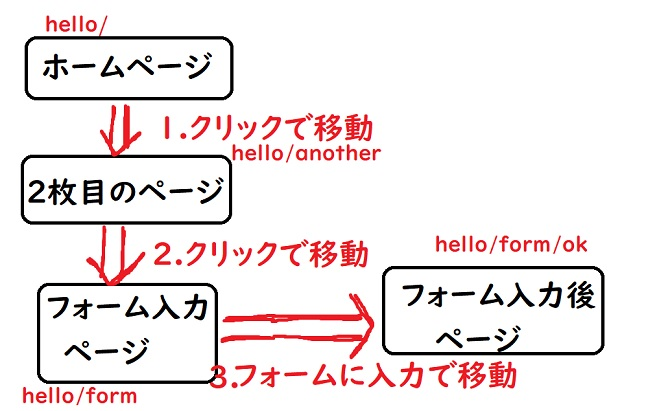

こんちゃっすー。ひろちょんです。

今回は**Django**での**フォーム(form)**について触れていきたいと思います！

フォームとは簡単に言うと『**ユーザーからの入力を受け取るやつ**』になります。

簡単に言い過ぎたので、動画で補足します。笑

↓こちらのツイートの動画で文字を入力⇒クリックしている部分がありますよね。

<blockquote class="twitter-tweet"><p lang="ja" dir="ltr">何か簡単にアウトプットしたいなーとかポケーッと思って作ったやつ。<br />
<a href="https://t.co/gsPM6pnElR">pic.twitter.com/gsPM6pnElR</a></p>&mdash; ひろちょん@ブロガー→機械学習エンジニアへ (@heacet43) <a href="https://twitter.com/heacet43/status/1192012678224498689?ref_src=twsrc%5Etfw">November 6, 2019</a></blockquote>

この一連の流れを今回は説明しつつ作成していきたいと思います。

また記事の後半ではDjangoで主に使われている**クラスを用いたフォームの記述方法**を紹介していきます。

**Djangoのバージョンは2.2.6です**

今回の目次です。

1. [どのようにDjangoのフォームは成り立っている？](/django-4/#h-jump1)
    - [①htmlファイルを作成する](/django-4/#h-jump11)
    - [②urls.pyをイジっていく](/django-4/#h-jump12)
    - [③views.pyをイジッテいく](/django-4/#h-jump13)
    - [④ちなみにCSSはこんな感じ](/django-4/#h-jump14)
2. [【ここからが本番】クラスでフォームを定義しよう！](/django-4/#h-jump2)
    - [①Formクラスを作成](/django-4/#h-jump21)
    - [②views.pyを書く](/django-4/#h-jump22)
    - [③forms.pyを軽く編集](/django-4/#h-jump23)
    - [④form.htmlを書くよ！](/django-4/#h-jump24)

<h2 id="h-jump1">どのようにDjangoのフォームは成り立っている？</h2>

Djangoではフォームを『urls.py』『views.py』『htmlファイル』を使って実装することができます。

まずはサイトを設計していきます。こんな感じ↓



この時、フォーム入力ページからフォーム入力後ページへの遷移を実装したいわけですね。

それには複数の課題があります。

- form入力専用のページを作らなければいけない
- ページへ移動させるためのpathを定義しないといけない
- フォームの入力を受け取り、出力しなければいけない
- ついでに『ホームへ戻る』ボタンを作りたい

<h3 id="h-jump11">htmlファイルを作成する</h3>

まずは前回にテンプレートを利用してindex.htmlを作成したように、もう一度index.htmlとformする専用のform.htmlを作成していきます。

```html
<!DOCTYPE html>

<html lang="ja">
    <head>
        <meta charset="UTF-8">
        <meta name="viewport" content="width=device-width, initial-scale=1.0">
        <meta http-equiv="X-UA-Compatible" content="ie=edge">
        <link rel="stylesheet" type="text/css" href="" />
        <title>hello{{title}}</title>
    </head>
    <body>
        <h1>helloの{{title}}ページ</h1>
        <p>『{{msg}}』とか言っとく。</p>
        <a href="">{{page}}</a>
    </body>
</html>
```

```html
<!DOCTYPE html>

<html lang="ja">
    <head>
        <meta charset="UTF-8">
        <meta name="viewport" content="width=device-width, initial-scale=1.0">
        <meta http-equiv="X-UA-Compatible" content="ie=edge">
        <link rel="stylesheet" type="text/css" href="" />
        <title>{{title}}</title>
    </head>
    <body>
        <h1>{{title}}ページ</h1>
        <p>{{msg1}}</p>
        <p>{{msg2}}</p>
        <form action="" method="post">
            
            <label for="message">何が言いたい？</label>
            <input id="message" type="text" name="saying">
            <input type="submit" value="くりっく">
        </form>
        <a href="">ホームへ戻る</a>
    </body>
</html>
```

このようにindexとformのhtmlファイルが完成しました。『**テンプレートについてよくわからない。**』という方はコチラの記事を参考にしてください↓

[【Django】テンプレートを使いこなそう！《3日目》](/django-3/)

ここでHTMLのformタグを使用しています。これはDjangoではなくHTMLの内容なので、詳しい説明はしませんが、『**action**』『**method**』『**for**』『**id**』『**type**』というformで使われている属性についてはとても重要なので、是非ググってみてください！！

特に注意なのがnameですね。これはurls.pyのpath内にあるnameと対応していて、どの変数を与えているかが注目です。

<h3 id="h-jump12">urls.pyをイジっていく</h3>

htmlファイルを作成したので、もちろんurlを振っていかなければいけません。

記事の序盤で設計したモデルを元に今回のurls.pyはこんな感じ↓

```python
from django.urls import path
from . import views

urlpatterns = [
	path('', views.index1, name='Index'),
	path('another/', views.index2, name='Another'),
	path('form/', views.form, name="Form"),
	path('form/ok/', views.ok, name="Formok"),
]
```

上の『**name=**』となっているところがhtml内のリンク(views.pyで定義したパラメータ)とつながってきます。

関数についての詳しい説明などは前の記事を参照してください。

↓urls.pyについての詳しい説明はコチラ↓

[【Django】初心者がviews.pyとurls.pyを解説！『2日目』](/django-2/)


<h3 id="h-jump13">views.pyをイジッテいく</h3>

urls.pyにて呼び出されているので、views.pyもプログラムしていきます。

こんな感じ↓

```python
from django.shortcuts import render
from django.http import HttpResponse

def index1(request):
	params = {
		'title':'1つ目',
		'msg':'Hello World!!',
		'link':'Another',
		'page':'ページ2へ',
	}
	return render(request, 'hello/index.html', params)

def index2(request):
	params = {
		'title':'2つ目',
		'msg':'Welcome to Japan!!',
		'link':'Form',
		'page':'フォームへ',
	}
	return render(request, 'hello/index.html', params)

def ok(request):
	msg2 = request.POST['saying']
	params = {
		'title':'入力してくれてありがとな',
		'msg1':'You successed in sending message!!',
		'msg2':msg2,
		'link':'Formok',
	}
	return render(request, 'hello/form.html', params)

def form(request):
	params = {
		'title':'フォーム(ホームじゃない)',
		'msg':'↓入力してね！↓',
		'link':'Formok',
	}
	return render(request, 'hello/form.html', params)
```

ここでnameの指定している場所が色々と可視化されました。

まず一つ目が…

**params内で定義している辞書形式のlinkとurls.pyにて書いたnameと、対応している**

※最後のフォームではテキスト入力を出力させ続けたかったので、linkはFormokと対応させています。

**`msg2 = request.POST[‘saying’]`**

これは初見のメソッドですね。GETメソッドと立ち位置には同じです。ですが役割が違います。

POSTメソッドは新しい値を受け取る際に使われるもので、ユーザの情報などを受け取るメソッドになります。

**実はこれが二つ目のnameの正体です！**

HTML内のformタグ内のinputタグでnameを”saying”と定義しているのを確認してください！

**その”saying”というnameをviews.py内のrequest.POST[“saying”]と書いて、テキストの値を受け取っています。**

他のviews.pyの詳しい関数の使い方や、パラメータの扱い方は前回に説明したので、そちらを参照してください(´艸｀*)

<h3 id="h-jump14">ちなみにCSSはこんな感じ</h3>

CSSがないと味気ないので、一応載せておきます(‘ω’)ノ

```css
ody{
	background: rgb(233, 233, 233);
	text-align: center;
}

h1{
	background: white;
	width: auto;
	height: 60px;
	line-height: 60px;
}

a{
	color: white;
	display: inline-block;
	background: rgb(133, 23, 23);
	height: 40px;
	padding: 0 20px;
	line-height: 40px;
	text-decoration: none;
}

a:hover{
	background: rgb(133,23,23,0.3);
	transition: 0.5s;
}

form {
	padding-bottom: 20px;
}
```

これで全ファイルの説明を終えたので、ページ冒頭に載せたTwitterの動画のように実装できるはずです！

<h2 id="h-jump2">【ここからが本番】クラスでフォームを定義しよう！</h2>

次に**Formのクラス**を定義して**フォーム**を作成していきます。

こちらがフレームワークとしての**Django**でよく使われている**フォーム**の作成方法ですね！

Djangoのフォームを使う利点としてこれらが挙げられます。

- HTMLの記述量が圧倒的に減る
- Djangoが入力された値の確認を行ってくれる
- 特定の範囲の値を入力できるようにできる
- その他さまざまな機能が簡単に実装できる

**HTMLで本来書くformのプログラムを少ない記述でDjangoで実装させることができます**

詳しくはviews.pyでクラスを呼び出してレンダリングしてくれるのですが、後で詳しく説明します。

ではさっそく実装していきます。

<h3 id="h-jump21">Formクラスを作成</h3>

日本語で解説をズラズラ見るよりもプログラムを直接見ながら学習する方が理解できると思うので、**Formクラス**を書いていきますね。

```python
from django import forms

class HeacetForm(forms.Form):
	name3 = forms.CharField(label="名前")
	mail3 = forms.CharField(label="メールアドレス")
	age3 = forms.IntegerField(label="年齢")
```

詳しく内容を説明していきます。

↓上図のプログラムの流れはこんな感じ↓

1. Djangoからformsをimport
2. HeacetFromクラスを定義
3. 赤字の変数にフィールドを代入
4. なお引数はオレン字のラベルを代入してる模様

#### Djangoからformsをimport

Djangoに搭載されてるformsというクラスをimportします。

ここにforms.py内のクラスの必需品が詰まっているわけですね。

#### HeacetFromクラスを定義

ここのクラスの名前はなんでも良いです。

**ですが引数の名前を間違えてはいけません**

ここではクラスの継承を行っているため、一言一句間違えてはいけません。笑

#### 変数としてフィールドを代入

ここで思い出してほしいのですが、先ほど`request.POST[]`を用いてフォームに入力された値を取り出しましたよね？

その時に`request.POST[]`の`[]`内にはHTMLの`inputタグ`で書いた`name`を入力していたと思います。

その`name`が**変数**と対応しているのです(/・ω・)/

つまり本来は**HTML内でname属性として書かなければいけない部分をHeacetFormクラスで済ませる**ということですね～

#### なお引数はラベルを代入してる

HTMLではまだ記述している部分がありましたよね。

`label`です！

こちらも`HeacetForm`クラスで実装させちゃいましょう。それが`label`で実装できちゃうんですね～

<h3 id="h-jump22">views.pyを書く</h3>

次にviews.pyにforms.pyのクラスであるHeacetFormを実装させつつ、プログラムを書いていきます。

↓まずプラグラムはこんな感じ↓

```python
from django.shortcuts import render
from django.http import HttpResponse
from .forms import HeacetForm

def index1(request):
	params = {
		'title':'1つ目',
		'msg':'Hello World!!',
		'link':'Form',
		'page':'フォームへ',
	}
	return render(request, 'hello/index.html', params)

def form(request):
	params = {
		'title':'フォーム(ホームじゃない)',
		'message':'↓入力してね！↓',
		'form':HeacetForm(),
	}
	if request.method == 'POST':
		params["message"] = "名前：" + request.POST["name3"] + "<br> メールアドレス：" + request.POST["mail3"] + "<br> 年齢：" + request.POST["age3"]
		params["form"] = HeacetForm(request.POST)
	return render(request, 'hello/form.html', params)
```

図の上部にて`HeacetForm`クラスを`import`して、そのインスタンスを生成(`HeacetForm()`)して、`params`の`"form"`の値として代入(`params["form"] = HeacetForm(request.POST)`)しています。

つまり今までの流れな感じで、HTMLにて`{{ form }}`のように使います。

これによってフォームで入力された値を保存することができます。

<h3 id="h-jump23">forms.pyを軽く編集</h3>

views.pyにて使う関数を減らして、ページ数も減らしたので、forms.pyを次のように定義します。

```python
from django.urls import path
from . import views

urlpatterns = [
	path('', views.index1, name='Index'),
	path('form/', views.form, name="Form"),
]
```

<h3 id="h-jump24">form.htmlを書くよ！</h3>

ではフォームをクラス中心に変更するとプラグラムはどのようになるのか…

↓こちらになります。

```html
<!DOCTYPE html>

<html lang="ja">
    <head>
        <meta charset="UTF-8">
        <meta name="viewport" content="width=device-width, initial-scale=1.0">
        <meta http-equiv="X-UA-Compatible" content="ie=edge">
        <link rel="stylesheet" type="text/css" href="" />
        <title>heacet.com</title>
    </head>
    <body>
        <h1>{{title}}ページ</h1>
        <p>{{message|safe}}</p>
        <form action="" method="post">
            
            {{ form }}
            <input type="submit" value="くりっく">
        </form>
        <a href="">ホームへ戻る</a>
    </body>
</html>
```

前半に書いたform.htmlに比べると、圧倒的に記述量が減っていますよね。

↓とりあえず実行するとこのようになります↓

<blockquote class="twitter-tweet" data-conversation="none"><p lang="ja" dir="ltr">クラスを使って少しパワーアップ。<br />
<a href="https://t.co/QPp5yX5Fbv">pic.twitter.com/QPp5yX5Fbv</a></p>&mdash; ひろちょん@ブロガー→AI系エンジニアへ (@heacet43) <a href="https://twitter.com/heacet43/status/1193063049097203713?ref_src=twsrc%5Etfw">November 9, 2019</a></blockquote>

驚きのクラスのインスタンスを呼び出すだけでHTMLの記述が勝手に行われています！

これが**Django**の**フォームクラス**のチカラ．．．

## まとめ


**フォームはnameがどこがどこに対応しているかややこしくなってくる**ので、注意ポイント高めです！

これからもファイル同士のやり取りが多くなってくるので、1つ1つ理解を怠らず進めていくのが大切だと思いますね(/ω＼)

<br />

『**まだまだ余裕がアルヨ～**』という方は`views.py`での関数をクラス化して、`__init__`,`GET`,`POST`をそれぞれ定義して、`urls.py`を編集したりできるので、ググってみてください～。

↓次の記事ではDjangoで扱うDBやモデル、レコードについて書きました↓

[【Django】データベースを解説！モデル？レコード？《Day5》](/django-5/)

もっと自分で『**Djangoを学んでいきたい！**』という方は僕も使っている↓コチラの本がオススメです。

[Python Django 超入門](https://af.moshimo.com/af/c/click?a_id=1597531&p_id=170&pc_id=185&pl_id=27060&r_v=&s_v=&url=https%3A%2F%2Fwww.amazon.co.jp%2FPython-Django-%25E8%25B6%2585%25E5%2585%25A5%25E9%2596%2580-%25E6%258E%258C%25E7%2594%25B0%25E6%25B4%25A5%25E8%2580%25B6%25E4%25B9%2583%2Fdp%2F4798054488)

<br />

---

<br />

最後まで読んで頂きありがとうございました。

気づいたこと、記事の感想、この文章おかしい…などなどございましたら、[お問い合わせページ](/contact-form/)にてお問い合わせください。

ついでにTwitter([@heacet43](https://twitter.com/heacet43/))フォローとかこのサイト(https://heacet.com)をお気に入りにしてくれると嬉しいなぁ…笑