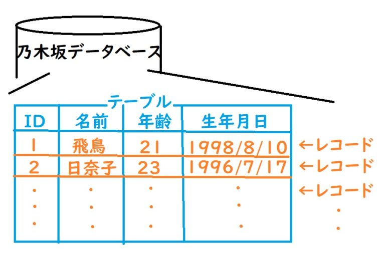

こんちゃっすー。ひろちょんです。

今までの記事では、入門～ビュー(View)に関してやってきましたが、ついに**データベース**を扱っていく話に突入していきます。

つまり**MVC(モデル・ビュー・コントローラー)**のMの部分である**モデル**について触れていくということですなー。

内容がバックエンドっぽくなってくるので、お楽しみに(‘ω’)ノ

※使用しているDjangoのバージョンは2.2.6です

## 出てくる用語を確認しよう！(データベース,モデル,レコード…)

『**データベース**』と『**モデル**』といった言葉は何かと耳にしますかね…

今回はバックエンドで使われている用語たちを役割と共に解説していく回になります。

↓主に出てくる用語達はコチラ↓

1. [データベース](/django-5/#h-jump11)
2. [テーブル](/django-5/#h-jump12)
3. [レコード](/django-5/#h-jump13)
4. [モデル](/django-5/#h-jump21)
5. [モデルのインスタンス](/django-5/#h-jump22)

これら6つの用語は大きく2つにわけることができます。

それが…

<table class="table"> 
    <tbody> 
        <tr> 
            <td style="background-color: #fafafa;width: 150px;">データベース側</td>
            <td>データベース、テーブル、レコード</td>
        </tr>
        <tr> 
            <td style="background-color: #fafafa;">モデル側</td>
            <td>モデル、モデルのインスタンス</td>
        </tr>
    </tbody>
</table>

なぜこの２つに分けられたかというと、簡単にいうと、**それぞれ動いている場所が違うからです**。

まずは上のデータ側の解説からしていきます！

## データベース

データベースとはおそらく想像通りで、『データの塊』でも間違いではないです。

<h3 id="h-jump11">データベースとは？</h3>

ですが厳密にいうとデータベースとは、データベースとは、『**データを保管することに特化したプログラム**』のことを言います。

そのデータベースにも色々種類がありますが、Djangoにて対応しているのがコチラの３つになります。

- MySQL
- PostgreSQL
- SQLite

↑コチラの名前も聞いたことはあるのではないでしょうか？

これらはデ**ータベース言語の名前**を示していたんです！

３つのデータベースにもそれぞれ特徴があるのですが、詳しい事はググってみてください(‘ω’)ノ

今回はその3つの中でもプログラムのサイズが小さく、今すぐ使うことできる**SQLite**を使っていきます。

### データベースの構造

データベースは『**データベース**』『**テーブル**』『**レコード**』で構成されていて、先ほど話したデータベースがすべてを覆っていて、その中にテーブル、その中にレコードが埋まっているイメージですね。

そして**データベースは直接データを格納することができません**。データベースとは『**テーブル**』をまとめて格納する場所になります。

<h3 id="h-jump12">テーブルとは？</h3>

テーブルとは**データを保存する際の形式を定義する場所**になります。例えば乃木坂メンバーの名前、年齢、生年月日を保存する…など。

ですがこのテーブルがデータを保管しているわけではなく、『**レコード**』にてデータを保管しています。

<h3 id="h-jump13">レコードとは？</h3>

レコードとは**テーブルが定義した形式に従って、データを保管する場所**になります。

『**テーブルが定義した形式に従って**』とは↓の2つの条件を満たしている事を言います。

- テーブルが定義した以外のデータは格納することができない
- テーブルが定義したデータを必ず格納しなければいけない

※厳密にいうと『必ず格納しなければいけない』は変更することができて、空白でもOKと設定すれば空白でも問題ないです。

これら3つの**データベース、テーブル、レコードが組み合わさってデータベースを作っている**んですね。

これらを分かりやすくした図がコチラ↓

コチラはそれぞれで色分けしていて、『**乃木坂というデータベース**』に、『**メンバーというテーブル**』を作って、『**飛鳥と日奈子のレコード**』を保管しています。

## モデル

次にモデルの解説へ入ります。

<h3 id="h-jump21">モデルとは？</h3>

モデルとは**テーブルの内容をDjango側で受け渡しできるもの**を指します。

つまり**データベース内のテーブルを定義する役割がモデル**という訳です。先ほどの図を使うと、『名前』『年齢』『生年月日』を定義する場所がモデルとなります。

<h3 id="h-jump22">モデルのインスタンスはレコードと対応</h3>

テーブルをモデルで定義するなら、レコードもどこかと対応してそうですね！

実は**レコードはモデルのインスタンスと対応している**のです。

## データベースとモデルを使って何をしていくのか

この記事では紹介しませんが、この2つを使ってデータベースとやり取りしていきます。

データベースからレコードのデータを取り出す際に、またこの話が重要となってくるのでよく理解しておく必要がありますね～。

もっと自分で『Djangoを学んでいきたい！』という方は僕も使っている↓コチラの本がオススメです。

[Python Django 超入門](https://af.moshimo.com/af/c/click?a_id=1597531&p_id=170&pc_id=185&pl_id=27060&r_v=&s_v=&url=https%3A%2F%2Fwww.amazon.co.jp%2FPython-Django-%25E8%25B6%2585%25E5%2585%25A5%25E9%2596%2580-%25E6%258E%258C%25E7%2594%25B0%25E6%25B4%25A5%25E8%2580%25B6%25E4%25B9%2583%2Fdp%2F4798054488)

 

---

 

最後まで読んで頂きありがとうございました。

気づいたこと、記事の感想、この文章おかしい…などなどございましたら、[お問い合わせページ](/contact-form/)にてお問い合わせください。

ついでにTwitter([@heacet43](https://twitter.com/heacet43/))フォローとかこのサイト(https://heacet.com)をお気に入りにしてくれると嬉しいなぁ…笑
