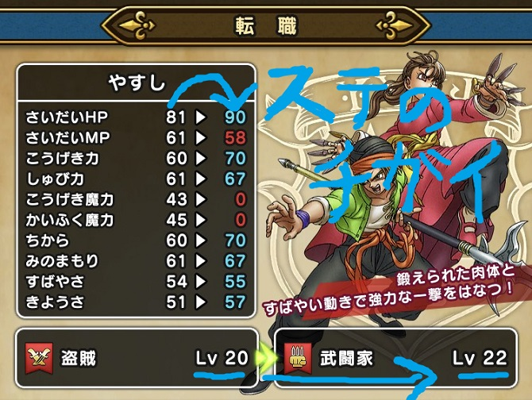

こんちゃっす。ひろちょんです。

今回は<strong>ドラクエウォーク</strong>にて、『<strong>武闘家から盗賊に転職する</strong>ってどうなんだろう…』

『てか<strong>転職</strong>するとなったらどの職業に<strong>転職</strong>するべきなんだろう…』って思いますよね…

その一例として『<strong>武闘家と盗賊</strong>』についてご紹介しますね！

また『<strong>武闘家と盗賊</strong>』がレベル20の時点でのステータスの比較もまとめたので、どうぞご覧ください～

↓武闘家についてはコチラ↓

[【ドラクエウォーク】きようさを持つ武闘家が凄い！『永続とは？』](/dqwalk-job-fighter/)

目次です～

<ol>
	<li><a href="#h-jump1"><b><strong>武闘家と盗賊</strong>を比較します</b></a>
	<ul>
		<li><a href="#h-jump11"><b><strong>武闘家と盗賊</strong>のステータスを比較</b></a></li>
		<li><a href="#h-jump12"><b><strong>武闘家と盗賊</strong>をスキル面から比較</b></a></li>
	</ul>
	</li>
	<li><a href="#h-jump2"><b><strong>武闘家から盗賊へ転職する</strong>理由は？</b></a>
	<ul>
		<li><a href="#h-jump21"><b><strong>盗賊に転職する</strong>とすばやさが手に入る</b></a></li>
		<li><a href="#h-jump22"><b><strong>武闘家から盗賊へ転職する</strong>理由</b></a></li>
	</ul>
	</li>
	<li><a href="#h-jump3"><b>『<strong>武闘家と盗賊</strong>』使うならどっち？</b></a></li>
</ol>

<h2 id="h-jump1">武闘家と盗賊を比較します</h2>

↑この画像は<strong>武闘家</strong>Lv22と<strong>盗賊</strong>Lv20の写真なので、参考にしないでください（笑）。『Lv20の時の比較画像撮り忘れた…』

<strong>武闘家と盗賊</strong>は似たような性能を持っていますが、それぞれの違いがあって、良さがあります！

では『<strong>武闘家と盗賊</strong>』のそれぞれのステータスを比較しながら解説していきますね。

<h3 id="h-jump11">武闘家と盗賊のステータスを比較</h3>

レベル1の時とレベル20の時、それぞれのステータスを比較していきます。

レベル20の方もなんとかステータス情報はゲットできたので、載せていきます(/・ω・)/

<h4>レベル1の時の武闘家と盗賊を比較</h4>

比較したものを↓下の表にまとめました！（優れている方を赤字にしました。）

 
<table class="table"> 
<tbody> 
<tr> 
<td style="width: 150px;background-color: #f6f6f6;"></td>
<td style="background-color: #fafafa;">武闘家</td><td style="background-color: #fafafa;">盗賊</td>
</tr>
<tr> 
<td style="background-color: #fafafa;">さいだいHP</td>
<td>24</td><td>21</td>
</tr>
<tr> 
<td style="background-color: #fafafa;">さいだいMP</td>
<td>4</td><td>7</td>
</tr>
<tr> 
<td style="background-color: #fafafa;">こうげき力</td>
<td>9</td><td>7</td>
</tr>
<td style="background-color: #fafafa;">しゅび力</td>
<td>7</td><td>7</td>
</tr>
<tr> 
<td style="background-color: #fafafa;">こうげき魔力</td>
<td>0</td><td>2</td>
</tr>
<tr> 
<td style="background-color: #fafafa;">かいふく魔力</td>
<td>0</td><td>2</td>
</tr>
<tr> 
<td style="background-color: #fafafa;">ちから</td>
<td>9</td><td>7</td>
</tr>
<tr> 
<td style="background-color: #fafafa;">みのまもり</td>
<td>7</td><td>7</td>
</tr>
<tr> 
<td style="background-color: #fafafa;">すばやさ</td>
<td>6</td><td>7</td>
</tr>
<tr> 
<td style="background-color: #fafafa;">きようさ</td>
<td>6</td><td>7</td>
</tr>
</tbody>
</table>

初期ステータスなので、正直コメントすることがないです。笑

てか<strong>盗賊</strong>のステータスが『７』がなんと『７個』ありますね。笑

<h4>レベル20の時の武闘家と盗賊を比較</h4>

レベル20時も比較したものを↓下の表にまとめました！（優れている方を赤字にしました。）

 
<table class="table" id="h-jump111"> 
<tbody> 
<tr> 
<td style="width: 150px;background-color: #f6f6f6;"></td>
<td style="background-color: #fafafa;">武闘家</td><td style="background-color: #fafafa;">盗賊</td>
</tr>
<tr> 
<td style="background-color: #fafafa;">さいだいHP</td>
<td>85</td><td>61</td>
</tr>
<tr> 
<td style="background-color: #fafafa;">さいだいMP</td>
<td>54</td><td>61</td>
</tr>
<tr> 
<td style="background-color: #fafafa;">こうげき力</td>
<td>65</td><td>60</td>
</tr>
<td style="background-color: #fafafa;">しゅび力</td>
<td>62</td><td>61</td>
</tr>
<tr> 
<td style="background-color: #fafafa;">こうげき魔力</td>
<td>0</td><td>43</td>
</tr>
<tr> 
<td style="background-color: #fafafa;">かいふく魔力</td>
<td>0</td><td>45</td>
</tr>
<tr> 
<td style="background-color: #fafafa;">ちから</td>
<td>65</td><td>60</td>
</tr>
<tr> 
<td style="background-color: #fafafa;">みのまもり</td>
<td>62</td><td>61</td>
</tr>
<tr> 
<td style="background-color: #fafafa;">すばやさ</td>
<td>51</td><td>54</td>
</tr>
<tr> 
<td style="background-color: #fafafa;">きようさ</td>
<td>53</td><td>51</td>
</tr>
</tbody>
</table>

武闘家と盗賊のステータスで特徴的な違いはコチラ
<ul>
	<li>さいだいHPに大きな差(<strong>武闘家</strong>が優位)</li>
	<li>『攻撃力』や『守備力』の基礎ステは<strong>武闘家</strong>が優位</li>
	<li><strong>武闘家</strong>が魔法使う気がないw(<strong>盗賊</strong>が優位)</li>
	<li>『きようさの<strong>武闘家</strong>』と『すばやさの<strong>盗賊</strong>』</li>
</ul>

このようにステータス面からみれば、<strong>武闘家</strong>が魔法が使えないにしても、まだ<strong>武闘家と盗賊</strong>の役割としては物理攻撃が主体なので、<strong>武闘家が盗賊より</strong>優れていることが分かります。

<h3 id="h-jump12">武闘家と盗賊をスキル面から比較</h3>

<h4>武闘家のスキル面</h4>

<strong>武闘家</strong>はとにかく『攻撃力が高い』ことが特徴で、『敵にどれだけ強い物理攻撃を与えれるか』を極めた職業といえます。

特に永続(パッシブ)として『きようさ』が得ることができるのが、モロに『攻撃を高めたい気持ち』が表れてますよね。笑

<a href="/dqwalk-job-fighter/#h-jump2">＞＞＞ きようさの詳しい説明はコチラへ</a>

<h4>盗賊のスキル面</h4>

<strong>盗賊</strong>は物理攻撃も魔法も平均的に使うことができる。そして『すばやい』ことが特徴ですね！

また永続(パッシブ)として『すばやさ』を手に入れることができて、戦闘においても一番早く行動することができます！(※メタスラには勝てません)

ですがどのステータスにしても中途半端さが目立って、後に『魔法の強化のスキル』や『ブーメランのスキル』を取得することができるのですが、ステータスがソコに振り切っていないので、現状ではうまく火力が出せないと思いますね。

恐らく敵を『マヒにする』や『毒状態にする』などの特殊効果系で<strong>盗賊</strong>が活躍する気がするので、今後に期待といったところです。

<h2 id="h-jump2">武闘家から盗賊へ転職する理由は？</h2>

恐らくストーリーを進めつつレベルを上げていくと、<strong>武闘家</strong>が仲間になって、<strong>転職</strong>ができるようになります！

<i class="fa fa-check" aria-hidden="true"></i> 転職する理由は『永続(パッシブ)』を習得できるから

<a href="/dqwalk-job-fighter/#h-jump22">＞＞＞ 永続(パッシブ)の詳しい説明はコチラへ</a>

<h3 id="h-jump21">盗賊に転職するとすばやさが手に入る</h3>

どの職業もレベル20になると、何かしらの永続(パッシブ)スキルが手に入る訳ですが、

<i class="fa fa-check" aria-hidden="true"></i> 特に<strong>盗賊が転職先</strong>ではイチオシ

それは<strong>盗賊</strong>は『すばやさ+20』が永続スキルとして習得できるからですね！

これはどの職業からの転職であっても言えることで、敵よりも先に行動できるメリットは図りしれないからです。

簡単に例として挙げると
<ol>
	<li>敵よりも先に攻撃する</li>
	<li>敵から攻撃を受ける回数が減る</li>
</ol>

他にも『先に味方にバイシオンなどの攻撃上昇の呪文をかけて、攻撃できる』などなど多種多様ですよね。

<h3 id="h-jump22">武闘家から盗賊へ転職する理由</h3>

ではなぜ『<strong>武闘家から盗賊へ転職する</strong>』ことが良いのかですが、

<i class="fa fa-check" aria-hidden="true"></i> 上昇させるべきステータスが似ている

<a href="#h-jump111">↑上のステータスの表</a>や、『モンスターのこころの系統』や『どちらもツメが得意武器』などなど、共通点が多いんですね。

<h4>モンスターのこころ</h4>

武器よりも重要(？)と言われている『こころ』ですが、よく見てみると青と赤のこころは似ているんですね。

『きようさ』と『すばやさ』をどちらも重きに置いていて、<strong>武闘家から盗賊へ</strong>のこころの代用がしやすいんですね。

<h4>武闘家と盗賊の得意武器がツメ</h4>

もし違う武器を使っていたなら申し訳ないのですが、同じ武器を使えるということは(得)マークの効果が反映されながら、今までの強化してきた武器を使えるということなので、非常に効率的です(´艸｀*)

<a href="/dqwalk-job-warrior/#h-jump23">＞＞＞ (得)マークの詳しい説明はコチラへ</a>

<h2 id="h-jump3">『武闘家と盗賊』使うならどっち？</h2>

<a href="#h-jump2">先ほどの画像</a>と間違い探しになっております。笑

結論は↑上の画像の通り武闘家にした方が良いです。

理由は以下です。
<ul>
	<li>攻撃力が高い</li>
	<li>防御力が高い</li>
	<li>会心の一撃が出やすい</li>
</ul>
もうハッキリ言うと、<strong>武闘家</strong>の方が強いです。笑

正直、職業として『<strong>盗賊</strong>』を使う理由は『<strong>すばやさ+20</strong>』を手に入れるのみかなぁと言った感じです。(間違ってたらごめんなさい笑)

<h2>まとめ</h2>

実際に『<strong>武闘家から盗賊へ転職</strong>』してみて感じたことや、具体的なステータス、スキル面をまとめました！

結論を言うと、『<strong>武闘家と盗賊</strong>は相性が良いよ！』ということと、

<i class="fa fa-check" aria-hidden="true"></i> 転職先でオススメランキング1位は『<strong>盗賊</strong>』なのは間違いない

やはり敵より先に行動できるのは大きいですね～。

是非参考にしてみてくださいm(__)m

 

最後まで読んで頂きありがとうございました。

気づいたこと、記事の感想、この文章おかしい…などなどございましたら、<a href="/contact-form/">お問い合わせページ</a>にてお問い合わせください。

まだまだドラクエウォークについて発信していくので、Twitter(@heacet43)フォローとかこのサイト(https://heacet.com)をお気に入りにしてくれると嬉しいなぁ…笑

↓コチラで僧侶の紹介もしてたりします↓

[https://heacet.com/dqwalk-job-priest/](/dqwalk-job-priest/)

注目記事<a href="/tag/dq-walk/">最新！ドラクエウォーク記事一覧</a>

 
