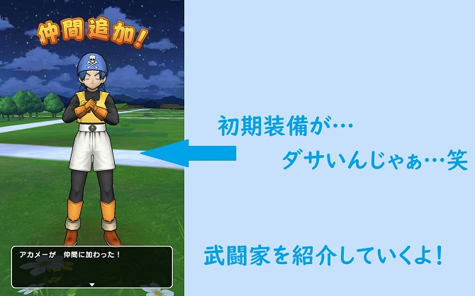
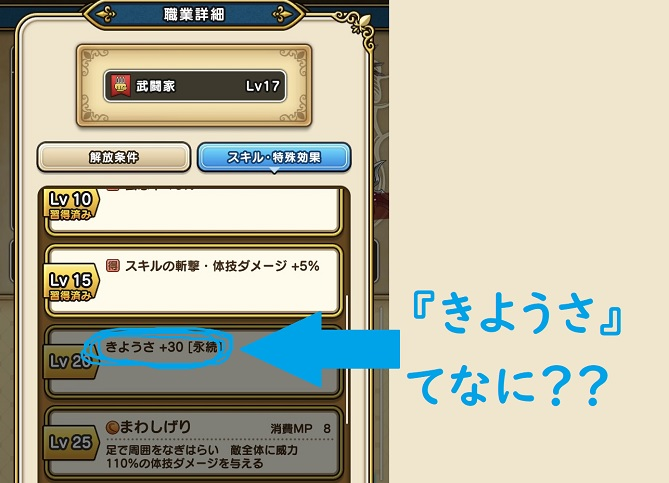
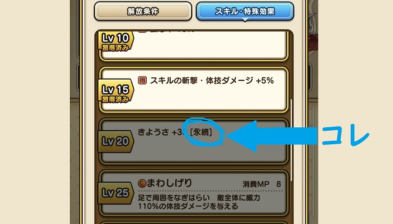

こんちゃっす。ひろちょんです。

<strong>ドラクエウォーク</strong>で武闘家さん使っていますか？？

この子ね。会心の一撃(かいしんのいちげき)が出やすいんです。

なぜかと言うと、<strong>ドラクエウォークのきようさ</strong>が会心の一撃と関係しているからですね！

そんな武闘家の強みや<strong>きようさ</strong>の特徴について詳しく解説していきます！

目次です～。
<ol>
	<li><a href="#h-jump1"><b>武闘家の基本スペック</b></a>
	<ul>
		<li><a href="#h-jump11"><b>武闘家を他職業と比較してみる</b></a></li>
		<li><a href="#h-jump12"><b>武闘家のスキル・特殊効果一覧</b></a></li>
	</ul>
	</li>
	<li><a href="#h-jump2"><b><strong>ドラクエウォークのきようさ</strong>[<strong>永続</strong>]とは？</b></a>
	<ul>
		<li><a href="#h-jump21"><b>会心の一撃(かいしんのいちげき)とは？</b></a></li>
		<li><a href="#h-jump22"><b><strong>永続とは</strong>？</b></a></li>
	</ul>
	</li>
</ol>

<h2 id="h-jump1">武闘家の基本スペック</h2>

武闘家さんはストーリークエストの２章１話をクリアすることで仲間にすることができますね！

そして仲間にした時の服装が↑コチラ。

<i class="fa fa-check" aria-hidden="true"></i> その組み合わせは見たことない。笑

<ul>
	<li>頭：給食用の三角巾</li>
	<li>体：ボクサースタイル on 全身タイツ</li>
	<li>足：ソックスおろしてレガースはみ出てる奴(サッカー部あるあるw)</li>
</ul>

あまりに情報量多すぎて触れずにはいられませんでした。笑

では紹介していきます！

<h3 id="h-jump11">武闘家を他職業と比較してみる</h3>

初期ステータスの他職業との比較は↓下の表にまとめてみました！（武闘家は赤字になっています。）

 
<table class="table"> 
<tbody> 
<tr> 
<td style="width: 150px;background-color: #f6f6f6;"></td>
<td style="background-color: #fafafa;">戦士</td><td style="background-color: #fafafa;">魔法使い</td><td style="background-color: #fafafa;">僧侶</td><td style="background-color: #fafafa;">武闘家</td><td style="background-color: #fafafa;">盗賊</td>
</tr>
<tr> 
<td style="background-color: #fafafa;">さいだいHP</td>
<td>25</td><td>19</td><td>21</td><td>24</td><td>21</td>
</tr>
<tr> 
<td style="background-color: #fafafa;">さいだいMP</td>
<td>5</td><td>10</td><td>9</td><td>4</td><td>7</td>
</tr>
<tr> 
<td style="background-color: #fafafa;">こうげき力</td>
<td>8</td><td>4</td><td>5</td><td>9</td><td>7</td>
</tr>
<td style="background-color: #fafafa;">しゅび力</td>
<td>8</td><td>6</td><td>7</td><td>7</td><td>7</td>
</tr>
<tr> 
<td style="background-color: #fafafa;">こうげき魔力</td>
<td>1</td><td>8</td><td>4</td><td>0</td><td>2</td>
</tr>
<tr> 
<td style="background-color: #fafafa;">かいふく魔力</td>
<td>1</td><td>3</td><td>7</td><td>0</td><td>2</td>
</tr>
<tr> 
<td style="background-color: #fafafa;">ちから</td>
<td>8</td><td>4</td><td>5</td><td>9</td><td>7</td>
</tr>
<tr> 
<td style="background-color: #fafafa;">みのまもり</td>
<td>8</td><td>6</td><td>7</td><td>7</td><td>7</td>
</tr>
<tr> 
<td style="background-color: #fafafa;">すばやさ</td>
<td>3</td><td>5</td><td>4</td><td>6</td><td>7</td>
</tr>
<tr> 
<td style="background-color: #fafafa;">きようさ</td>
<td>4</td><td>5</td><td>4</td><td>6</td><td>7</td>
</tr>
</tbody>
</table>

武闘家で突出して高いのは『こうげき力』『ちから』ですね！

これらは主に、魔法以外で敵に与えるダメージ量に関係してくるステータスですね！

また、『こうげき魔力』と『かいふく魔力』のステータスが0であることから、魔法系は使わない方が良いこともわかります！

『すばやさ』『<strong>きようさ</strong>』は盗賊に続いて２番目に高いステータスということも分かりますね！

<h3 id="h-jump12">武闘家のスキル・特殊効果一覧</h3>
次にレベルアップしていくごとに習得することのできるスキルや特殊効果を見ていきますね！

↓表にまとめたのがコチラ↓

 
<table class="table"> 
<tbody> 
<tr> 
<td style="background-color: #fafafa;width: 150px;">Lv 5</td>
<td>必中拳 小さな火の玉で、敵一体にメラ属性の呪文小ダメージを与える</td>
</tr>
<tr> 
<td style="background-color: #fafafa;">Lv 5</td>
<td>(得)ちから+１５</td>
</tr>
<tr> 
<td style="background-color: #fafafa;">Lv 10</td>
<td>不撓不屈 心を奮い立たせることで、状態変化と能力低下を解除する</td>
</tr>
<tr> 
<td style="background-color: #fafafa;">Lv 10</td>
<td>(得)会心率+３％</td>
</tr>
<tr> 
<td style="background-color: #fafafa;">Lv 15</td>
<td>(得)スキルの斬撃・体技ダメージ+５％</td>
</tr>
<tr> 
<td style="background-color: #fafafa;">Lv 20</td>
<td>[永続]<strong>きようさ</strong>+３０</td>
</tr>
<tr> 
<td style="background-color: #fafafa;">Lv 25</td>
<td>まわしげり 足で周囲をなぎはらい、敵全体に威力１１０％の体技ダメージを与える</td>
</tr>
<tr> 
<td style="background-color: #fafafa;">Lv 30</td>
<td>(得)ちから+１０</td>
</tr>
<tr> 
<td style="background-color: #fafafa;">Lv 40</td>
<td>タイガークロー 激しく切り裂き、敵一体に威力８０％の斬撃攻撃を３回する</td>
</tr>
<tr> 
<td style="background-color: #fafafa;">Lv 40</td>
<td>(得)スキルの斬撃・体技ダメージ+５％</td>
</tr>
<tr> 
<td style="background-color: #fafafa;">Lv 50</td>
<td>[永続]ちから+１０</td>
</tr>
<tr> 
<td style="background-color: #fafafa;">Lv 55</td>
<td>(得)ちから+１０</td>
</tr>
</tbody>
</table>

この表を見ると、『ちから』と『会心率』、『<strong>きようさ</strong>』、『体技』のステータスが上がりやすいことが分かりますね！

また(得)と[<strong>永続</strong>]マークがたくさんありますね！

↓(得)マークについて知りたい方はコチラの記事へ(戦士についても書いてます)↓

[【ドラクエウォーク】戦士の《みのまもり》は最強です。『得とは？』](/dqwalk-job-warrior/)

『<strong>きようさ</strong>ってなんだ？』『<strong>永続</strong>ってなんだ？』と思った方もいるかもしれないので、補足しておきます。

<h2 id="h-jump2">ドラクエウォークのきようさ[永続とは？]</h4>

↑上の画像は転職時のキャラの強さを見る時に確認することができます。

冒頭で少しだけ説明したように、<strong>きようさ</strong>が高いほど『会心の一撃が出やすくなる』というものです。

この『会心の一撃』を出すために『<strong>きようさ</strong>』のステータスをどんどん上げていきたいです。

そんなところに武闘家さんがなんと『<strong>きようさ</strong>』を持っているではないですか！！？

<h3 id="h-jump21">会心の一撃(かいしんのいちげき)とは？</h3>

会心の一撃とは、とてつもないダメージ量を繰り出す技です。

詳しくはコチラ。

<blockquote cite="https://wikiwiki.jp/dqdic3rd/%E3%80%90%E4%BC%9A%E5%BF%83%E3%81%AE%E4%B8%80%E6%92%83%E3%80%91">基本的な仕様としては、自分の【攻撃力】とほぼ同等のダメージを与える攻撃である。
通常攻撃のダメージは【防御力】によって軽減される上に、計算の最後に2で割った値がダメージとして適用されるので、会心の一撃は【ルカニ】で守備力を0まで下げた相手に通常攻撃をした時の2倍のダメージ、という事になる。
そう考えるといかに大きな威力を持った攻撃なのかが分かる。

【会心の一撃】 - ドラゴンクエスト大辞典を作ろうぜ！！第三版 Wiki*</blockquote>

つまり相手の防御を無視した上に、与えるダメージ量が２倍になるということですね！

例えばメタルスライム相手だと、ダメージは１しか与えられないはずが、会心の一撃を繰り出せるとワンパンできます。

『会心の一撃』が起こりやすくなる『<strong>きようさ</strong>』の高いステータスを持つ<strong>武闘家</strong>の火力には期待できそうですね！！

<h4>メタルダンジョンが開催！</h4>

<blockquote class="twitter-tweet">
【 メタルスライムがあらわれた！ 】 今週末はメタル系モンスターと戦える「メタルダンジョン」が開催されます。 経験値を稼げるチャンスとなっておりますので、この機会をお見逃しなく。  
<a href="https://t.co/r4K9kHIsAG">https://t.co/r4K9kHIsAG</a> 
<a href="https://twitter.com/hashtag/DQ%E3%82%A6%E3%82%A9%E3%83%BC%E3%82%AF?src=hash&amp;ref_src=twsrc%5Etfw">#DQウォーク</a> <a href="https://t.co/2vkv6uNCQS">pic.twitter.com/2vkv6uNCQS</a>
&mdash; ドラゴンクエストウォーク公式 (@DQWalk) <a href="https://twitter.com/DQWalk/status/1172389608232873984?ref_src=twsrc%5Etfw">September 13, 2019</a></blockquote>

現在、レベルアップのための経験値を多く稼ぐことができるメタルダンジョンが開催されていることが<strong>ドラクエウォーク</strong>公式様から発表がありました。

このようなダンジョンで武闘家の<strong>きようさ</strong>が活躍しそうですね！

<h3 id="h-jump22">永続とは？</h3>

しっかりとした説明がゲーム内でされてなさそう(？)なので、しっかりとここで<strong>永続とは</strong>何か説明をしておきます！

<i class="fa fa-check" aria-hidden="true"></i> つまり<strong>永続とは</strong>…一度取得すると永続的にそのステータスを得れるもの

武闘家を例として挙げるとこんな感じ。
<ol>
	<li>レベル５で『(得)ちから+１０』を習得</li>
	<li>レベル２０で『[<strong>永続</strong>]<strong>きようさ</strong>+３０』を習得</li>
	<li>転職で盗賊になる↓</li>
	<li style="list-style: none;">✕『ちから+１０』は転職したら受け継がれない</li>
	<li style="list-style: none;">◯『<strong>きようさ</strong>+３０』は転職しても受け継がれる</li>
</ol>

このように<strong>永続とは</strong>、転職でレベルが１に初期化されても、<strong>永続</strong>マークが付いていれば、引き継げる能力だということですね。

なので武闘家からの転職を考えているならば、一度レベルを２０まで上げて、『<strong>きようさ</strong>+３０』を習得してからの方がよさそうですね！

<h4>最初の転職先は盗賊がオススメ</h4>

盗賊をオススメする理由はコチラ
<ul>
	<li>ステータスが似ている</li>
	<li>モンスターのこころの系統が似ている</li>
	<li>ツメがどちらも得意武器</li>
</ul>

簡単にまとめるとこのようになりますが、↓詳しく知りたい方はコチラへ↓

[【ドラクエウォーク】武闘家から盗賊へ転職してみた『性能を比較！』](/dqwalk-fighter-thief/)

<h2>まとめ</h2>
武闘家が『<strong>きようさ</strong>+３０』を[<strong>永続</strong>]として習得できる凄さを語りまくってきました。

<i class="fa fa-check" aria-hidden="true"></i> ポイントは経験値を多く得られるメタスラが倒しやすくなる

<i class="fa fa-check" aria-hidden="true"></i> 敵ボスに大ダメージを与えられる

まだ確認はできていないですが、もしキングメタルスライムなどが出てくると、メタスラ装備を持っていない側からすると倒しにくい敵になってくると思います。

そこで<strong>武闘家</strong>の<strong>きようさ</strong>をパッシブスキルとして持っていると、戦いを有利に進めることができるのではないでしょうか？

ボス戦でも大ダメージを与えられるのは大きいので、使い方は様々ですね！

 

最後まで読んで頂きありがとうございました。

気づいたこと、記事の感想、この文章おかしい…などなどございましたら、<a href="/contact-form/">お問い合わせページ</a>にてお問い合わせください。

まだまだドラクエウォークについて発信していくので、Twitter(@heacet43)フォローとかこのサイト(https://heacet.com)をお気に入りにしてくれると嬉しいなぁ…笑

[追記]サムネイルのやすしを紹介するのを忘れていました(笑)。あれは僕の武闘家キャラの名前です。笑

↓僧侶の使い方や、さくせんについて詳しく知りたい方はコチラも↓
[【ドラクエウォーク】僧侶のさくせんは一択『他の作戦紹介も！』](/dqwalk-job-priest/)

注目記事<a href="/tag/dq-walk/">最新！ドラクエウォーク記事一覧はコチラ</a>

 
