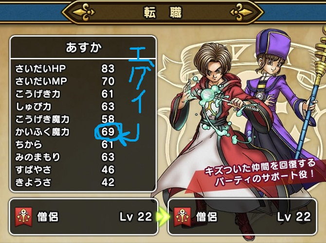
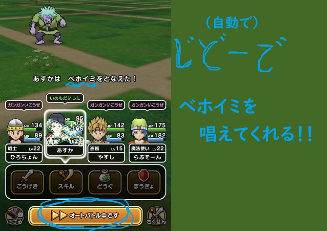
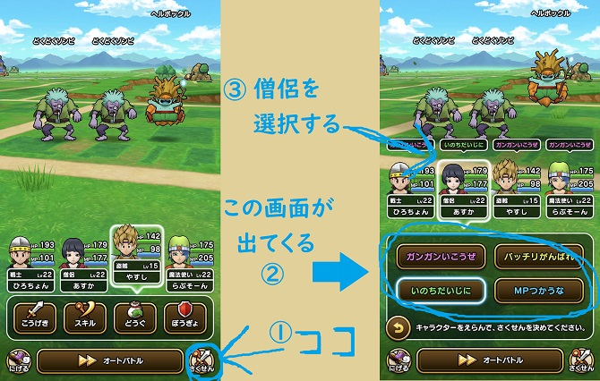

こんにちは。ひろちょんです。

<strong>ドラクエウォーク</strong>で<strong>僧侶</strong>さんのホイミ(仲間を回復できる呪文)は使っていますか？

僕は<strong>僧侶</strong>さんのホイミがないと、やってられません(>_<)

特にウォークモードやオートバトル時に、<strong>さくせん</strong>(<strong>作戦</strong>)を上手く使うと、味方を勝手に回復してくれるのが唯一無二の証ですね！

またバギ系の呪文も使えたりするので、割と高性能です(/・ω・)/

今回はそんな回復と攻撃役として重宝する<strong>僧侶</strong>の使い方についてまとめていきます。

目次です
<ol>
	<li><a href="#h-jump1"><b><strong>僧侶</strong>の基本スペック</b></a>
	<ul>
		<li><a href="#h-jump11"><b><strong>僧侶</strong>を他職業と比較してみる</b></a></li>
		<li><a href="#h-jump12"><b><strong>僧侶</strong>のスキル・特殊効果一覧</b></a></li>
		<li><a href="#h-jump13"><b><strong>僧侶</strong>の強い点と弱い点</b></a></li>
	</ul>
	</li>
	<li><a href="#h-jump2"><b><strong>僧侶</strong>の<strong>さくせん</strong>はコレ！</b></a>
	<ul>
		<li><a href="#h-jump21"><b><strong>さくせん</strong>(<strong>作戦</strong>)は『いのちだいじに』</b></a></li>
		<li><a href="#h-jump22"><b><strong>僧侶</strong>の初手はバギマを使うべし。</b></a></li>
	</ul>
	</li>
</ol>

<h2 id="h-jump1">僧侶の基本スペック</h2>

<strong>僧侶</strong>はストーリークエストの1章の5話をクリアすることで仲間になってくれる最初のパートナーです(/・ω・)/

<h3 id="h-jump11">僧侶を他の職業と比較してみる</h3>

初期ステータスの他職業との比較は↓下の表にまとめてみました！（僧侶は赤字になっています。）

 
<table class="table"> 
<tbody> 
<tr> 
<td style="width: 150px;background-color: #f6f6f6;"></td>
<td style="background-color: #fafafa;">戦士</td><td style="background-color: #fafafa;">魔法使い</td><td style="background-color: #fafafa;">僧侶</td><td style="background-color: #fafafa;">武闘家</td><td style="background-color: #fafafa;">盗賊</td>
</tr>
<tr> 
<td style="background-color: #fafafa;">さいだいHP</td>
<td>25</td><td>19</td><td>21</td><td>24</td><td>21</td>
</tr>
<tr> 
<td style="background-color: #fafafa;">さいだいMP</td>
<td>5</td><td>10</td><td>9</td><td>4</td><td>7</td>
</tr>
<tr> 
<td style="background-color: #fafafa;">こうげき力</td>
<td>8</td><td>4</td><td>5</td><td>9</td><td>7</td>
</tr>
<td style="background-color: #fafafa;">しゅび力</td>
<td>8</td><td>6</td><td>7</td><td>7</td><td>7</td>
</tr>
<tr> 
<td style="background-color: #fafafa;">こうげき魔力</td>
<td>1</td><td>8</td><td>4</td><td>0</td><td>2</td>
</tr>
<tr> 
<td style="background-color: #fafafa;">かいふく魔力</td>
<td>1</td><td>3</td><td>7</td><td>0</td><td>2</td>
</tr>
<tr> 
<td style="background-color: #fafafa;">ちから</td>
<td>8</td><td>4</td><td>5</td><td>9</td><td>7</td>
</tr>
<tr> 
<td style="background-color: #fafafa;">みのまもり</td>
<td>8</td><td>6</td><td>7</td><td>7</td><td>7</td>
</tr>
<tr> 
<td style="background-color: #fafafa;">すばやさ</td>
<td>3</td><td>5</td><td>4</td><td>6</td><td>7</td>
</tr>
<tr> 
<td style="background-color: #fafafa;">きようさ</td>
<td>4</td><td>5</td><td>4</td><td>6</td><td>7</td>
</tr>
</tbody>
</table>

<h4>僧侶のステータス面での良い所</h4>

突出して優れているのは『さいだいMP』『かいふく魔力』ですね。

これは回復役としての役割を果たすためのステータスですよね。
<ul>
	<li>回復呪文を使うためのMP量</li>
	<li>回復呪文の効果を高めることができるかいふく魔力</li>
</ul>

また『こうげき魔力』も魔法使いには劣りますが、全職業中で2番目に高いステータスを思っているので、攻撃系の呪文も得意としていることが分かります。

<h4>僧侶のステータス面での悪い所</h4>

やはり耐久力がないところが一般的に言われていますが、ステータス面では『武闘家』『盗賊』とあまり変わりはないです。

ただ魔法職は『装備のしゅび力』が低く設定されているので、そこで『武闘家』や『盗賊』との耐久力の差が生まれてきますね。

また『すばやさ』や『きようさ』も低いです。

<h3 id="h-jump12">僧侶のスキル・特殊効果一覧</h3>

次にレベルアップしていくごとに習得することのできるスキルや特殊効果を見ていきましょう！

↓表にまとめたのがコチラ↓

 
<table class="table"> 
<tbody> 
<tr> 
<td style="background-color: #fafafa;width: 150px;">Lv 1</td>
<td>ホイミ 仲間ひとりのHPを回復する</td>
</tr>
<tr> 
<td style="background-color: #fafafa;">Lv 5</td>
<td>(得)かいふく魔力+１０</td>
</tr>
<tr> 
<td style="background-color: #fafafa;">Lv 10</td>
<td>バギ 小さな竜巻で、敵全体にバギ属性の呪文微小ダメージを与える</td>
</tr>
<tr> 
<td style="background-color: #fafafa;">Lv 10</td>
<td>(得)じゅもんHP回復効果+１０％</td>
</tr>
<tr> 
<td style="background-color: #fafafa;">Lv 15</td>
<td>スカラ 仲間ひとりのしゅび力をかなり上げる</td>
</tr>
<tr> 
<td style="background-color: #fafafa;">Lv 15</td>
<td>(得)さいだいMP+１０</td>
</tr>
<tr> 
<td style="background-color: #fafafa;">Lv 20</td>
<td>ベホイミ 仲間ひとりのHPをかなり回復する</td>
</tr>
<tr> 
<td style="background-color: #fafafa;">Lv 20</td>
<td>[永続]かいふく魔力+１０</td>
</tr>
<tr> 
<td style="background-color: #fafafa;">Lv 25</td>
<td>バギマ はげしい竜巻で、敵全体にバギ属性の呪文小ダメージを与える</td>
</tr>
<tr> 
<td style="background-color: #fafafa;">Lv 30</td>
<td>(得)バギ属性じゅもんダメージ+２０％</td>
</tr>
<tr> 
<td style="background-color: #fafafa;">Lv 40</td>
<td>聖なる祈り 神に祈りを捧げ、回復呪文の回復量を上げる</td>
</tr>
<tr> 
<td style="background-color: #fafafa;">Lv 40</td>
<td>(得)じゅもんHP回復効果+１０％</td>
</tr>
<tr> 
<td style="background-color: #fafafa;">Lv 50</td>
<td>[永続]さいだいMP+１０</td>
</tr>
<tr> 
<td style="background-color: #fafafa;">Lv 55</td>
<td>(得)かいふく魔力+１０</td>
</tr>
</tbody>
</table>

<a href="/dqwalk-job-warrior/#h-jump23">＞＞＞ (得)マークの詳しい説明はコチラへ</a>

<a href="/dqwalk-job-fighter/#h-jump22">＞＞＞ [永続]マークの詳しい説明はコチラへ</a>

表から<strong>僧侶</strong>は主に『ホイミ、ベホイミ』といった回復呪文や、『バギ、バギマ』といったバギ系の攻撃呪文を得意としていますね！

また永続スキルとして、『かいふく魔力』や『さいだいMP』を向上させるスキルを持っています。

ですがレベル50になって、やっと永続の『さいだいMP』を習得できるので、あまり他職からの転職はオススメできないです。

<h3 id="h-jump3">僧侶の強い点と弱い点</h3>

いままでまとめてきたステータスやスキルからこれらの事が言えます。

<ul>
	<li>回復に関してのエキスパート</li>
	<li>バギ系の攻撃呪文ならそれなりに使える</li>
	<li>耐久力がない</li>
</ul>
これらが<strong>僧侶</strong>を使う上で、おさえるべきポイントという感じですかね～

<h2 id="h-jump2">僧侶のさくせんはコレ！</h2>

<strong>僧侶</strong>は回復がメインの職業といえます。

ですが全て命令で動かす訳ではなく、ウォークモード(Walk Mode)やオートバトルを使って自動で戦闘ができるのが、<strong>ドラクエウォーク</strong>の良い所ですよね(/・ω・)/

ですが自動であっても、キャラの行動をある程度は命令したいですよね…

そこで登場するのが『<strong>さくせん</strong>(<strong>作戦</strong>)』です！！！

<i class="fa fa-check" aria-hidden="true"></i> さくせんとは、オートバトル中にキャラの動きを指示するもの

<h3 id="h-jump21">さくせん(作戦)は『いのちだいじに』</h3>

<strong>僧侶</strong>の<strong>さくせん</strong>は『いのちだいじに』に設定しましょう！

<i class="fa fa-check" aria-hidden="true"></i> 《いのちだいじに》とは『自分や仲間のHPが減った時に回復して！』と命令すること

<strong>作戦</strong>には他にも種類がありまして、↓こんな感じ↓

 
<table class="table"> 
<tbody> 
<tr> 
<td style="background-color: #fafafa;width: 150px;">ガンガンいこうぜ</td>
<td>MPをガンガン消費して、大技をMP残量をためらわず打っていきます。 僕の使用感からすると、敵のHPを判断しながら技を打ってくれるから好き。</td>
</tr>
<tr> 
<td style="background-color: #fafafa;">バッチリがんばれ</td>
<td>適度に攻撃しつつ、回復もしてくれます。 HPに余裕がある時や敵がザコい時は、<strong>僧侶</strong>の場合はバギマしてくれるので使い分けが重要です。</td>
</tr>
<tr> 
<td style="background-color: #fafafa;">いのちだいじに</td>
<td>回復や蘇生を優先してくれます。 『バッチリがんばれ』では恐らく50%~30%以下で使ってくれるけど 『いのちだいじに』では減ったらすぐに使用する感じ</td>
</tr>
<tr> 
<td style="background-color: #fafafa;">MPつかうな</td>
<td>その名の通りMPを使いません。 道中で弱いモンスターにMPを消費したくない時に使いますかね。</td>
</tr>
</tbody>
</table>

このようにケースバイケースでさくせんを変えていきます。

<strong>僧侶</strong>はとにかく回復に専念して欲しいので、僕は『いのちだいじに』に設定しています。

<h3 id="h-jump22">僧侶の初手はバギマを使うべし。</h3>

<strong>さくせん</strong>の『いのちだいじに』は一つだけ欠点がありまして…

**自分や仲間のHPが満タンだと通常攻撃してしまいます。**

もちろん<strong>僧侶</strong>は通常攻撃のステを上げていないので、弱いです。

ここで効果的な使い方として、

<i class="fa fa-check" aria-hidden="true"></i> 味方のHPがあまり減っていない時は、攻撃呪文の『バギマ』を使う

先ほど説明したように、<strong>僧侶</strong>はバギ系の効果を高める特殊効果を持っているので、全体攻撃をしてくれる『バギマ』とても強いです！

なのである程度強い敵には、初ターンは『<strong>バギマ</strong>』を使って、あとはオートバトルに任せる流れが一番効率よさそうです。

<h2>まとめ</h2>

一見、回復オンリーなイメージがありますが、攻撃役としてもとても優秀な能力を発揮してくれる<strong>僧侶</strong>のご紹介でした！

<strong>僧侶</strong>の初ターンにあえて攻撃して、早めに敵を倒してしまうという<strong>作戦</strong>も逆にHPを温存する方法は結構良いですよ！笑

是非試してみてください！

 

最後まで読んで頂きありがとうございました。

気づいたこと、記事の感想、この文章おかしい…などなどございましたら、<a href="/contact-form/">お問い合わせページ</a>にてお問い合わせください。

まだまだドラクエウォークについて発信していくので、Twitter(@heacet43)フォローとかこのサイト(https://heacet.com)をお気に入りにしてくれると嬉しいなぁ…笑

注目記事<a href="/tag/dq-walk/">最新！ドラクエウォーク記事一覧</a>

 
