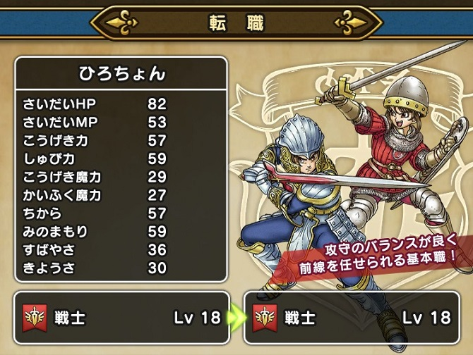
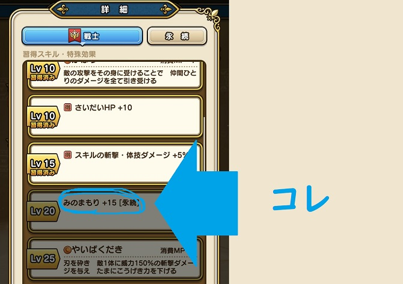
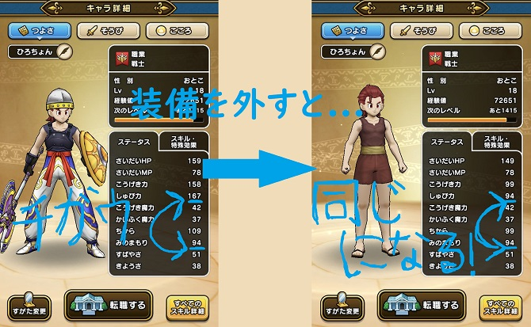
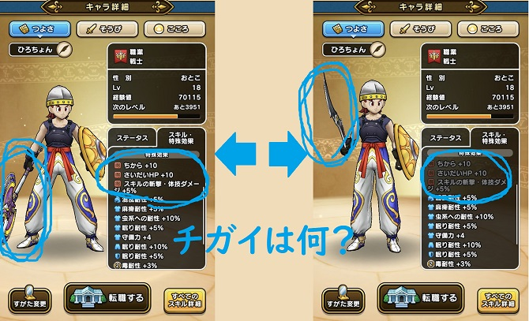

こんちゃっす。ひろちょんです。

<strong>ドラクエウォーク</strong>で強制的に就職することになる職業ございますね。笑

<strong>戦士</strong>です。

<strong>戦士</strong>の特徴は何と言っても《<strong>みのまもり</strong>》が永続(パッシブ)で習得できることなんですね～

そんな初期職業である<strong>戦士</strong>の特徴や《<strong>みのまもり</strong>》がなぜすごいのかなどなど、

またステータス画面にある《<strong>得とは</strong>》何なのかも触れていきながらご紹介していきます！

目次です～
<ol>
	<li><a href="#h-jump1"><b><strong>戦士</strong>の基本スペック</b></a>
	<ul>
		<li><a href="#h-jump11"><b><strong>戦士</strong>を他職業と比較してみる</b></a></li>
		<li><a href="#h-jump12"><b><strong>戦士</strong>のスキル・特殊効果一覧</b></a></li>
	</ul>
	</li>
	<li><a href="#h-jump2"><b><strong>みのまもり</strong>《<strong>得とは</strong>？》</b></a>
	<ul>
		<li><a href="#h-jump21"><b><strong>みのまもり</strong>としゅび力の違いは？</b></a></li>
		<li><a href="#h-jump22"><b><strong>みのまもり</strong>+１５が優秀すぎる件</b></a></li>
		<li><a href="#h-jump23"><b><strong>得とは</strong>？</b></a></li>
	</ul>
	</li>
</ol>

 

<h2 id="h-jump1">戦士の基本スペック</h2>

↑これは僕の<strong>戦士</strong>ちゃんです。装備無しの時のステータスですね～。

突出しているのはやはりHPですかね。他は平均的といったところです。

実際に具体的なステータスを見ていきます！

<h3 id="h-jump11">戦士を他職業と比較してみる</h3>

初期ステータスの他職業との比較は↓下の表にまとめてみました！（<strong>戦士</strong>は赤字になっています。）

<table class="table"> 
<tbody> 
<tr> 
<td style="width: 150px;background-color: #f6f6f6;"></td>
<td style="background-color: #fafafa;">戦士</td><td style="background-color: #fafafa;">魔法使い</td><td style="background-color: #fafafa;">僧侶</td><td style="background-color: #fafafa;">武闘家</td><td style="background-color: #fafafa;">盗賊</td>
</tr>
<tr> 
<td style="background-color: #fafafa;">さいだいHP</td>
<td>25</td><td>19</td><td>21</td><td>24</td><td>21</td>
</tr>
<tr> 
<td style="background-color: #fafafa;">さいだいMP</td>
<td>5</td><td>10</td><td>9</td><td>4</td><td>7</td>
</tr>
<tr> 
<td style="background-color: #fafafa;">こうげき力</td>
<td>8</td><td>4</td><td>5</td><td>9</td><td>7</td>
</tr>
<td style="background-color: #fafafa;">しゅび力</td>
<td>8</td><td>6</td><td>7</td><td>7</td><td>7</td>
</tr>
<tr> 
<td style="background-color: #fafafa;">こうげき魔力</td>
<td>1</td><td>8</td><td>4</td><td>0</td><td>2</td>
</tr>
<tr> 
<td style="background-color: #fafafa;">かいふく魔力</td>
<td>1</td><td>3</td><td>7</td><td>0</td><td>2</td>
</tr>
<tr> 
<td style="background-color: #fafafa;">ちから</td>
<td>8</td><td>4</td><td>5</td><td>9</td><td>7</td>
</tr>
<tr> 
<td style="background-color: #fafafa;">みのまもり</td>
<td>8</td><td>6</td><td>7</td><td>7</td><td>7</td>
</tr>
<tr> 
<td style="background-color: #fafafa;">すばやさ</td>
<td>3</td><td>5</td><td>4</td><td>6</td><td>7</td>
</tr>
<tr> 
<td style="background-color: #fafafa;">きようさ</td>
<td>4</td><td>5</td><td>4</td><td>6</td><td>7</td>
</tr>
</tbody>
</table>

やはり初期ステータスでは《HP》は他の職業と比べると最も高く、《こうげき力、しゅび力、ちから、<strong>みのまもり</strong>》などは平均的に高いような万能型な印象ですね。

<h3 id="h-jump12">戦士のスキル・特殊効果一覧</h3>

次にレベルアップしていくごとに習得することのできるスキルや特殊効果を見ていきますね！

↓表にまとめたのがコチラ↓

 
<table class="table"> 
<tbody> 
<tr> 
<td style="background-color: #fafafa;width: 150px;">Lv 5</td>
<td>きあいため きあいをためることで、次のターン与えるダメージが倍になる</td>
</tr>
<tr> 
<td style="background-color: #fafafa;">Lv 5</td>
<td>(<strong>得</strong>)ちから+１０</td>
</tr>
<tr> 
<td style="background-color: #fafafa;">Lv 10</td>
<td>かばう 敵の攻撃をその身に受けることで、仲間ひとりのダメージを全て引き受ける</td>
</tr>
<tr> 
<td style="background-color: #fafafa;">Lv 10</td>
<td>(<strong>得</strong>)さいだいHP+１０</td>
</tr>
<tr> 
<td style="background-color: #fafafa;">Lv 15</td>
<td>(<strong>得</strong>)スキルの斬撃・体技ダメージ+５％</td>
</tr>
<tr> 
<td style="background-color: #fafafa;">Lv 20</td>
<td>[永続]<strong>みのまもり</strong>+１５</td>
</tr>
<tr> 
<td style="background-color: #fafafa;">Lv 25</td>
<td>やいばくだき 刃を砕き、敵一体に威力１５０％の斬撃ダメージを与え、たまにこうげき力を下げる</td>
</tr>
<tr> 
<td style="background-color: #fafafa;">Lv 30</td>
<td>(<strong>得</strong>)ちから+１５</td>
</tr>
<tr> 
<td style="background-color: #fafafa;">Lv 40</td>
<td>はやぶさ斬り はやぶさのごとき高速の剣技で、敵一体に威力１２０％の斬撃攻撃を２回する</td>
</tr>
<tr> 
<td style="background-color: #fafafa;">Lv 40</td>
<td>(<strong>得</strong>)スキルの斬撃・体技ダメージ+５％</td>
</tr>
<tr> 
<td style="background-color: #fafafa;">Lv 50</td>
<td>[永続]さいだいHP+２０</td>
</tr>
<tr> 
<td style="background-color: #fafafa;">Lv 55</td>
<td>(<strong>得</strong>)ちから+１０</td>
</tr>
</tbody>
</table>

上昇しているステータスを見ると、《ちから》と《<strong>みのまもり</strong>》が上がっていますね～

そして(<strong>得</strong>)と[永続]のマークがゲーム内でもたくさん付いています。

永続とは簡単に言うと、１度取得すると永続的にそのステータスを得れるものを指します。

↓永続についてもっと知りたい方はコチラから(武闘家についても書いてます)↓

[【ドラクエウォーク】きようさを持つ武闘家が凄い！『永続とは？』](/dqwalk-job-fighter/)

また『<strong>みのまもり</strong>ってなんだ？』『<strong>得とは</strong>？』と思った方もいるかもしれないので、補足しますね！

 

<h2 id="h-jump2">みのまもり《得とは？》</h2>

まず、<strong>みのまもり</strong>とはその名前の通り身を守る力で、何も装備していない状態で守備力になります！

とりあえず能力が高ければ高いほど、受けるダメージ量が減っていくということですね！

<h3 id="h-jump21">みのまもりとしゅび力の違いは？</h3>

↑上の画像を見て頂いたらわかる通り、しゅび力とは『装備の守備力』と『<strong>みのまもり</strong>』が足し算された値になっているということです。

<blockquote>キャラクターが何も装備していない状態での体の丈夫さを表す。【ちから】とは対をなす能力。キャラクターの【しゅび力】に大きく関係するパラメータであり、
　　　　みのまもり＋【防具】【装飾品】の守備力の合計＝キャラクターの守備力
となる。
<a href="https://wikiwiki.jp/dqdic3rd/%E3%80%90%E3%81%BF%E3%81%AE%E3%81%BE%E3%82%82%E3%82%8A%E3%80%91">【みのまもり】 - ドラゴンクエスト大辞典を作ろうぜ！！第三版 Wiki*</a></blockquote>

つまり何も装備していないと『しゅび力＝<strong>みのまもり</strong>』ですが、装備をつけると『しゅび力＝<strong>みのまもり</strong>+装備の守備力』となる訳ですね(/・ω・)/

<h3 id="h-jump22">みのまもり+１５が優秀すぎる件</h3>

転職の際に是非考えて欲しいのですが、戦士はレベル２０になると永続で『<strong>みのまもり</strong>+１５』を習得できることはめちゃくちゃ優秀です。

装備一つで守備力を上げる時に、装備のレア度やレベルが上がっていないと、普通に１５も上がってないんですよね。

つまり『<strong>みのまもり</strong>+１５』を永続で習得できる戦士は是非とも全員に転職させておきたい職業であることに間違いないです！

<h3 id="h-jump23">得とは？</h3>

↑上の画像で違いがあるのですが、具体的な違いを挙げるとこんな感じ。
<ul>
	<li>武器が違う</li>
	<li>得の色が違う</li>
</ul>

<h4>武器が違う</h4>

まず武器が違うのですが、左はオノで右はブーメランなんですね。

<h4>得の色が違う</h4>

よく見てみると、左は<strong>得</strong>が適応されいるのに、右は<strong>得</strong>が適応されていない気がしますよね…

『実はその勘は正解です！』

これは職業によって得意な武器が決まっていて、得意な武器を装備することで(<strong>得</strong>)がついている効果を発揮できるのです！

<i class="fa fa-check" aria-hidden="true"></i> <strong>得とは</strong>得意な武器を装備したときに発動する特殊効果

戦士を例に挙げると、『片手剣』『オノ』『やり』を装備したときに発動する特殊効果という訳ですね！

なので『武器は職業に合ったものを選ぶべき』ということが言われている訳です(´艸｀*)

<h2>まとめ</h2>

今回は<strong>ドラクエウォーク</strong>で『これ絶対わからんやろ…』と思ったことを、調べてまとめてみました！

特に『<strong>得とは</strong>』なになのかは、初見ではわかりませんよね。笑

あと『<strong>みのまもり</strong>』の説明もさせて頂きました！これは是非とも転職を使えるようになった時にとっておきたいスキルですね～。

<a href="/dqwalk-job-priest/">＞＞＞僧侶の使い方や、さくせんについて詳しく知りたい方はコチラへ</a>

 

最後まで読んで頂きありがとうございました。

気づいたこと、記事の感想、この文章おかしい…などなどございましたら、<a href="/contact-form/">お問い合わせページ</a>にてお問い合わせください。

まだまだドラクエウォークについて発信していくので、Twitter(@heacet43)フォローとかこのサイト(https://heacet.com)をお気に入りにしてくれると嬉しいなぁ…笑

注目記事<a href="/tag/dq-walk">最新！ドラクエウォーク記事一覧はコチラ</a>

 
