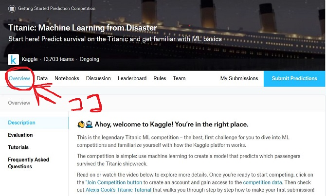
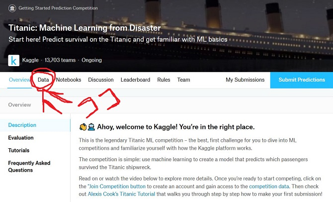
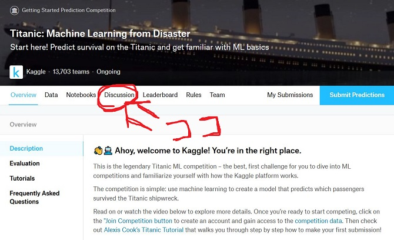

こんちゃっす。ひろちょんです。

今回は<a href="https://www.kaggle.com/">Kaggle</a>の<strong>テーブルコンペ</strong>に参加したときに、<strong>始めにやること</strong>をまとめていきます。

ただいま初のコンペに参加しておりまして、『軌跡をのこしておきたいな』と思って、書いていく次第です！

また次の<strong>テーブルコンペ</strong>に参加するときに『自分は何をやってたかなぁ』と思い出すための個人的なメモみたいなものです。笑

～目次です～
<ol>
	<li><a href="#h-jump1"><b><strong>コンペ</strong>の説明を読もう！</b></a></li>
	<li><a href="#h-jump2"><b>データセットに目を通す</b></a>
	<ul>
		<li><a href="#h-jump21"><b>データの解説を翻訳する</b></a></li>
		<li><a href="#h-jump22"><b>公式のデータ可視化ツールをチラ見</b></a></li>
	</ul></li>
	<li><a href="#h-jump3"><b>コードを書く前にDiscussionを見よう！</b></a>
	<ul>
		<li><a href="#h-jump31"><b>+αでやること</b></a></li>
	</ul></li>
	<li><a href="#h-jump4"><b>Notebooksを探索する！</b></a>
	<ul>
		<li><a href="#h-jump41"><b>良さげなNotebookをfolk!</b></a></li>
	</ul></li>
</ol>

<h2 id="h-jump1">コンペの説明を読もう！</h2>

まず翻訳使いまくっても良いので、【Overview】を読みましょう！笑

ここにはコンペ主催者のコンペ開催の意図や、コンペでスコアを出していくうえで、大切なことが必ず書かれています。

<h2 id="h-jump2">データセットに目を通す</h2>

データセットとはコンペで主に使用するデータ達になります。

主にコチラのデータ群がいたり、いなかったりします。
<ul>
	<li>訓練データ</li>
	<li>テストデータ</li>
	<li>訓練データが何を指すか説明するデータ</li>
	<li>テストデータが何を指すか説明するデータ</li>
	<li>提出する際の見本データ</li>
</ul>

↑のデータ群の解説がDataページにあるので、見ていきましょう。

<h3 id="h-jump21">データの解説を翻訳する</h3>
まず文章を読みつつ、恐らくデータの解説があると思うので、それぞれ何に対応しているのかを把握しましょう。

<i class="fa fa-check" aria-hidden="true"></i> データを英語⇒日本語に翻訳する

データの解説を翻訳しとけば大体把握できるので、まとめておきましょう。

<h3 id="h-jump22">公式のデータ可視化ツールをチラ見</h3>
Dataページを進めていくと、Kaggleがデータを可視化してくれている場所があります。

ここで軽くデータ群には何が入っているのか見ておくと、よりデータが何を指しているか分かりますね(/・ω・)/

<h2 id="h-jump3">コードを書く前にDiscussionを見よう！</h2>
ココにはコンペを始める上で主催者の重要な解説があったりします。

コンペを進めていく上で便利なツールを公表している場合もあるので、苦労する前に確認しておきましょう！！

<h3 id="h-jump31">+αでやること</h3>
できれば他のDiscussionも見ておきましょう。

Discussionの【sort by】の右側でDiscussionのソート方法が選択できるので、【Most Votes】を選択して、気になるDiscussionを見ておきましょう。

ここではコンペ参加者が疑問点を話し合っています。

ソート方法で投票数を選択したので、上位に挙がってきているDiscussionはそれだけ『参加者がその疑問点にぶつかった』という訳ですよね(/・ω・)/

いずれぶち当たる問題について、あらかじめ解決方法を知ることができるので、目を通しておくことをオススメします！

もしそれで解決できた時には、『ありがとう』コメントと▲をクリックしてあげてください。笑

<h2 id="h-jump4">Notebooksを探索する！</h2>

僕の場合はコンペ開催と同時に始めていないので、ある程度情報が揃っているケースになります。笑(※about 10days ago)

なので優しい方がチュートリアルを出してくれています！笑
データを分かりやすく可視化してくれているNotebookがあったりするので、くまなく読んでいきます。(為になったNotebookには▲クリック！)

<h3 id="h-jump41">良さげなNotebookをfolk!</h3>
Notebooksにはチュートリアルだけではなく、ハイスコアを出すたベースラインとなるような学習モデルをKernelとしてあげてくれている方がいます！！

そこで『参考になったよ！』コメントをしつつ、copy＆editしちゃいましょう！！

もしとても効果的なKernelならば▲クリックします。

<h2 id="h-jump">まとめ</h2>
今回は『コンペが始まった瞬間にどんな行動をとるべきか』について書きました！

実際にデータセットをどう扱っていくかについてはまた違う記事でまとめていきたいと思います！

最後まで読んで頂きありがとうございました。

気づいたこと、記事の感想、この文章おかしい…などなどございましたら、<a href="/contact-form/">お問い合わせページ</a>にてお問い合わせください。

どんどんKaggleについて発信していこうと思っているので、Twitter(@heacet43)フォローとかこのサイト(https://heacet.com)をお気に入りにしてくれると嬉しいなぁ…笑

