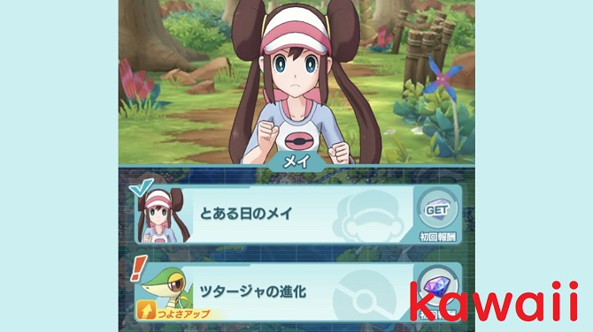
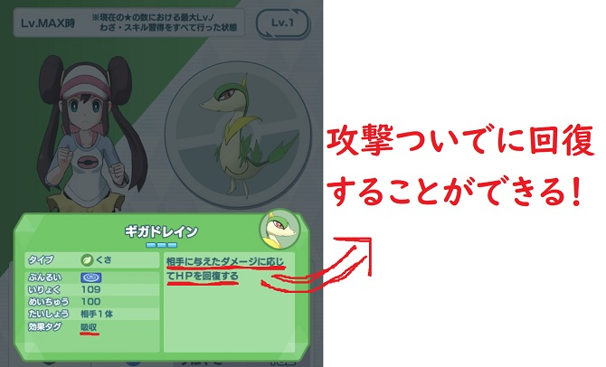
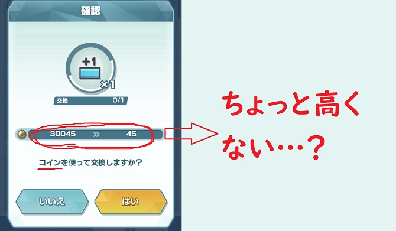
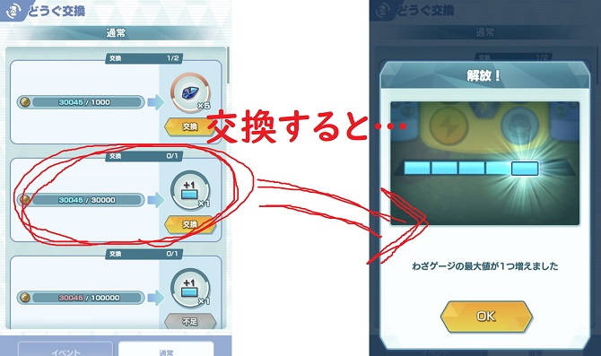
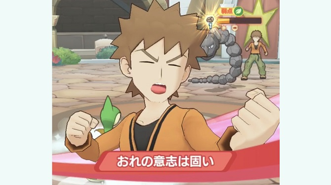
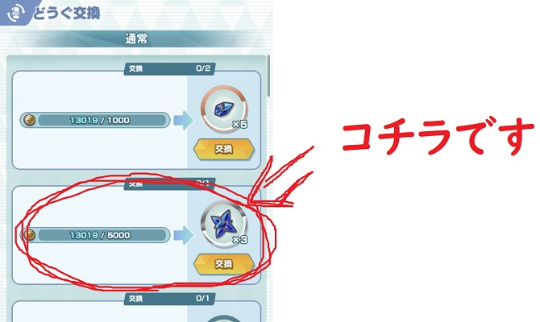

こんちゃっす。<strong>ポケマス</strong>どハマりのひろちょんです。

メイ＆ツタージャを<strong>ジャノビー</strong>に<strong>進化</strong>させるのは、頑張れば可能でした。

ですが<strong>ジャノビー</strong>を<strong>ジャローダ</strong>に<strong>進化</strong>させる時に『<strong>タケシ</strong>が<strong>強すぎ</strong>て<strong>勝てない</strong>！！』という方が多いのではないでしょうか？

『てか<strong>タケシ</strong>の<strong>イワーク</strong>が半端ない！笑』

くさタイプは弱点のはずなんですが、2，3回はシンプルに負けちゃいました笑

今回はそんな<strong>メイちゃん</strong>の<strong>ジャノビー</strong>を<strong>ジャローダ</strong>に<strong>進化</strong>させるための<strong>攻略法</strong>をまとめてきました！

もくじです～
<ol>
	<li><a href="#h-jump1"><b><strong>ジャノビー</strong>を育てよう！</b></a></li>
	<li><a href="#h-jump2"><b><strong>わざゲージ</strong>を購入しよう！</b></a></li>
	<li><a href="#h-jump3"><b><strong>タケシ&イワーク</strong>との戦い方</b></a></li>
</ol>

 

<h2 id="h-jump1">ジャノビーを育てよう！</h2>

<i class="fa fa-check" aria-hidden="true"></i> 打倒<strong>イワーク</strong>に向けて<strong>ジャノビー</strong>を育てる

僕が実際に育てた要点としてはこんな感じ。
<ul>
	<li><a href="#h-jump11"><b>ジャノビーをレベル50にする。</b></a></li>
	<li><a href="#h-jump12"><b>ギガドレインを習得　⇐必須</b></a></li>
</ul>

<h3 id="h-jump11">ジャノビーをレベル50にする。</h3>

<strong>ポケマス</strong>では1レべでステータスが結構変わってくるので、<strong>ジャノビー</strong>を50レべまではあげていた方がいいと思います！

<h4>バディーズの強化には強化の修練！</h4>

バディーズの強化で最も効率が良いのが、強化の修練エリアにて報酬で強化マニュアルを手に入れることです！

強化の修練エリアはエクストラエリアにあります。

またエクストラエリアの下の方にある強化の大修練の方が報酬が良かったりするので、開催されているなら是非行ってみてください！

<h3 id="h-jump12">ギガドレインを習得</h3>

ギガドレインは相手にダメージを与えながら、自身を回復することのできるチート技ですね！

そしてギガドレインを習得しなければイワークに勝つことができないです。

<h4>イワークのこうげきに耐えられない</h4>

<strong>イワーク</strong>はロールがアタッカーなので、こうげきが強いです。

こちらも<strong>ジャノビー</strong>のロールがサポートなのでぼうぎょ力は高いのですが、イワークのこうげきに押し負けてしまいます…

そこでギガドレインは『回復しつつ攻撃することができるちょうど良すぎるわざ』な訳です！

<h4>素材集めは守の修練へ行こう！</h4>

ギガドレインを習得するためには、守の修練へ素材を集めに行く必要があります。

こちらは強化の修練と同様にエクストラエリアにあります！

<h2 id="h-jump2">わざゲージを購入しよう！</h2>

わざゲージとはいつも戦闘中にわざを使うために溜まっていくゲージの事を指しています。

なんとこのゲージは初期状態の4つから2つ増やすことができるのです！！

<h3>増やし方は『購入』</h3>

余計な画像をすみません。笑

購入の手順はこんな感じ
<ol>
	<li>ショップを押す</li>
	<li>どうぐ交換を押す</li>
	<li>わざゲージを交換する</li>
</ol>

<h4>わざゲージ交換を補足</h4>

『どれを交換していいかわからない』という方向けに一応画像を貼り付けておきました！

てか『お金との交換』という名の購入ですよね…笑

とにかくこれでわざゲージが増えましたね！

さて実際に<strong>タケシ</strong>&<strong>イワーク</strong>と戦っていきます！

<h2 id="h-jump3">タケシ&イワークとの戦い方</h2>

さて実際にタケシ＆イワークと戦っていきます！

すみません。その前に進化石のかたまりが必要です。笑

<h3>進化石のかたまりを交換</h3>

エリアに入る前に進化のかたまり×３を要求されるので、交換しておきましょう。

こちらもショップ⇒どうぐ交換にあります。

<h3>バディーズエピソードへ</h3>

進化するためのエリアはバディーズエピソードのメイを選択してください。

そこで<strong>ジャノビーの進化</strong>の項目があるので選択。

<h3>戦いの手順</h3>

いよいよ戦っていきます。

手順としてはこんな感じ
<ol>
	<li>開始と同時にSPアップG</li>
	<li>ギガドレイン×2</li>
	<li>元気メイっぱい</li>
	<li>ギガドレイン×2</li>
	<li>SPアップG</li>
	<li>ギガドレイン</li>
	<li>元気メイっぱい</li>
	<li>ギガドレイン</li>
	<li>多分ここでイワークのバディーズわざ</li>
	<li>ジャノビーのバディーズわざ</li>
</ol>

僕はこの流れで勝てました(/・ω・)/

ポイントは『<strong>イワーク</strong>の<strong>バディーズわざ</strong>を耐えられるかどうか』だと思います。

ここがギガドレインを覚えさせる主な要因ですね！

<h2>まとめ</h2>

さて<strong>ジャノビー</strong>を<strong>ジャローダ</strong>に<strong>進化</strong>させることができたでしょうか？

僕は<strong>ジャローダ</strong>を見たことがなかったので、<strong>ポケマス</strong>で初見しました笑

まさかミニリューみたくなると思いませんでした…笑

 

最後まで読んで頂きありがとうございました。

気づいたこと、記事の感想、この文章おかしい…などなどございましたら、<a href="/contact-form/">お問い合わせページ</a>にてお問い合わせください。

最後にTwitter(@heacet43)フォローとかこのサイト(https://heacet.com)をお気に入りにしてくれると嬉しいなぁ…笑