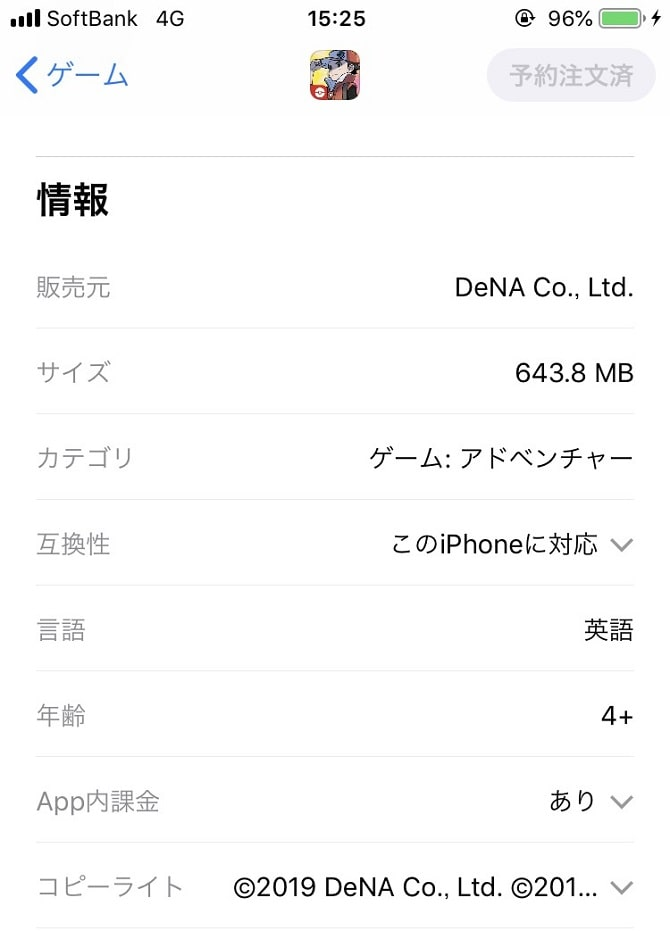
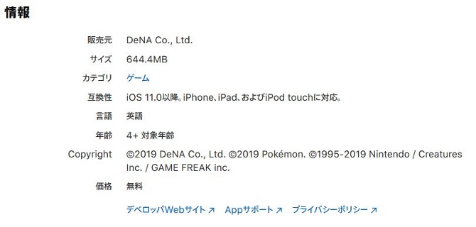
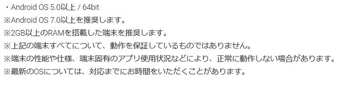

こんちゃっす。ひろちょんです。

<strong>ポケマス</strong>って<strong>容量</strong>取りそうですよね～。

なにせ<strong>DS</strong>でやっていた<strong>ゲーム</strong>を<strong>スマホアプリ</strong>としてやろうとしていますからね！笑

そんなポケマスの気になる容量や、対応機種について調べてきました！

目次です。
<ol>
	<li><a href="#h-jump1"><b>ポケマスの容量はどれくらい？</b></a></li>
	<li><a href="#h-jump2"><b>対応している機種は？</b></a></li>
</ol>

<h2 id="h-jump1">ポケマスの容量はどれくらい？</h2>

ポケマスの容量は最終的に1.3GB程必要と言われていますね！

<h3>実際に公式Twitterがその問いについて回答していました。</h3>

<blockquote class="twitter-tweet">
【必要な空き容量について】 『ポケモンマスターズ』をプレイするには、約1.3GBの空き容量が必要になります。 ※リリース時点で必要な容量です。  配信開始までに準備しておかないとですね！<a href="https://twitter.com/hashtag/%E3%83%9D%E3%82%B1%E3%83%9E%E3%82%B9?src=hash&amp;ref_src=twsrc%5Etfw">#ポケマス</a> <a href="https://twitter.com/hashtag/%E3%83%9D%E3%82%B1%E3%83%A2%E3%83%B3%E3%83%9E%E3%82%B9%E3%82%BF%E3%83%BC%E3%82%BA?src=hash&amp;ref_src=twsrc%5Etfw">#ポケモンマスターズ</a> <a href="https://t.co/W6BJlRajJy">pic.twitter.com/W6BJlRajJy</a>
&mdash; [公式]ポケマスだいすきクラブ (@pokemas_game) <a href="https://twitter.com/pokemas_game/status/1165458778122330112?ref_src=twsrc%5Etfw">August 25, 2019</a></blockquote>

<blockquote cite="https://twitter.com/pokemas_game/status/1165458778122330112">【必要な空き容量について】
『ポケモンマスターズ』をプレイするには、約1.3GBの空き容量が必要になります。
※リリース時点で必要な容量です。

配信開始までに準備しておかないとですね！</blockquote>

リリース時点で1.3GBは必要だということです。

ということは、今後アップデートされる度に容量も増えていくので、余分に確保しておく必要がありそうですね！

<h3>AppleStoreでは…</h3>

またAppleStoreではダウンロード時に必要な容量として648MBと書いています。

なのでゲーム内にて残りの700MBダウンロードするということですね～

アプリを入れただけではダウンロードは終わっていないのでご注意を！

<h2 id="h-jump2">対応している機種は？</h2>
実際に両ストアで確認してきました！

<h3>AppleStore</h3>

iOSは11以降でないといけないみたいです。

最近では訴訟のおかげでアップデートによってスマホの動作が重くなることもないので、アップデートされていない方はこれを機にアップデートしてみては？？

<h3>GooglePlay</h3>

アンドロイドではOSが5.0以上である必要があるみたいですが、7.0以上を推奨していますね。

Androidについてはあまり詳しく内で、以上です！笑

<h2>まとめ</h2>

現在、主に使用されている機種では起動するみたいですね！

ただし容量は1.3GB必要なので、そこが僕にとっては鬼門となってきそうです…笑

あのアプリ消すかぁ…

 

最後まで読んで頂きありがとうございました。

気づいたこと、記事の感想、この文章おかしい…などなどございましたら、お問い合わせページにてお問い合わせください。

最後にTwitter(@heacet43)フォローとかこのサイト(https://heacet.com)をお気に入りにしてくれると嬉しいなぁ…笑