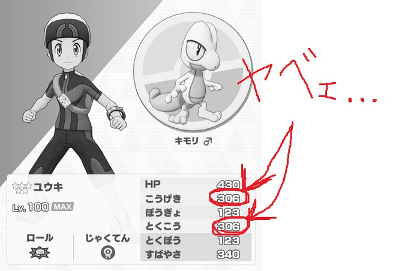
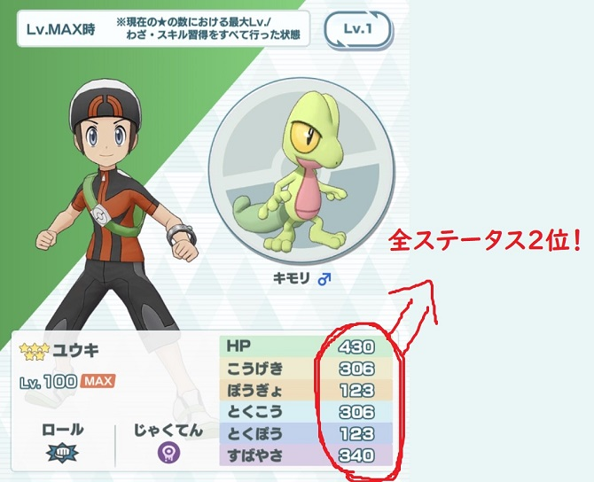
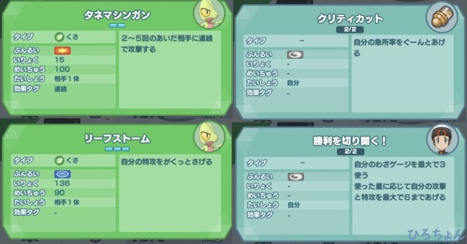
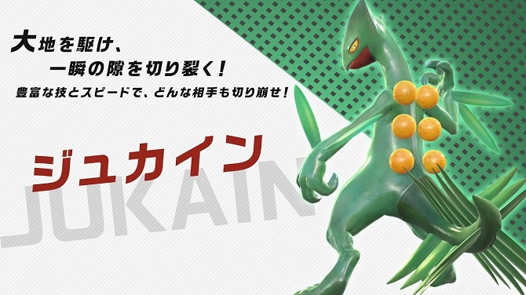
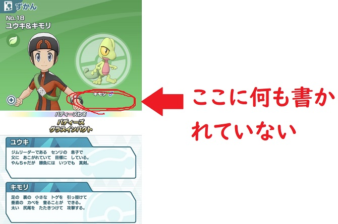
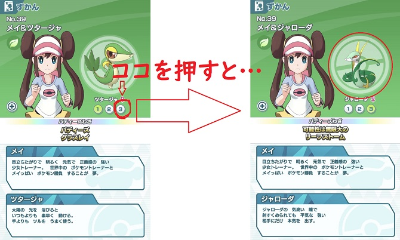
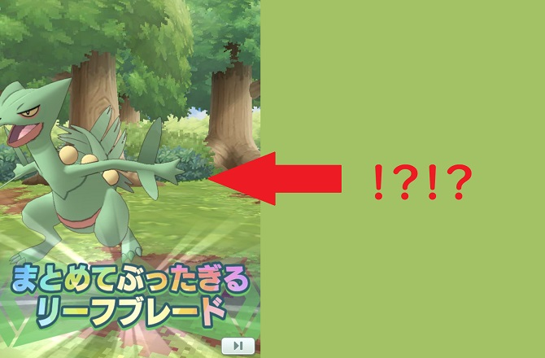
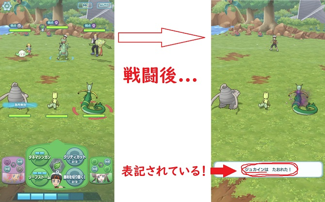

どうもです！ひろちょんです！

<strong>ポケマス</strong>の星5バディーズで割と強いと言われている<strong>ユウキ＆キモリ</strong>がいますよね！

この<strong>キモリ</strong>を実際に<strong>使ってみた感想</strong>や、『<strong>キモリ進化</strong>説』について書いていきたいと思います！

ポケモンサファイアで<strong>ジュプトル</strong>と<strong>ジュカイン</strong>を選んでいた身としては、<strong>進化</strong>して欲しいですね～

もくじ～～
<ol>
	<li><a href="#h-jump1"><b>今の僕の<strong>キモリ</strong>とその未来</b></a></li>
	<li><a href="#h-jump2"><b><strong>ユウキ＆キモリ</strong>を育成した感想</b></a></li>
	<li><a href="#h-jump3"><b><strong>キモリ</strong>って<strong>進化</strong>するの？</b></a></li>
	<li><a href="#h-jump4"><b><strong>ジュプトル</strong>と<strong>ジュカイン</strong>について</b></a></li>
</ol>

<h2 id="h-jump1">今の僕のキモリとその未来</h2>

↑これは僕のキモリではありません笑

なんでこんな画像を持っているか…あとでご紹介します！

<h3>まずこちらが僕のキモリです！</h3>

先ほど『<strong>勝利を切り開く！</strong>』を開放してきました～

火力を上げることしか考えていないわざ達なので、やっぱり攻撃は強いですね～

<h3>レベル100時のキモリ</h3>

なんとキモリは全バディーズの中でステータス総合2位なんですよね。

100レベル時のステータスは以下の方法で見れます。
<ol>
	<li>右下のポリゴンフォンを押す</li>
	<li>ずかんを押す</li>
	<li>見たいバディーズを押す</li>
	<li>左の中心あたりにある+マークを押す</li>
</ol>

↓こちらは100レベル時のステータスを比較したものです。

 
<table class="table"> 
<tbody> 
<tr> 
<td style="background-color: #fafafa; text-align: center; width: 90px;">バディーズ</td>
<td>HP</td>
<td>こうげき</td>
<td>ぼうぎょ</td>
<td>とくこう</td>
<td>とくぼう</td>
<td>すばやさ</td>
<td>全ステータス</td>
</tr>
<tr> 
<td style="background-color: #fafafa; text-align: center;">カリン ＆ ヘルガー</td>
<td>460</td>
<td>268</td>
<td>155</td>
<td>336</td>
<td>141</td>
<td>345</td>
<td>1705</td>
</tr>
<tr> 
<td style="background-color: #fafafa; text-align: center;">ユウキ ＆ キモリ</td>
<td>430</td>
<td>306</td>
<td>123</td>
<td>306</td>
<td>123</td>
<td>340</td>
<td>1628</td>
</tr>
<tr> 
<td style="background-color: #fafafa; text-align: center;">キクコ ＆ ゲンガー</td>
<td>417</td>
<td>119</td>
<td>102</td>
<td>339</td>
<td>150</td>
<td>337</td>
<td>1464</td>
</tr>
<tr> 
<td style="background-color: #fafafa; text-align: center;">ダヅラ ＆ カイロス</td>
<td>477</td>
<td>365</td>
<td>141</td>
<td>71</td>
<td>118</td>
<td>251</td>
<td>1423</td>
</tr>
</tbody>
</table>

お気づきの方もいるかもしれませんが、<strong>キモリ＆ユウキ</strong>以外全員が<strong>メガシンカ</strong>後のステータスとなっております。笑

キモリがメガシンカするかは分かりませんが、今後に期待できますね！

<h2 id="h-jump2">ユウキ＆キモリの使用感</h2>

雑な絵ですみません…笑

いくつかのポイントに分けてご紹介しますね。
<ol>
	<li><a href="#h-jump21"><b>すばやさが凄い！</b></a></li>
	<li><a href="#h-jump22"><b>バランスのとれているわざ</b></a></li>
	<li><a href="#h-jump23"><b>『勝利を切り開く！』が強すぎる</b></a></li>
	<li><a href="#h-jump24"><b>キモリのここがいまいち…</b></a></li>
</ol>

<h3 id="h-jump21">すばやさが凄い！</h3>

先ほどのステータスランキングを見て頂いたらわかる通り、すばやさがすごいんですよね～。

全体で3位のすばやさなので、わざゲージも溜まりやすい仕様となっております！

<h3 id="h-jump22">バランスのとれているわざ</h3>

 
<table class="table"> 
<tbody> 
<tr> 
<td style="background-color: #fafafa;width: 150px;">タネマシンガン</td>
<td>物理攻撃</td>
<td>2～5回のあいだ相手に連続で攻撃する</td>
</tr>
<tr> 
<td style="background-color: #fafafa;">リーフストーム</td>
<td>特殊攻撃</td>
<td>自分の特攻をがくっと下げる</td>
</tr>
<tr>
<td style="background-color: #fafafa;">クリティカルヒット</td>
<td>バフ</td>
<td>自分の急所率をぐーんとあげる</td>
</tr>
<tr> 
<td style="background-color: #fafafa;">勝利を切り開く！</td>
<td>バフ</td>
<td>自分のわざゲージを最大で3使う 使った量に応じて自分の攻撃と特攻を最大6まであげる</td>
</tr>
</tbody>
</table>

<h4>流れの作りやすいわざ構成</h4>

わざが一つ一つ意味のある動きをしてくれるので、とても使いやすいのが特徴です。

流れとして
<ul>
	<li>『クリティカルヒット』にて急所率を上げる⇒『タネマシンガン』で連続攻撃で高火力</li>
	<li>『勝利を切り開く！』⇒『タネマシンガン,リーフストーム』</li>
</ul>

特に急所率が上がっているときのタネマシンガンはわざゲージ2の威力をはるかに超えていますね…笑

<h3 id="h-jump23">『勝利を切り開く！』が強すぎる</h3>

これが<strong>キモリ</strong>のリセマラランキングの順位を上げている主な要因と言えるところです。

最大で『こうげき』と『とくこう』を６ずつ上げてます。笑

これがどれくらいヤバイかというと…

ツタージャにも全体の『とくこう』を上げるバフがあるのですが、それでも2しか上がりません。

それが『こうげき』と『とくこう』の両方を6ずつ上げているのでヤバさは歴然ですね！

<h3 id="h-jump24">キモリのここがいまいち…</h3>

ぜんぜん満足しているのですが、いくつか『イマイチだなー』と思うことがあるので、ご紹介します！

<ol>
	<li><a href="#h-jump241"><b>タネマシンガンが2回だけのときー！</b></a></li>
	<li><a href="#h-jump242"><b>耐久力は皆無</b></a></li>
</ol>

<h4 id="h-jump241">タネマシンガンが2回だけのときー！</h4>

タネマシンガンは威力15のわざを2～5回の攻撃するのですが、2回だけの時はガッカリしますね。笑

しかも急所に当たっていない時は『せっかくのわざゲージ2が…』とか思うことは多々あります。笑

<h4 id="h-jump242">耐久力は皆無</h4>

もう攻撃されたら終わりです。笑

『☆全体攻撃マジ卍☆』

<h2 id="h-jump3">キモリって進化するの？</h2>

従来のポケモンシリーズだと、<strong>キモリ</strong>は<strong>進化</strong>すると⇒<strong>ジュプトル</strong>は<strong>進化</strong>すると⇒<strong>ジュカイン</strong>となります。

この<strong>ポケモンマスターズ</strong>では進化するのかどうかなのですが、

結論から言いますと…

『現在は<strong>進化</strong>は実装されていません！』

なぜ分かるかと言いますと、進化するポケモンにはずかんに番号が振られています。

<h3>ポケモンが進化するかどうかわかる場所</h3>

ではどこにその表示があるか見ていきます！

<h4>キモリ</h4>

↓ずかんのキモリを見てもらうとこのようになっています。

赤で囲まれている部分に数字が描かれていると<strong>進化</strong>が<strong>ポケマス</strong>内で実装されている証拠になります。

ですがキモリにはどうやら見当たりません。

<h4>ツタージャ</h4>

↓ずかんのツタージャを見てもらうとこのようになっています。

ツタージャでは数字の表示がありますね！

押してみると進化後の様子が反映されるようになっています。

このように<strong>ポケマス</strong>で<strong>進化</strong>が実装されているかどうかは、ずかんにて確認することができます。

<h2 id="h-jump4">ジュプトルとジュカインについて</h2>

ある日、エクストラエリアの強化の修練【VERY HARD】に挑んだ時に、ビックリしましたね！笑

『普通にジュカイン出てきてるやん(；ﾟДﾟ)』

そうなんです。ボスとして<strong>ジュカイン</strong>は<strong>ポケマス</strong>内にて実装されています！

<h3>ジュカインとジュプトルの実装は確定かな？</h3>

戦闘後に↑こんな表記がされていました。

ここまで実装させておいて、なぜ<strong>進化</strong>できないのかが逆に気になりますね！笑

<strong>ジュカイン</strong>が現れたということは、<strong>進化前</strong>の<strong>ジュプトル</strong>も実装されるはずなので、期待です( *´艸｀)

<h2>まとめ</h2>

<strong>キモリ＆ユウキ</strong>をめちゃくちゃ紹介してきましたが、僕は<strong>キモリ</strong>好きですね！

やっぱり個人的に<strong>ポケマス</strong>では、『好きなバディーズを使うことが一番かなぁ』と思っています。

いまのところ育てればどのバディーズでもステージはクリアできるので是非色々なバディーズを楽しんでみてください！

<a href="/pokemonmasters-janoby/">＞＞＞ こちらでジャノビー(ツタージャ)の進化方法もまとめています。</a>

 

最後まで読んで頂きありがとうございました。

気づいたこと、記事の感想、この文章おかしい…などなどございましたら、<a href="/contact-form/">お問い合わせページ</a>にてお問い合わせください。

最後にTwitter(@heacet43)フォローとかこのサイト(https://heacet.com)をお気に入りにしてくれると嬉しいなぁ…笑
