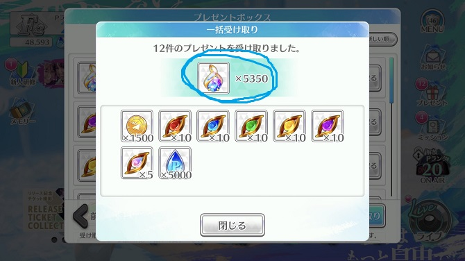
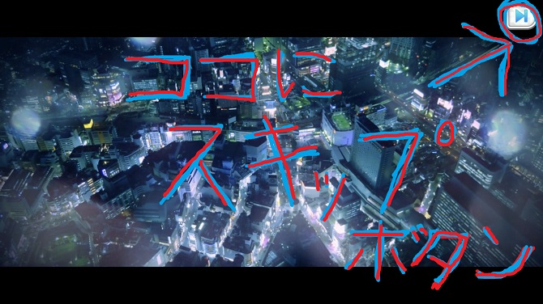
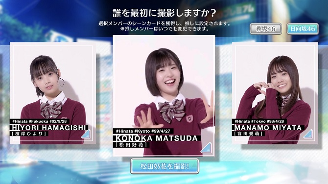
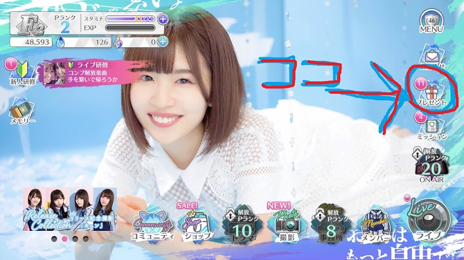
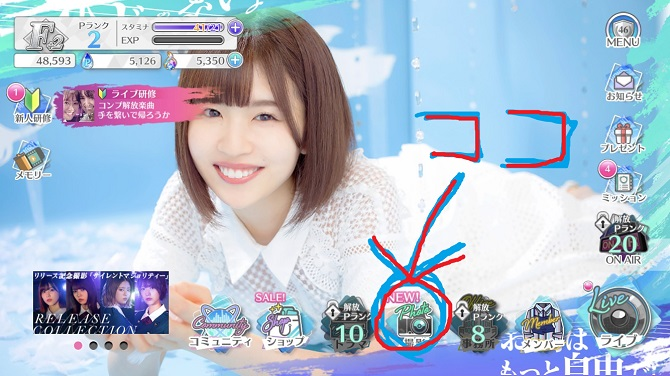
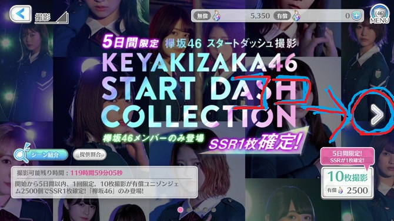
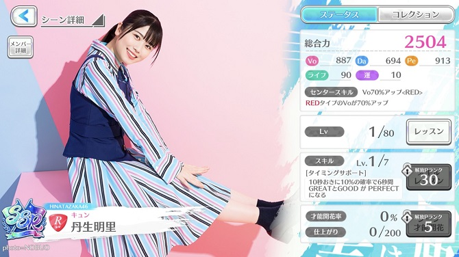
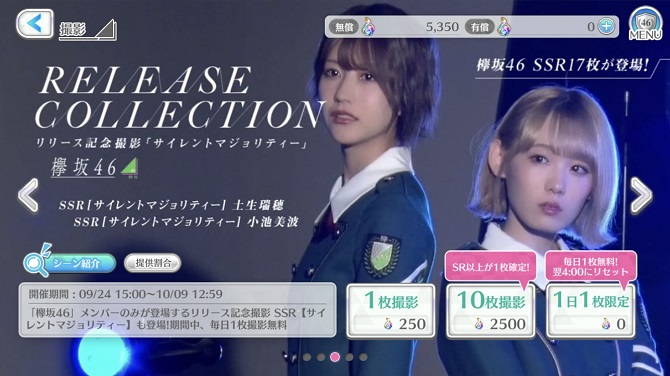

こんちゃっす。ひろちょんです。

ついに『欅坂46』、『日向坂46』の公式音ゲーである<strong>ユニゾンエアー</strong>がリリースされましたね！

<strong>ユニゾンエアー</strong>ではガチャを採用しているので、僕のように運のない方は、推しメンを<strong>リセマラ</strong>でゲットする必要があるみたいです…

なので今回は<strong>ユニゾンエアーのリセマラ</strong>手順を紹介していきます(/・ω・)/

目次です～
<ol>
	<li><a href="#h-jump1"><b><strong>ユニゾンエアーのリセマラ</strong>手順はコレ</b></a>
	<ul>
		<li><a href="#h-jump11"><b><strong>リセマラ</strong>手順を表にまとめました</b></a></li>
	</ul>
	</li>
	<li><a href="#h-jump2"><b>最速<strong>リセマラ</strong>周回のコツ</b></a>
	<ul>
		<li><a href="#h-jump21"><b><strong>リセマラ</strong>は一部スキップできる！</b></a></li>
		<li><a href="#h-jump22"><b>苦渋の推しメン選択…</b></a></li>
		<li><a href="#h-jump23"><b>プレゼントを選択</b></a></li>
		<li><a href="#h-jump24"><b>撮影を選択</b></a></li>
		<li><a href="#h-jump25"><b>有償ガチャに注意</b></a></li>
		<li><a href="#h-jump26"><b>SSRの推しメンが出れば終了！</b></a></li>
	</ul>
	</li>
</ol>

<h2 id="h-jump1">ユニゾンエアーのリセマラ手順はコレ</h2>

実際に<strong>ユニゾンエアー</strong>をプレイして<strong>リセマラ</strong>手順を確認してきました(/・ω・)/

<strong>ユニゾンエアー</strong>ではチュートリアルクリアでガチャ20回分のプレゼントがもらえます！

もしそこで当たらなかったら、『<strong>リセマラ</strong>』という感じです！

<h3 id="h-jump11">リセマラ手順を表にまとめました！</h3>
<ol>
	<li>色々とダウンロード開始！</li>
	<li><a href="#h-jump21"><b><strong>リセマラ</strong>は一部スキップできる！</b></a></li>
	<li><a href="#h-jump22"><b>苦渋の推しメン選択…</b></a></li>
	<li>ライブをプレイ！</li>
	<li><a href="#h-jump23"><b>プレゼントを選択</b></a></li>
	<li><a href="#h-jump24"><b>撮影を選択</b></a></li>
	<li><a href="#h-jump25"><b>有償ガチャに注意です。</b></a></li>
	<li><a href="#h-jump26"><b>SSRの推しメンが出れば終了！</b></a></li>
	<li><a href="#h-jump27"><b>出なければアプリをアンインストール</b></a></li>
</ol>

大体の流れはこんな感じ。

主に重要そうなところを太字にしています。(押すと詳しい説明を開きます。)

恐らく説明不足だと思いますので、補足していきますね(´艸｀*)

<h2 id="h-jump2">最速リセマラ周回のコツ</h2>

<strong>ユニゾンエアーにてリセマラする</strong>にあたって、注意すべき点がいくつかあります。

画像を合わせて説明していきますね～

<h3 id="h-jump21">リセマラは一部スキップできる！</h3>

実はリセマラ序盤でSkipボタンが出現しています！

一度映像を見て、飛ばしたいと言う方は画面の右上をタップしてみてください！

するとSkipボタンが現れるので、Skipしちゃってください('ω')ノ

(Skipできないシーンもアリ)

<h3 id="h-jump22">苦渋の推しメン選択…</h3>

『もちろん僕はこのかさん一択なので…(みーぱんとKAWATAも捨てがたい…)』

などなどリセマラ中にやっていると、心が持ちません。(ココで一番時間使いました。笑)

『おひさまの皆さん！ファイトです！』

<h3 id="h-jump23">プレゼントを選択！</h3>

ライブが終わり、チュートリアルをポチポチしていると、自由に行動できるようになります。

ここからすぐに↑上の画像のプレゼントをクリックしましょう。

するとガチャ20回分(ユニゾンジェム5000個)のプレゼントを受け取ることができます。

<h3 id="h-jump24">撮影を選択！</h3>

恐らく<strong>ユニゾンエアーでリセマラしていると</strong>『ガチャはどこだ！？』ってなるので、場所を紹介です(´艸｀*)

<strong>ユニゾンエアー</strong>では『ガチャ』の事を『撮影』と呼ぶみたいですね！

<h3 id="h-jump25">有償ガチャに注意です。</h3>

撮影ボタンを押すと、ガチャの画面になるのですが、コチラは有償(課金のみ)のガチャになっていて、配布されたユニゾンジェムではガチャを引くことができません。

若干見にくくて申し訳ないのですが、画面右側の矢印マークを2回押すとガチャが引ける画面が出て来ます(/・ω・)/

<h3 id="h-jump26">SSRの推しメンが出れば終了！</h3>

最高レアはSSRとなっていて、確率は6%だそうです。

なので計算的には20回引いて一人SSRが出そうですね。

ですが<strong>リセマラ</strong>するとなると『<strong>二人SSR</strong>』or『<strong>推しメンSSR</strong>』といったところですかね～

<h3 id="h-jump27">出なければアプリをアンインストール</h3>

↑少し日向坂贔屓に書いてしまったので、欅坂も(みいちゃんが可愛すぎて…)↑

ガチャ20連でSSRが出なかったら、<strong>リセマラ</strong>継続になりますね！

<h2>まとめ</h2>

今回の<strong>ユニゾンエアーではリセマラ</strong>がしやすいのではないでしょうか？

比較的にダウンロードする時間も、チュートリアルも少なそうなので、すぐにガチャを引けそうです！

また記事内で紹介した<strong>リセマラ</strong>中のスキップの方法も試してみてください！

 

最後まで読んで頂きありがとうございました。

気づいたこと、記事の感想、この文章おかしい…などなどございましたら、<a href="/contact-form/">お問い合わせページ</a>にてお問い合わせください。

最後にTwitter([@heacet43](https://twitter.com/heacet43))フォローとかこのサイト(https://heacet.com)をお気に入りにしてくれると嬉しいなぁ…笑
