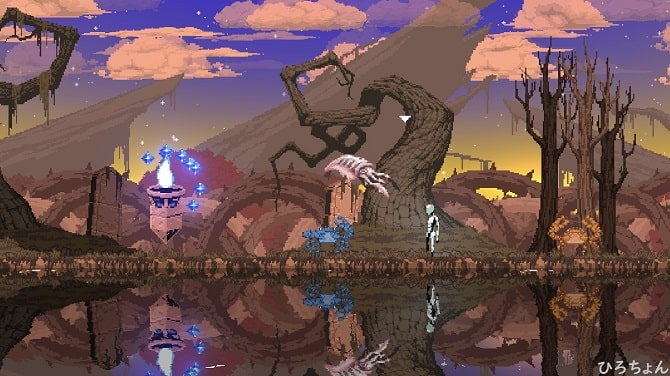
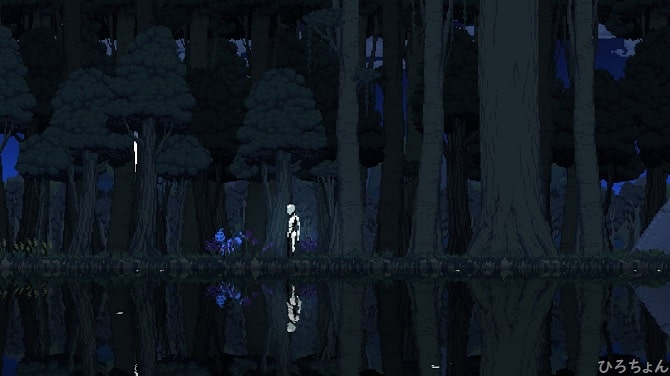

こんにちは。ひろちょんです。

なーーんと、<strong>World for two</strong>に<strong>色違い</strong>の生物たちがいるみたいですね！！

『実は今まで気付きませんでした…笑』

早速ご紹介させていただきます！！

目次です('ω')
<ol>
	<li><a href="#h-jump1"><strong>色違いの生物達</strong></a></li>
	<li><a href="#h-jump2"><strong>さっそく色違いを探しに行きます！</strong></a></li>
	<li><a href="#h-jump3"><strong>(考察)色違いがいる理由は…？</strong></a></li>
</ol>

<h2 id="h-jump1">色違いの生物達</h2>

↓今のところ発見された<strong>色違い</strong>の<strong>生物</strong>はこちら↓

<ol>
	<li><a href="#h-jump11"><strong>色違いのカニ</strong></a></li>
	<li><a href="#h-jump12"><strong>色違いのマンタ</strong></a></li>
	<li><a href="#h-jump13"><strong>色違いのアリ</strong></a></li>
	<li><a href="#h-jump14"><strong>色違いのカエル</strong></a></li>
	<li><a href="#h-jump15"><strong>色違いのサル</strong></a></li>
</ol>

どうやら発見されている色違いは全て神秘のDNAとの組み合わせで生まれているみたいですね。
詳しく見ていきましょう！

 

<h3 id="h-jump11">色違いのカニ</h3>

<h4>DNA組み合わせ</h4>
<ul>
	<li><a href="/world-for-two-numa/#h-jump32">カニ</a></li>
	<li>神秘のDNA</li>
</ul>
<h4>進化前/進化後</h4>
<ul>
	<li>進化前　⇒　<a href="/world-for-two-numa/#h-jump32">カニ</a></li>
	<li>進化後　⇒　無</li>
</ul>
<h4>見た目の感想</h4>

色がすーごい南アフリカ付近に生息してそう…笑

 

<h3 id="h-jump12">色違いのマンタ</h3>

<h4>DNA組み合わせ</h4>
<ul>
	<li><a href="/world-for-two-numa/#h-jump22">マンタ</a></li>
	<li>神秘のDNA</li>
</ul>
<h4>進化前/進化後</h4>
<ul>
	<li>進化前　⇒　<a href="/world-for-two-numa/#h-jump22">マンタ</a></li>
	<li>進化後　⇒　<a href="/world-for-two-numa/#h-jump23">リュウグウノツカイ</a></li>
</ul>
<h4>見た目の感想</h4>

赤より青の方がリアルに近い…？

 

<h3 id="h-jump13">色違いのアリ</h3>

<h4>DNA組み合わせ</h4>
<ul>
	<li><a href="/world-for-two-shinrin/#h-jump12">アリ</a></li>
	<li>神秘のDNA</li>
</ul>
<h4>進化前/進化後</h4>
<ul>
	<li>進化前　⇒　<a href="/world-for-two-shinrin/#h-jump12">アリ</a></li>
	<li>進化後　⇒　<a href="/world-for-two-shinrin/#h-jump13">サナギ</a>　/　<a href="/world-for-two-shinrin/#h-jump21">コガネムシ</a></li>
</ul>
<h4>見た目の感想</h4>

そろそろ色に予想ついてきましたね！

赤は毒々しかったけど、色違いはクールだぁ( *´艸｀)

 

<h3 id="h-jump14">色違いのカエル</h3>

<h4>DNA組み合わせ</h4>
<ul>
	<li><a href="/world-for-two-sakyu/#h-jump11">カエル</a></li>
	<li>神秘のDNA</li>
</ul>
<h4>進化前/進化後</h4>
<ul>
	<li>進化前　⇒　<a href="/world-for-two-sakyu/#h-jump11">カエル</a></li>
	<li>進化後　⇒　<a href="/world-for-two-sakyu/#h-jump12">トカゲ</a>　/　<a href="/world-for-two-iseki/#h-jump11">小鳥</a>　/　<a href="/world-for-two-iseki/#h-jump21">ネズミ</a></li>
</ul>
<h4>見た目の感想</h4>

またも青色ですね！

このカエルは絶対アマゾンにいますよ。笑

 

<h3 id="h-jump15">色違いのサル</h3>

<h4>DNA組み合わせ</h4>
<ul>
	<li><a href="/world-for-two-iseki/#h-jump22">サル</a></li>
	<li>神秘のDNA</li>
</ul>
<h4>進化前/進化後</h4>
<ul>
	<li>進化前　⇒　<a href="/world-for-two-iseki/#h-jump22">サル</a></li>
	<li>進化後　⇒　無</li>
</ul>
<h4>見た目の感想</h4>

『青にせんのかーーーーい！』

ここまで引っ張りましたね～。サルだけ黄色なのは意味があるのかな…？？

 

<h2 id="h-jump2">さっそく色違いを探しに行きます！</h2>

久しぶりの冒険でワクワクしています～

<h3>『カニ』と『青いカニ』夢の競演</h3>

見えますかね…？

右側に赤いカニ、左側に青いカニがいるんですが、背景が夕方なので保護色みたくなってますね笑

<h3>マンタが近い近い///</h3>

色違いマンタと至近距離で目が合ってしまいました///

<h3>進化に成功している色違いアリ</h3>

『赤から青に進化したことで見つけにくくなってる！？』

夜だと本当に見つけにくいです。笑

<h3>カエルとかくれんぼ</h3>

『あれ…いないなぁ…』と思っていたら、バレバレですよ。

ゲームのシステム的に見つかりました。笑

これ『逃走中でカメラマンが見つかって、逃げてる人がハンターに見つかっちゃうパターン』と似てません？？笑

<h3>すぐに見つけれる色違いサル</h3>

元は白で見つけにくかったんですが、黄色になって、他の色違い生物と比べてすごく見つけやすくなりました。笑

<h2 id="h-jump3">(考察)色違いがいる理由は…？</h2>

色違いのサルからDNAを採取してみたのですが、普通のサルのDNAが得られました。
どうやら図鑑(BOOK)に反映されることはないようです。

 

新たに生成させた色違いの生物を探索しているうちに色々気づけることがありました。

答えはゲーム内での解説はなかったので、僕の考察を発表しますね。

<h3>4匹の色違いが青だった理由</h3>

カニとマンタ、アリ、カエルが色違いでしたね。
なぜこの4匹にしたのかは予想がつきませんでした。

ですがなぜ青色で、4匹が青色だったのかは考察できました。

<i class="fa fa-check" aria-hidden="true"></i> 夜が青暗く、どの生物にしても捕食される立場だから

 

【<strong>World for Two</strong>】をプレイしていると、《日中》《夕方》《夜中》と3つの状態に分かれます。
そして《夜中》が一番生物を見つけづらいのですが、《夜中》の時は青暗くなるんです。

僕はこのゲーム内の設定に生物が対応して、『進化したのではないか？』と考えます。

実際にどの生物も《夜中》は見つけづらかったです。また《日中》《夕方》にしても、比較的に見つけにくくなりますね。

<h3>サルだけ黄色だった理由</h3>

唯一サルだけが黄色で、すごく見つけやすかったです。笑

ではなぜサルだけ見つけやすい黄色で、また1匹だけなのでしょうか？

<i class="fa fa-check" aria-hidden="true"></i>それは生態系の頂点に立っているから

 

サルは人間に進化する(実際はゴリラが一番可能性が高い)と言われていて、現在の人間とは生態系の頂点に立つものです。

そして『サルは生態系の頂点に立つため、捕食される対象も少なく、身を隠す必要が無くなったのでは？』と考えています。

<h2>まとめ</h2>

自分なりに考察してみたのですが、いかがだったでしょうか。

『本当に考えさせられるゲームだな。』と再び感心させられてました。

 

最後まで読んで頂き、ありがとうございました。

気づいたこと、記事の感想、この文章おかしい…などなどございましたら、[お問い合わせページ](/contact-form/)にてお問い合わせください。

Twitter([@heacet43](https://twitter.com/heacet43/))フォローとかこのサイト(https://heacet.com)をお気に入りにしてくれると嬉しいなぁ…笑
