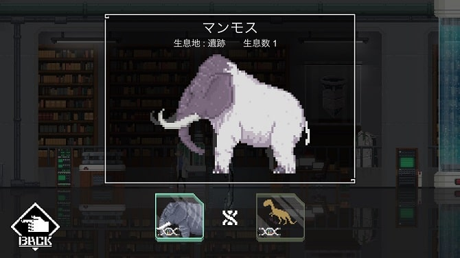

こんにちは。ひろちょんです。

**【World for Two】**の**DNA(遺伝子)の組み合わせ**を、**攻略**が難しいという方に向けてまとめました！

この記事は遺跡についてです。どうぞ参考にしてください。

目次です

<ol>
	<li><a href="#h-jump1"><strong>遺跡の1列目</strong></a></li>
	<li><a href="#h-jump2"><strong>遺跡の2列目</strong></a></li>
	<li><a href="#h-jump3"><strong>遺跡の3列目</strong></a></li>
	<li><a href="#h-jump4"><strong>遺跡のBOOK完成図がこちら</strong></a></li>
</ol>

<h2 id="h-jump1">遺跡の1列目</h2>

<strong>遺跡</strong>の１列目になります。

<a href="#h-jump2"><u>2列目はこちら</u></a>

<ol>
	<li><a href="#h-jump11"><strong>小鳥</strong></a></li>
	<li><a href="#h-jump12"><strong>ワシ</strong></a></li>
	<li><a href="#h-jump13"><strong>鳥人</strong></a></li>
	<li><a href="#h-jump14"><strong>ツル</strong></a></li>
	<li><a href="#h-jump15"><strong>クジャク</strong></a></li>
</ol>

<h3 id="h-jump11">小鳥</h3>

<h4>DNA組み合わせ</h4>
<ul>
	<li><a href="https://heacet.com/world-for-two-sakyu/#h-jump11">カエル(砂丘ページへ飛びます)</a></li>
	<li>鳥類のDNA</li>
</ul>
<h4>進化前/進化後</h4>
<ul>
	<li>進化前　⇒　<a href="https://heacet.com/world-for-two-sakyu/#h-jump11">カエル</a></li>
	<li>進化後　⇒　<a href="#h-jump12">ワシ</a>　/　<a href="#h-jump14">ツル</a></li>
</ul>
<h4>見た目の感想</h4>

小鳥という名前を見た時は最初笑いましたね。笑

<b>『せめて名前つけてあげて…でも可愛いからOK』</b>

 

<h3 id="h-jump12">ワシ</h3>

<h4>DNA組み合わせ</h4>
<ul>
	<li><a href="#h-jump11">小鳥</a></li>
	<li>肉食類のDNA</li>
</ul>
<h4>進化前/進化後</h4>
<ul>
	<li>進化前　⇒　<a href="#h-jump11">小鳥</a></li>
	<li>進化後　⇒　<a href="#h-jump13">鳥人</a></li>
</ul>
<h4>見た目の感想</h4>

はい。きました！シンプルにかっこいい奴。笑

ドット絵なのに、飛ぶ姿がすてきですね～。

 

<h3 id="h-jump13">鳥人</h3>

<h4>DNA組み合わせ</h4>
<ul>
	<li><a href="#h-jump12">ワシ</a></li>
	<li>知性のDNA</li>
</ul>
<h4>進化前/進化後</h4>
<ul>
	<li>進化前　⇒　<a href="#h-jump12">ワシ</a></li>
	<li>進化後　⇒　無</li>
</ul>
<h4>見た目の感想</h4>

姿がまるで民族のようですね！

そして人間誰しもが持ちたいと思ったことのある翼を持っています！

<b>この方は足のモサモサ部分で飛ぶのでしょうか…？</b>

 

<h3 id="h-jump14">ツル</h3>

<h4>DNA組み合わせ</h4>
<ul>
	<li><a href="#h-jump11">小鳥</a></li>
	<li>鳥類のDNA</li>
</ul>
<h4>進化前/進化後</h4>
<ul>
	<li>進化前　⇒　<a href="#h-jump11">小鳥</a></li>
	<li>進化後　⇒　<a href="#h-jump15">クジャク</a></li>
</ul>
<h4>見た目の感想</h4>

ツルの特徴である赤がとても鮮やかで、赤の誇張強めな感じ。笑

<b>『僕は好きです！』</b>

 

<h3 id="h-jump15">クジャク</h3>

<h4>DNA組み合わせ</h4>
<ul>
	<li><a href="#h-jump14">ツル</a></li>
	<li>鳥類のDNA</li>
</ul>
<h4>進化前/進化後</h4>
<ul>
	<li>進化前　⇒　<a href="#h-jump14">ツル</a></li>
	<li>進化後　⇒　無</li>
</ul>
<h4>見た目の感想</h4>

モンハンに出てきそうな存在感！

仲間を呼んできそうですね…

 

<h2 id="h-jump2">遺跡の2列目</h2>

<strong>遺跡</strong>の２列目になります。

<a href="#h-jump1"><u>1列目はこちら</u></a>

<a href="#h-jump3"><u>3列目はこちら</u></a>
<ol>
	<li><a href="#h-jump21"><strong>ネズミ</strong></a></li>
	<li><a href="#h-jump22"><strong>サル</strong></a></li>
	<li><a href="#h-jump23"><strong>キツネ</strong></a></li>
	<li><a href="#h-jump24"><strong>ライオン</strong></a></li>
</ol>

 

<h3 id="h-jump21">ネズミ</h3>

<h4>DNA組み合わせ</h4>
<ul>
	<li><a href="/world-for-two-sakyu/#h-jump11">カエル(砂丘ページへ飛びます)</a></li>
	<li>哺乳類のDNA</li>
</ul>
<h4>進化前/進化後</h4>
<ul>
	<li>進化前　⇒　<a href="/world-for-two-sakyu/#h-jump11">カエル(砂丘ページへ飛びます)</a></li>
	<li>進化後　⇒　<a href="#h-jump22">サル</a>　/　<a href="#h-jump23">キツネ</a>　/　<a href="#h-jump31">イノシシ</a></li>
</ul>
<h4>見た目の感想</h4>

どちらかというと、ハリネズミ？？？

『可愛すぎる(/ω＼)』

 

<h3 id="h-jump22">サル</h3>

<h4>DNA組み合わせ</h4>
<ul>
	<li><a href="#h-jump21">ネズミ</a></li>
	<li>知性のDNA</li>
</ul>
<h4>進化前/進化後</h4>
<ul>
	<li>進化前　⇒　<a href="#h-jump21">ネズミ</a></li>
	<li>進化後　⇒　<a href="/world-for-two-irochigai/#h-jump15">色違いのサル</a></li>
</ul>
<h4>見た目の感想</h4>

これは…ババコン…
『いや、顔が可愛いがな。』

 

<h3 id="h-jump23">キツネ</h3>

<h4>DNA組み合わせ</h4>
<ul>
	<li><a href="#h-jump21">ネズミ</a></li>
	<li>肉食類のDNA</li>
</ul>
<h4>進化前/進化後</h4>
<ul>
	<li>進化前　⇒　<a href="#h-jump21">ネズミ</a></li>
	<li>進化後　⇒　<a href="#h-jump24">ライオン</a></li>
</ul>
<h4>見た目の感想</h4>

この世界独特の色使いですね～。

キツネも別世界を感じられて、感嘆させられます。

 

<h3 id="h-jump24">ライオン</h3>

<h4>DNA組み合わせ</h4>
<ul>
	<li><a href="#h-jump23">キツネ</a></li>
	<li>肉食類のDNA</li>
</ul>
<h4>進化前/進化後</h4>
<ul>
	<li>進化前　⇒　<a href="#h-jump23">キツネ</a></li>
	<li>進化後　⇒　無</li>
</ul>
<h4>見た目の感想</h4>

『この線の入った感じは九尾がかな？？』と思いきや、ライオンでした。(厨二な早とちり)

この世界のライオンよりも禍々しさが感じられます…

 

<h2 id="h-jump3">遺跡の3列目</h2>

<strong>遺跡</strong>の３列目になります。

<a href="#h-jump2"><u>2列目はこちら</u></a>

<ol>
	<li><a href="#h-jump31"><strong>イノシシ</strong></a></li>
	<li><a href="#h-jump32"><strong>シカ</strong></a></li>
	<li><a href="#h-jump33"><strong>ハクシカ</strong></a></li>
	<li><a href="#h-jump34"><strong>ゾウ</strong></a></li>
	<li><a href="#h-jump35"><strong>マンモス</strong></a></li>
</ol>

 

<h3 id="h-jump31">イノシシ</h3>

<h4>DNA組み合わせ</h4>
<ul>
	<li><a href="#h-jump21">ネズミ</a></li>
	<li>哺乳類のDNA</li>
</ul>
<h4>進化前/進化後</h4>
<ul>
	<li>進化前　⇒　<a href="#h-jump21">ネズミ</a></li>
	<li>進化後　⇒　<a href="#h-jump32">シカ</a></li>
</ul>
<h4>見た目の感想</h4>

ドット絵独自の可愛らしさが表現されてますよね！

小さい尻尾が揺られてます…(´艸｀*)

 

<h3 id="h-jump32">シカ</h3>

<h4>DNA組み合わせ</h4>
<ul>
	<li><a href="#h-jump31">イノシシ</a></li>
	<li>哺乳類のDNA</li>
</ul>
<h4>進化前/進化後</h4>
<ul>
	<li>進化前　⇒　<a href="#h-jump31">イノシシ</a></li>
	<li>進化後　⇒　<a href="#h-jump33">ハクシカ</a>　/　<a href="#h-jump34">ゾウ</a></li>
</ul>
<h4>見た目の感想</h4>

みなさん見ましたか？？

小さい尻尾がフリフリと…

可愛すぎっっ(/ω＼)

 

<h3 id="h-jump33">ハクシカ</h3>

<h4>DNA組み合わせ</h4>
<ul>
	<li><a href="#h-jump32">シカ</a></li>
	<li>神秘のDNA</li>
</ul>
<h4>進化前/進化後</h4>
<ul>
	<li>進化前　⇒　<a href="#h-jump32">シカ</a></li>
	<li>進化後　⇒　無</li>
</ul>
<h4>見た目の感想</h4>

これはっっ！希少種に間違いない！

※一狩らないでください。

 

<h3 id="h-jump34">ゾウ</h3>

<h4>DNA組み合わせ</h4>
<ul>
	<li><a href="#h-jump32">シカ</a></li>
	<li>巨大のDNA</li>
</ul>
<h4>進化前/進化後</h4>
<ul>
	<li>進化前　⇒　<a href="#h-jump32">シカ</a></li>
	<li>進化後　⇒　<a href="#h-jump35">マンモス</a></li>
</ul>
<h4>見た目の感想</h4>

『THIS IS 最高なドット ELEPHANT』

 

<h3 id="h-jump35">マンモス</h3>

<h4>DNA組み合わせ</h4>
<ul>
	<li><a href="#h-jump34">ゾウ</a></li>
	<li>古代のDNA</li>
</ul>
<h4>進化前/進化後</h4>
<ul>
	<li>進化前　⇒　<a href="#h-jump34">ゾウ</a></li>
	<li>進化後　⇒　無</li>
</ul>
<h4>見た目の感想</h4>

ゾウより牙が長く、曲線的に曲がっていますね！

この差は環境の違いでしょうか…？

 

<h2 id="h-jump4">遺跡のBOOK完成図</h2>

遺跡は全部で１４匹いましたね！動物が多かったので、なんだかほっこりしました。

今回は以上です。他のエリアのDNA組み合わせ一覧もございます(/・ω・)/

沼地のDNA組み合わせ一覧は↓のリンクへ 
<a href="/world-for-two-numa/">＞＞＞<u>【World for Two攻略】DNAの組み合わせ一覧～沼地～</u></a>

森林のDNA組み合わせ一覧は↓のリンクへ 
<a href="/world-for-two-shinrin/">＞＞＞<u>【World for Two攻略】DNAの組み合わせ一覧～森林～</u></a>

砂丘のDNA組み合わせ一覧は↓のリンクへ 
<a href="/world-for-two-sakyu/">＞＞＞<u>『World for Two アプリ攻略』全DNAの組み合わせ～砂丘～</u></a>

 

---

 

最後まで見て頂きありがとうございました！気になる点などございましたら、お気軽に[お問い合わせページ](/contact-form/)にて、お問い合わせください。
