こんにちは。ひろちょんです。

【**World for Two**】の**DNA(遺伝子)の組み合わせ**を、**攻略**が難しいという方に向けてまとめました！

今回は**沼地**についてです。どうぞ参考にしてください。※ネタバレ注意

※アップデートにより、シロナガスクジラのDNA組み合わせが変更されました。(2019/6/3)

目次です。（見たいリンクを押すとそこまで飛ぶことができます。）

1. [沼地の1列目](/world-for-two-numa/#h-jump1)
2. [沼地の2列目](/world-for-two-numa/#h-jump2)
3. [沼地の3列目](/world-for-two-numa/#h-jump3)
4. [沼地のBOOK完成図がこちら](/world-for-two-numa/#h-jump4)

<h2 id="h-jump1">沼地の1列目</h2>

沼地の１列目になります。（リンクを押すとそこまで飛ぶことができます。）

[2列目はこちら](/world-for-two-numa/#h-jump2)

<ol>
	<li><a href="#h-jump11"><strong>アメーバ</strong></a></li>
	<li><a href="#h-jump12"><strong>ピカイア</strong></a></li>
	<li><a href="#h-jump13"><strong>シーラカンス</strong></a></li>
	<li><a href="#h-jump14"><strong>サメ</strong></a></li>
	<li><a href="#h-jump15"><strong>ジンベエザメ</strong></a></li>
	<li><a href="#h-jump16"><strong>シロナガスクジラ</strong></a></li>
	<li><a href="#h-jump17"><strong>魚人</strong></a></li>
</ol>

 

<h3 id="h-jump11">アメーバ</h3>

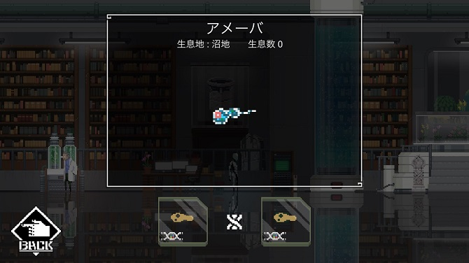

<h4>DNA組み合わせ</h4>
<ul>
	<li>原始生命体のDNA　×　２</li>
</ul>
<h4>進化前/進化後</h4>
<ul>
	<li>進化前　⇒　無</li>
	<li>進化後　⇒　<a href="#h-jump12">ピカイア</a>　/　<a href="/world-for-two-shinrin/#h-jump11">ミジンコ(森林ページへ飛びます)</a></li>
</ul>
<h4>見た目の感想</h4>

遠くから見たら水色のラムネの容器に見えるんですよね。笑（赤い部分にも注目）

 

<h3 id="h-jump12">ピカイア</h3>

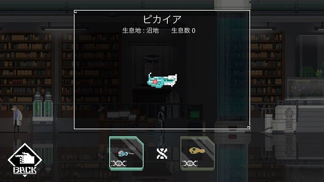

<h4>DNA組み合わせ</h4>
<ul>
	<li><a href="#h-jump11">アメーバ</a></li>
	<li>原始生命体のDNA</li>
</ul>
<h4>進化前/進化後</h4>
<ul>
	<li>進化前　⇒　<a href="#h-jump11">アメーバ</a></li>
	<li>進化後　⇒　<a href="#h-jump13">シーラカンス</a>　/　<a href="#h-jump31">アンモナイト</a></li>
</ul>
<h4>見た目の感想</h4>
小さい角がチャームポイントですね。

<b>『めっちゃかわいい！！』</b>

 

<h3 id="h-jump13">シーラカンス</h3>

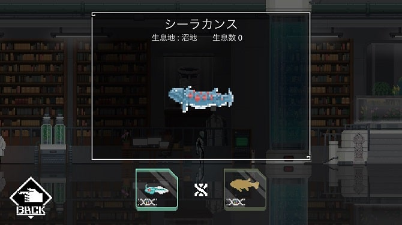

<h4>DNA組み合わせ</h4>
<ul>
	<li><a href="#h-jump12">ピカイア</a></li>
	<li>魚類のDNA</li>
</ul>
<h4>進化前/進化後</h4>
<ul>
	<li>進化前　⇒　<a href="#h-jump12">ピカイア</a></li>
	<li>進化後　⇒　<a href="#h-jump14">サメ</a>　/　<a href="#h-jump21">アンコウ</a>　/　<a href="/world-for-two-sakyu/#h-jump11">カエル(砂丘ページへ飛びます)</a></li>
</ul>
<h4>見た目の感想</h4>

想像していたシーラカンスより色合い鮮やかで、作者のセンスを感じた。笑

 

<h3 id="h-jump14">サメ</h3>

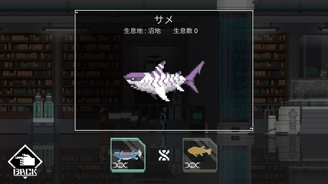

<h4>DNA組み合わせ</h4>
<ul>
	<li><a href="#h-jump13">シーラカンス</a></li>
	<li>魚類のDNA</li>
</ul>
<h4>進化前/進化後</h4>
<ul>
	<li>進化前　⇒　<a href="#h-jump13">シーラカンス</a></li>
	<li>進化後　⇒　<a href="#h-jump15">ジンベエザメ</a></li>
</ul>
<h4>見た目の感想</h4>

色の使い方とサメの動きで恐ろしさが伝わってきますね...。

 

<h3 id="h-jump15">ジンベエザメ</h3>

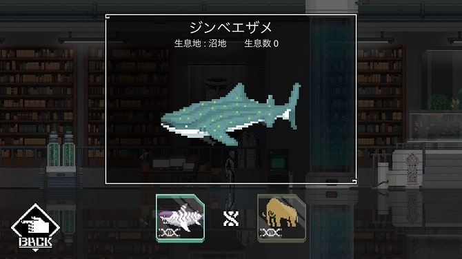

<h4>DNA組み合わせ</h4>
<ul>
	<li><a href="#h-jump14">サメ</a></li>
	<li>巨大のDNA</li>
</ul>
<h4>進化前/進化後</h4>
<ul>
	<li>進化前　⇒　<a href="#h-jump14">サメ</a></li>
	<li>進化後　⇒　<a href="#h-jump16">シロナガスクジラ</a></li>
</ul>
<h4>見た目の感想</h4>

僕が小さい頃に海遊館で感じたジンベエザメと同じ愛らしさを感じますね。

 

<h3 id="h-jump16">シロナガスクジラ</h3>

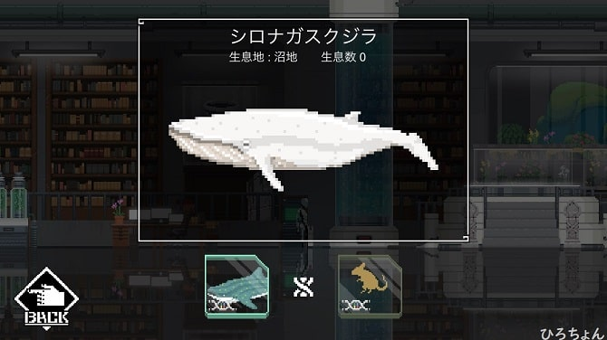

<h4>DNA組み合わせ</h4>
<ul>
	<li><a href="#h-jump15">ジンベエザメ</a></li>
	<li>哺乳類のDNA（アップデート前は巨大のDNA）</li>
</ul>
<h4>進化前/進化後</h4>
<ul>
	<li>進化前　⇒　<a href="#h-jump15">ジンベエザメ</a></li>
	<li>進化後　⇒　<a href="#h-jump17">魚人</a></li>
</ul>
<h4>見た目の感想</h4>

<b>『しろ...長す...』</b>

 

<h3 id="h-jump17">魚人</h3>

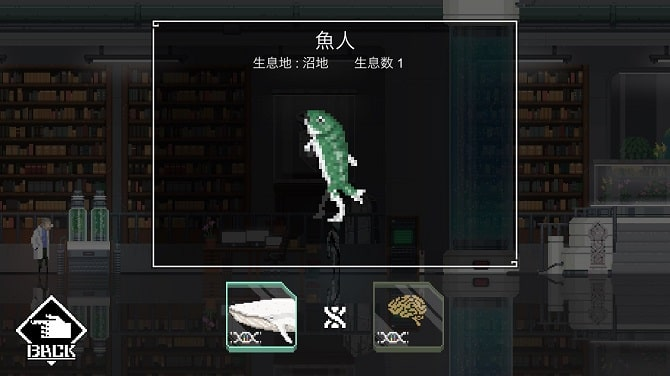

<h4>DNA組み合わせ</h4>
<ul>
	<li><a href="#h-jump16">シロナガスクジラ</a></li>
	<li>知性のDNA</li>
</ul>
<h4>進化前/進化後</h4>
<ul>
	<li>進化前　⇒　<a href="#h-jump16">シロナガスクジラ</a></li>
	<li>進化後　⇒　無</li>
</ul>
<h4>見た目の感想</h4>

シリアスな物語に、初見だとこーれは...笑ってしまう。笑

体が緑色というセンスもツボです。笑

 

<h2 id="h-jump2">沼地の2列目</h2>

<strong>沼地</strong>の２列目になります。（オレン字のリンクを押すとそこまで飛びます。）

<a href="#h-jump1"><u>1列目はこちら</u></a>

<a href="#h-jump3"><u>3列目はこちら</u></a>

<ol>
	<li><a href="#h-jump21"><strong>アンコウ</strong></a></li>
	<li><a href="#h-jump22"><strong>マンタ</strong></a></li>
	<li><a href="#h-jump23"><strong>リュウグウノツカイ</strong></a></li>
	<li><a href="#h-jump24"><strong>龍</strong></a></li>
</ol>

<h3 id="h-jump21">アンコウ</h3>

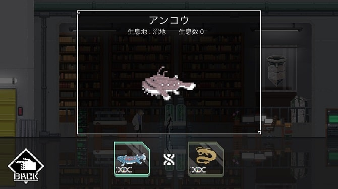

<h4>DNA組み合わせ</h4>
<ul>
	<li><a href="#h-jump13">シーラカンス</a></li>
	<li>深海のDNA</li>
</ul>
<h4>進化前/進化後</h4>
<ul>
	<li>進化前　⇒　<a href="#h-jump13">シーラカンス</a></li>
	<li>進化後　⇒　<a href="#h-jump22">マンタ</a></li>
</ul>
<h4>見た目の感想</h4>

あごひげの動きや下部分の動きで、あのアンコウのブヨブヨ感が伝わってきて、感銘と共になんとも言えない気持ちになりました。笑

 

<h3 id="h-jump22">マンタ</h3>

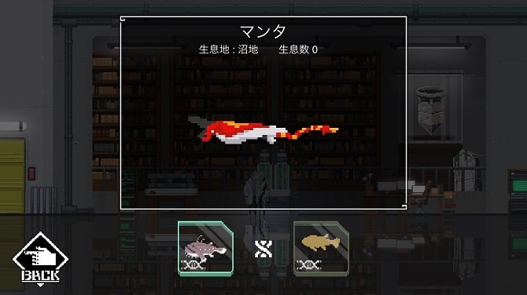

<h4>DNA組み合わせ</h4>
<ul>
	<li><a href="#h-jump21">アンコウ</a></li>
	<li>魚類のDNA</li>
</ul>
<h4>進化前/進化後</h4>
<ul>
	<li>進化前　⇒　<a href="#h-jump21">アンコウ</a></li>
	<li>進化後　⇒　<a href="#h-jump23">リュウグウノツカイ</a>　/　<a href="/world-for-two-irochigai/#h-jump12">色違いのマンタ</a></li>
</ul>
<h4>見た目の感想</h4>

色的にぱっと見<b>『誰やねんこれ！』</b>と思いましたが、マンタの下部分にしっかり線が入っているあたり、マンタです(/ω＼)

 

<h3 id="h-jump23">リュウグウノツカイ</h3>

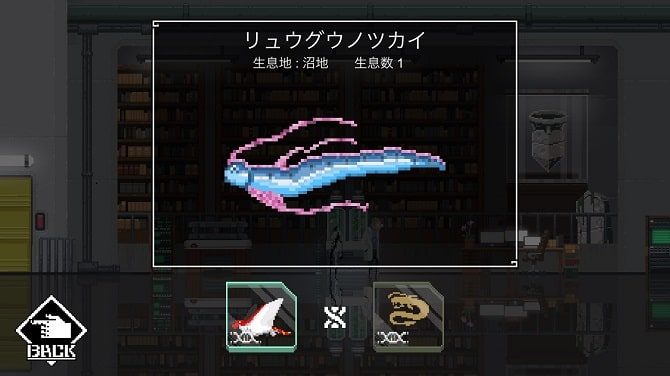

<h4>DNA組み合わせ</h4>
<ul>
	<li><a href="#h-jump22">マンタ</a></li>
	<li>深海のDNA</li>
</ul>
<h4>進化前/進化後</h4>
<ul>
	<li>進化前　⇒　<a href="#h-jump22">マンタ</a></li>
	<li>進化後　⇒　<a href="#h-jump24">龍</a></li>
</ul>
<h4>見た目の感想</h4>

想像通りのリュウグウノツカイが出てきて逆にビックリ。アプリ独特の画質でここまでリアルさが伝わるのはスゴイ！

 

<h3 id="h-jump24">龍</h3>

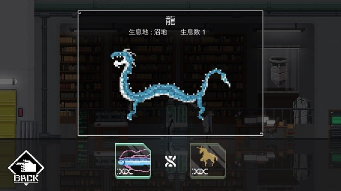

<h4>DNA組み合わせ</h4>
<ul>
	<li><a href="#h-jump23">リュウグウノツカイ</a></li>
	<li>神秘のDNA</li>
</ul>
<h4>進化前/進化後</h4>
<ul>
	<li>進化前　⇒　<a href="#h-jump23">リュウグウノツカイ</a></li>
	<li>進化後　⇒　無</li>
</ul>
<h4>見た目の感想</h4>

正直ちょっと笑ってしまいました。足のひょろ長さがツボです...笑

デザインの方、すみません。笑

 

<h2 id="h-jump3">沼地の3列目</h2>

<strong>沼地</strong>の３列目になります。（オレン字のリンクを押すとそこまで飛びます。）

<a href="#h-jump2"><u>2列目はこちら</u></a>
<ol>
	<li><a href="#h-jump31"><strong>アンモナイト</strong></a></li>
	<li><a href="#h-jump32"><strong>カニ</strong></a></li>
	<li><a href="#h-jump33"><strong>イカ</strong></a></li>
	<li><a href="#h-jump34"><strong>ダイオウイカ</strong></a></li>
</ol>

<h3 id="h-jump31">アンモナイト</h3>

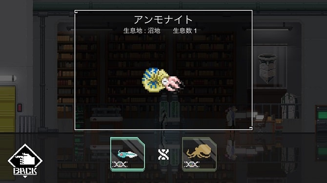

<h4>DNA組み合わせ</h4>
<ul>
	<li><a href="#h-jump12">ピカイア</a></li>
	<li>軟体類のDNA</li>
</ul>
<h4>進化前/進化後</h4>
<ul>
	<li>進化前　⇒　<a href="#h-jump12">ピカイア</a></li>
	<li>進化後　⇒　<a href="#h-jump32">カニ</a>　/　<a href="#h-jump33">イカ</a></li>
</ul>
<h4>見た目の感想</h4>

この形はどう見てもアンモナイトですね！

間に挟まっている青いのなんだろ…昔の海水は青かった説の提起…？(知らないけど笑)

 

<h3 id="h-jump32">カニ</h3>

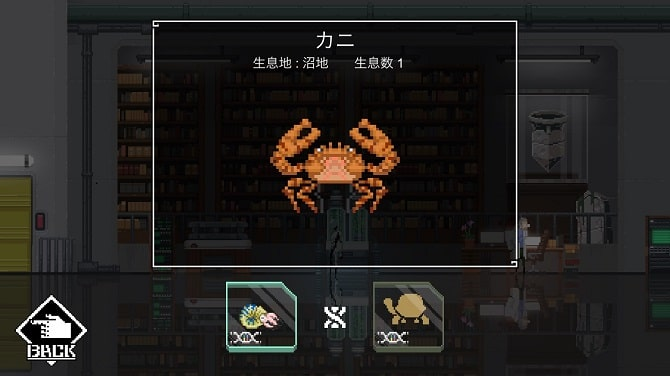

<h4>DNA組み合わせ</h4>
<ul>
	<li><a href="#h-jump31">アンモナイト</a></li>
	<li>甲羅のDNA</li>
</ul>
<h4>進化前/進化後</h4>
<ul>
	<li>進化前　⇒　<a href="#h-jump31">アンモナイト</a></li>
	<li>進化後　⇒　<a href="/world-for-two-irochigai/#h-jump11">色違いのカニ</a></li>
</ul>
<h4>見た目の感想</h4>

『This is a カニ！』

 

<h3 id="h-jump33">イカ</h3>

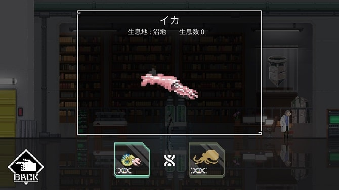

<h4>DNA組み合わせ</h4>
<ul>
	<li><a href="#h-jump31">アンモナイト</a></li>
	<li>軟体類のDNA</li>
</ul>
<h4>進化前/進化後</h4>
<ul>
	<li>進化前　⇒　<a href="#h-jump31">アンモナイト</a></li>
	<li>進化後　⇒　<a href="#h-jump34">ダイオウイカ</a></li>
</ul>
<h4>見た目の感想</h4>

先っちょの三角の動きがイカへの食欲をそそられます。

 

<h3 id="h-jump34">ダイオウイカ</h3>

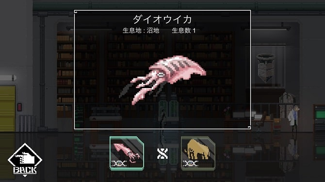

<h4>DNA組み合わせ</h4>
<ul>
	<li><a href="#h-jump33">イカ</a></li>
	<li>巨大のDNA</li>
</ul>
<h4>進化前/進化後</h4>
<ul>
	<li>進化前　⇒　<a href="#h-jump33">イカ</a></li>
	<li>進化後　⇒　無</li>
</ul>
<h4>見た目の感想</h4>

子供の時に見ていた図鑑に載っていたダイオウイカですね！！

こちらのイカの動きはイカへの食欲をそがれます。

 

<h2 id="h-jump4">沼地のBook完成図がコチラ</h2>

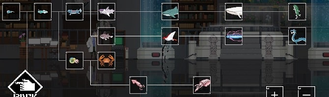

全部で１５匹いましたね！こうやって見ると海での生物の進化が分かりますよね...

今回は以上です。沼地以外でもDNA組み合わせ一覧の記事がございます！

森林のDNA組み合わせ一覧は↓のリンクから 
<a href="/world-for-two-shinrin/">
＞＞＞ <u>【World for Two攻略】DNAの組み合わせ一覧～森林～</u></a>

砂丘のDNA組み合わせ一覧は↓のリンクから 
<a href="/world-for-two-sakyu/">
＞＞＞ <u>『World for Two アプリ攻略』全DNAの組み合わせ～砂丘～</u></a>

遺跡のDNA組み合わせ一覧は↓のリンクから 
<a href="/world-for-two-iseki/">
＞＞＞ <u>【World for Two攻略】DNAの組み合わせ一覧～遺跡～</u></a>
