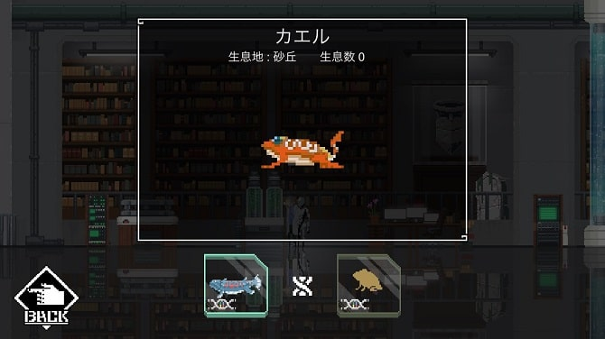
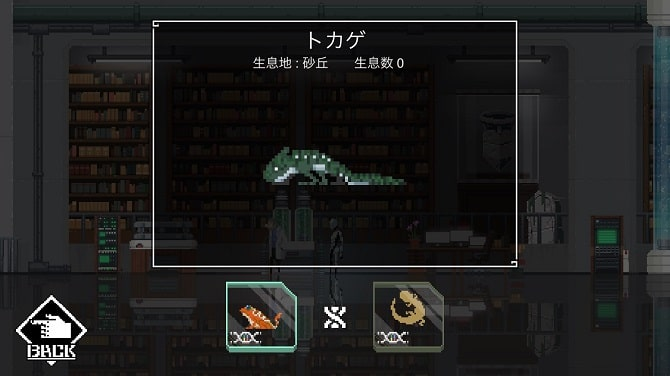
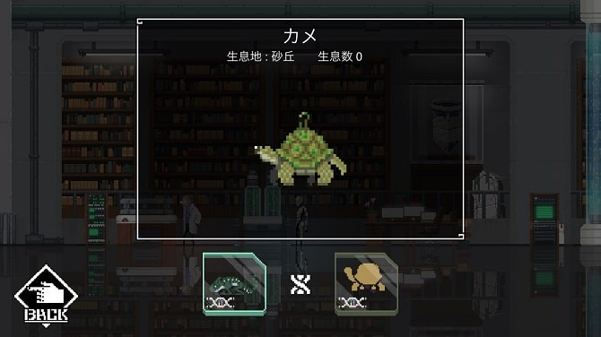
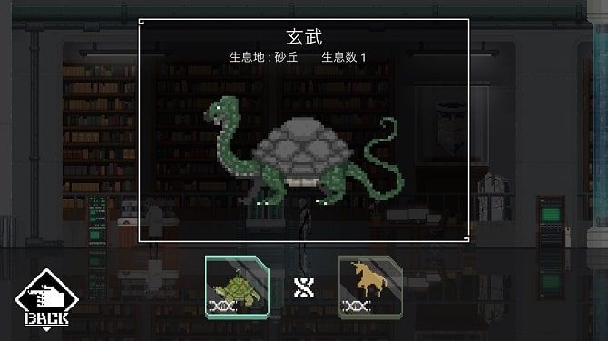
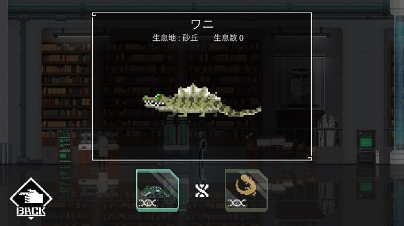
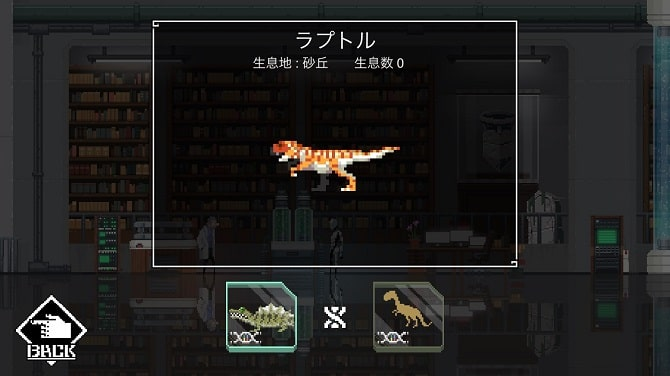
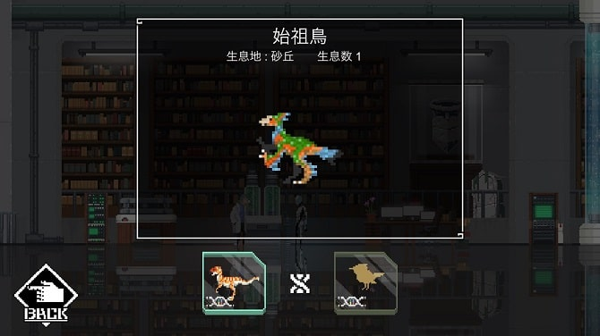
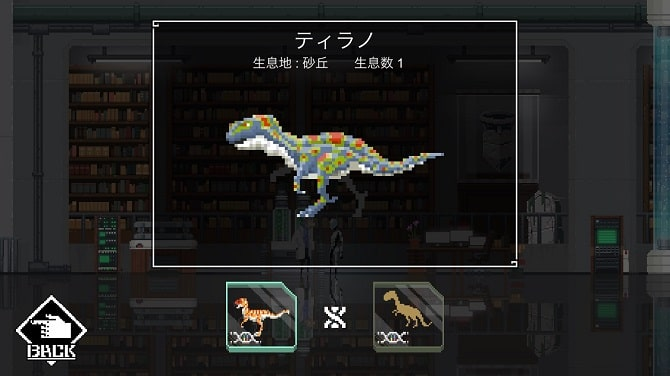
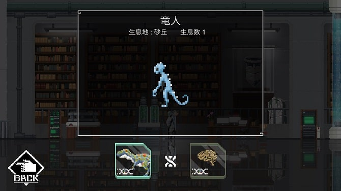
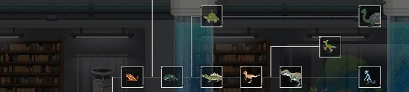

こんにちは。ひろちょんです。

<strong>【World for Two】</strong>という<strong>アプリ</strong>のストーリーを進めたいけど、<strong>DNA(遺伝子)</strong>の<strong>組み合わせ</strong>で<strong>攻略</strong>が難しいという方に向けてまとめました！

この記事は<strong>砂丘</strong>についてです。どうぞ参考にお使いください！

目次です
<ol>
	<li><a href="#h-jump1"><strong>砂丘のBOOK1列目</strong></a></li>
	<li><a href="#h-jump2"><strong>砂丘のBOOK2列目</strong></a></li>
	<li><a href="#h-jump3"><strong>砂丘のBOOK完成図がこちら</strong></a></li>
	<li><a href="#h-jump4"><strong>もう少しでアプリランキング１位！</strong></a></li>
</ol>

 

<h2 id="h-jump1">砂丘のBOOK1列目</h2>

<strong>砂丘</strong>のBOOK１列目になります。

<a href="#h-jump2"><u>BOOKの2列目はこちら</u></a>
<ol>
	<li><a href="#h-jump11"><strong>カエル</strong></a></li>
	<li><a href="#h-jump12"><strong>トカゲ</strong></a></li>
	<li><a href="#h-jump13"><strong>カメ</strong></a></li>
	<li><a href="#h-jump14"><strong>玄武</strong></a></li>
</ol>

 

<h3 id="h-jump11">カエル</h3>

<h4>DNA組み合わせ</h4>
<ul>
	<li><a href="/world-for-two-numa/#h-jump13">シーラカンス（このリンクは沼地ページへ飛びます。）</a></li>
	<li>両生類のDNA</li>
</ul>
<h4>進化前/進化後</h4>
<ul>
	<li>進化前　⇒　<a href="/world-for-two-numa/#h-jump13">シーラカンス（このリンクは沼地ページへ飛びま）</a></li>
	<li>進化後　⇒　<a href="#h-jump12">トカゲ</a>　/　<a href="/world-for-two-iseki/#h-jump11">小鳥(遺跡ページへ飛びます)</a>　/　<a href="/world-for-two-iseki/#h-jump21">ネズミ(遺跡ページへ飛びます)</a>　/　<a href="/world-for-two-irochigai/#h-jump14">色違いのカエル</a></li>
</ul>
<h4>見た目の感想</h4>

色から結構な目立ちたがり屋みたいですね！笑

てか尻尾たってる！かわゆ！

 

<h3 id="h-jump12">トカゲ</h3>

<h4>DNA組み合わせ</h4>
<ul>
	<li><a href="#h-jump11">カエル</a></li>
	<li>爬虫類のDNA</li>
</ul>
<h4>進化前/進化後</h4>
<ul>
	<li>進化前　⇒　<a href="#h-jump11">カエル</a></li>
	<li>進化後　⇒　<a href="#h-jump13">カメ</a>　/　<a href="#h-jump21">ワニ</a></li>
</ul>
<h4>見た目の感想</h4>

おめめが真っ白。<b>『シーラカンスと同じ目してるよ？疲れてない？？』</b>

 

<h3 id="h-jump13">カメ</h3>

<h4>DNA組み合わせ</h4>
<ul>
	<li><a href="#h-jump12">トカゲ</a></li>
	<li>甲羅のDNA</li>
</ul>
<h4>進化前/進化後</h4>
<ul>
	<li>進化前　⇒　<a href="#h-jump12">トカゲ</a></li>
	<li>進化後　⇒　<a href="#h-jump14">玄武</a></li>
</ul>
<h4>見た目の感想</h4>

甲羅上のチョロチョロなんだろ。笑

フシギダネに見えてきた...笑

 

<h3 id="h-jump14">玄武</h3>

<h4>DNA組み合わせ</h4>
<ul>
	<li><a href="#h-jump13">カメ</a></li>
	<li>神秘のDNA</li>
</ul>
<h4>進化前/進化後</h4>
<ul>
	<li>進化前　⇒　<a href="#h-jump13">カメ</a></li>
	<li>進化後　⇒　無</li>
</ul>
<h4>見た目の感想</h4>

玄武っていうのを初めてみたけど、<del datetime="2019-05-31T20:03:49+00:00">ただのカメの尻尾長いバージョン？？</del>

中国の神様みたいです( ;∀;)

 

<h2 id="h-jump2">砂丘のBOOK2列目</h2>

<strong>砂丘</strong>のBOOK２列目になります。（オレン字のリンクを押すとそこまで飛びます。）

<a href="#h-jump1"><u>BOOKの1列目はこちら</u></a>
<ol>
	<li><a href="#h-jump21"><strong>ワニ</strong></a></li>
	<li><a href="#h-jump22"><strong>ラプトル</strong></a></li>
	<li><a href="#h-jump23"><strong>始祖鳥</strong></a></li>
	<li><a href="#h-jump24"><strong>ティラノ</strong></a></li>
	<li><a href="#h-jump25"><strong>竜人</strong></a></li>
</ol>

 

<h3 id="h-jump21">ワニ</h3>

<h4>DNA組み合わせ</h4>
<ul>
	<li><a href="#h-jump12">トカゲ</a></li>
	<li>爬虫類のDNA</li>
</ul>
<h4>進化前/進化後</h4>
<ul>
	<li>進化前　⇒　<a href="#h-jump12">トカゲ</a></li>
	<li>進化後　⇒　<a href="#h-jump22">ラプトル</a></li>
</ul>
<h4>見た目の感想</h4>

目が黄緑色に光ってる！？

足の短さがドット絵によって、かわゆさ増し増しです(/ω＼)

 

<h3 id="h-jump22">ラプトル</h3>

<h4>DNA組み合わせ</h4>
<ul>
	<li><a href="#h-jump21">ワニ</a></li>
	<li>古代のDNA</li>
</ul>
<h4>進化前/進化後</h4>
<ul>
	<li>進化前　⇒　<a href="#h-jump21">ワニ</a></li>
	<li>進化後　⇒　<a href="#h-jump23">始祖鳥</a>　/　<a href="#h-jump24">ティラノ</a></li>
</ul>
<h4>見た目の感想</h4>

『いやぁ…めっちゃラプトルっぽいわぁ（←なにも知らない』

 

<h3 id="h-jump23">始祖鳥</h3>

<h4>DNA組み合わせ</h4>
<ul>
	<li><a href="#h-jump22">ラプトル</a></li>
	<li>鳥類のDNA</li>
</ul>
<h4>進化前/進化後</h4>
<ul>
	<li>進化前　⇒　<a href="#h-jump22">ラプトル</a></li>
	<li>進化後　⇒　無</li>
</ul>
<h4>見た目の感想</h4>

これ確か高校の生物でやったような…やってないような…

そんで〇ルペッコみたく、仲間呼んできそうシリーズですね。笑

 

<h3 id="h-jump24">ティラノ</h3>

<h4>DNA組み合わせ</h4>
<ul>
	<li><a href="#h-jump22">ラプトル</a></li>
	<li>古代のDNA</li>
</ul>
<h4>進化前/進化後</h4>
<ul>
	<li>進化前　⇒　<a href="#h-jump22">ラプトル</a></li>
	<li>進化後　⇒　<a href="#h-jump25">竜人</a></li>
</ul>
<h4>見た目の感想</h4>

毒々しい色ですね…

アプリ独特の赤を使った生物シリーズですな(/・ω・)/

 

<h3 id="h-jump25">竜人</h3>

<h4>DNA組み合わせ</h4>
<ul>
	<li><a href="#h-jump24">ティラノ</a></li>
	<li>知性のDNA</li>
</ul>
<h4>進化前/進化後</h4>
<ul>
	<li>進化前　⇒　<a href="#h-jump24">ティラノ</a></li>
	<li>進化後　⇒　無</li>
</ul>
<h4>見た目の感想</h4>

BOOKだとわかりませんが、砂丘ではキョロキョロしながら火噴いてるんですよ！

<b>火を噴かなかったら、ベッドで添い寝したい愛くるしさありますね！！笑</b>

 

<h2 id="h-jump3">砂丘のBOOK完成図がこちら</h2>

砂丘は全部で９匹でした！ということは、森林の生物の数とおなじでしたね～

これからアップデートで増えることはあるのでしょうか…？（ストーリー的にはなさそう…）

 

<h2 id="h-jump4">もう少しでアプリランキング１位！</h2>

この記事を書いている時点では２位ですね～

別に開発者側ではないんですが、<strong>ストーリー</strong>や<strong>世界観</strong>がすごく気にっている<strong>アプリ</strong>なので...

どうせなら１位なってほしいですよね(/・ω・)/

もうちょっと頑張って！！笑

今回は以上です。他のエリアでのDNA組み合わせの解説記事もあります(/・ω・)/

沼地のDNA組み合わせ一覧は↓のリンクから 
<a href="/world-for-two-numa/">＞＞＞<u>【World for Two攻略】DNAの組み合わせ一覧～沼地～</u></a>

森林のDNA組み合わせ一覧は↓のリンクから 
<a href="/world-for-two-shinrin/">＞＞＞<u>【World for Two攻略】DNAの組み合わせ一覧～森林～</u></a>

遺跡のDNA組み合わせ一覧は↓のリンクから 
<a href="https://heacet.com/world-for-two-iseki/">＞＞＞<u>【World for Two攻略】DNAの組み合わせ一覧～遺跡～</u></a>

最後までご覧いただき、ありがとうございました。気になる点などございましたら、[お問い合わせフォーム](/contact-form/)にて、お問い合わせください。
