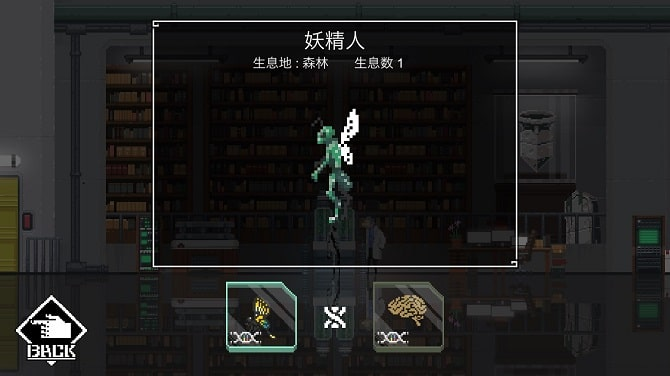

こんにちは。ひろちょんです。

<strong>【World for Two】</strong>の<strong>DNA(遺伝子)</strong>の<strong>組み合わせ</strong>を、<strong>攻略</strong>が難しいという方に向けてまとめました！

今回は<strong>森林</strong>についてです。どうぞ参考にしてください。

目次です
<ol>
	<li><a href="#h-jump1"><strong>森林の1列目</strong></a></li>
	<li><a href="#h-jump2"><strong>森林の2列目</strong></a></li>
	<li><a href="#h-jump3"><strong>森林のBOOK完成図がこちら</strong></a></li>
</ol>
<h2 id="h-jump1">森林の1列目</h2>

<strong>森林</strong>の１列目になります。

<a href="#h-jump2"><u>2列目はこちら</u></a>
<ol>
	<li><a href="#h-jump11"><strong>ミジンコ</strong></a></li>
	<li><a href="#h-jump12"><strong>アリ</strong></a></li>
	<li><a href="#h-jump13"><strong>サナギ</strong></a></li>
	<li><a href="#h-jump14"><strong>チョウ</strong></a></li>
	<li><a href="#h-jump15"><strong>妖精人</strong></a></li>
</ol>

 

<h3 id="h-jump11">ミジンコ</h3>

<h4>DNA組み合わせ</h4>
<ul>
	<li><a href="/world-for-two-numa/#h-jump11">アメーバ(沼地ページへ飛びます)</a></li>
	<li>昆虫類のDNA</li>
</ul>
<h4>進化前/進化後</h4>
<ul>
	<li>進化前　⇒　<a href="/world-for-two-numa/#h-jump11">アメーバ(沼地ページへ飛びます)</a></li>
	<li>進化後　⇒　<a href="#h-jump12">アリ</a>　/　<a href="#h-jump24">巨大アメーバ</a></li>
</ul>
<h4>見た目の感想</h4>

『あ！久しぶりに見た。中学校で習った奴！』

 

<h3 id="h-jump12">アリ</h3>

<h4>DNA組み合わせ</h4>
<ul>
	<li><a href="#h-jump11">アリ</a></li>
	<li>昆虫類のDNA</li>
</ul>
<h4>進化前/進化後</h4>
<ul>
	<li>進化前　⇒　<a href="#h-jump11">アリ</a></li>
	<li>進化後　⇒　<a href="#h-jump13">サナギ</a>　/　<a href="#h-jump21">コガネムシ</a>　/　<a href="/world-for-two-irochigai/#h-jump13">色違いのアリ</a></li>
</ul>
<h4>見た目の感想</h4>

なんでこんな赤いの…猛毒じゃないですか。笑

 

<h3 id="h-jump13">サナギ</h3>

<h4>DNA組み合わせ</h4>
<ul>
	<li><a href="#h-jump12">アリ</a></li>
	<li>昆虫類のDNA</li>
</ul>
<h4>進化前/進化後</h4>
<ul>
	<li>進化前　⇒　<a href="#h-jump12">アリ</a></li>
	<li>進化後　⇒　<a href="#h-jump14">チョウ</a></li>
</ul>
<h4>見た目の感想</h4>
良く見てみると、ドット絵の色が変化してる。

だけど僕にはピッツァにしか見えない。

 

<h3 id="h-jump14">チョウ</h3>

<h4>DNA組み合わせ</h4>
<ul>
	<li><a href="#h-jump13">サナギ</a></li>
	<li>昆虫類のDNA</li>
</ul>
<h4>進化前/進化後</h4>
<ul>
	<li>進化前　⇒　<a href="#h-jump13">サナギ</a></li>
	<li>進化後　⇒　<a href="#h-jump15">妖精人</a></li>
</ul>
<h4>見た目の感想</h4>

ドット絵という世界観での美しいアゲハ蝶です！！

なぜかどうぶつの森に出てくる蝶々を思い出します。笑

 

<h3 id="h-jump15">妖精人</h3>

<h4>DNA組み合わせ</h4>
<ul>
	<li><a href="#h-jump14">チョウ</a></li>
	<li>知性のDNA</li>
</ul>
<h4>進化前/進化後</h4>
<ul>
	<li>進化前　⇒　<a href="#h-jump14">チョウ</a></li>
	<li>進化後　⇒　無</li>
</ul>
<h4>見た目の感想</h4>

『おぉ…おお…この人みたくなるシリーズ来たぁ。笑』

 

<h2 id="h-jump2">森林の2列目</h2>

<strong>森林</strong>の２列目になります。

<a href="#h-jump1"><u>1列目はこちら</u></a>
<ol>
	<li><a href="#h-jump21"><strong>コガネムシ</strong></a></li>
	<li><a href="#h-jump22"><strong>カブトムシ</strong></a></li>
	<li><a href="#h-jump23"><strong>昆虫人</strong></a></li>
	<li><a href="#h-jump24"><strong>巨大アメーバ</strong></a></li>
</ol>

 

<h3 id="h-jump21">コガネムシ</h3>

<h4>DNA組み合わせ</h4>
<ul>
	<li><a href="#h-jump12">アリ</a></li>
	<li>甲虫類のDNA</li>
</ul>
<h4>進化前/進化後</h4>
<ul>
	<li>進化前　⇒　<a href="#h-jump12">アリ</a></li>
	<li>進化後　⇒　<a href="#h-jump22">カブトムシ</a></li>
</ul>
<h4>見た目の感想</h4>

ドット絵でカラフルなのを表現していて、どこか今の絵にはない虫らしさを感じる。

 

<h3 id="h-jump22">カブトムシ</h3>

<h4>DNA組み合わせ</h4>
<ul>
	<li><a href="#h-jump21">コガネムシ</a></li>
	<li>甲虫類のDNA</li>
</ul>
<h4>進化前/進化後</h4>
<ul>
	<li>進化前　⇒　<a href="#h-jump21">コガネムシ</a></li>
	<li>進化後　⇒　<a href="#h-jump23">昆虫人</a></li>
</ul>
<h4>見た目の感想</h4>

絶対ヘラクレスオオカブト（ムシキング知識

 

<h3 id="h-jump23">昆虫人</h3>

<h4>DNA組み合わせ</h4>
<ul>
	<li><a href="#h-jump22">カブトムシ</a></li>
	<li>知性のDNA</li>
</ul>
<h4>進化前/進化後</h4>
<ul>
	<li>進化前　⇒　<a href="#h-jump22">カブトムシ</a></li>
	<li>進化後　⇒　無</li>
</ul>
<h4>見た目の感想</h4>

うぉお…２足歩行してる…

<b>でもなんだろう…他の○○人よりしっくりくる。笑</b>

 

<h3 id="h-jump24">巨大アメーバ</h3>

<h4>DNA組み合わせ</h4>
<ul>
	<li><a href="#h-jump11">ミジンコ</a></li>
	<li>巨大のDNA</li>
</ul>
<h4>進化前/進化後</h4>
<ul>
	<li>進化前　⇒　<a href="#h-jump11">ミジンコ</a></li>
	<li>進化後　⇒　無</li>
</ul>
<h4>見た目の感想</h4>

<b>『ナメクジ感すごっ……でも水色ってなんだか神秘的(/・ω・)/』</b>

 

<h2 id="h-jump3">森林のBOOK完成図がこちら</h2>

森林は全部で９匹いました！いつも見ている世界とは一回り違うので、おもしろかったです( *´艸｀)

今回は以上です。他のエリアでのDNA組み合わせ一覧もございます！

沼地のDNA組み合わせ一覧は↓のリンクから 
<a href="/world-for-two-numa/">＞＞＞<u>【World for Two攻略】DNAの組み合わせ一覧～沼地～</u></a>

砂丘のDNA組み合わせ一覧は↓のリンクから 
<a href="/world-for-two-sakyu/">＞＞＞<u>『World for Two アプリ攻略』全DNAの組み合わせ～砂丘～</u></a>

遺跡のDNA組み合わせ一覧は↓のリンクから 
<a href="/world-for-two-iseki/">＞＞＞<u>【World for Two攻略】DNAの組み合わせ一覧～遺跡～</u></a>。

最後までご覧いただきありがとうございました！気になる点などございましたら、お気軽に[お問い合わせフォーム](./contact-form/)にてお問い合わせくださいm(__)m
